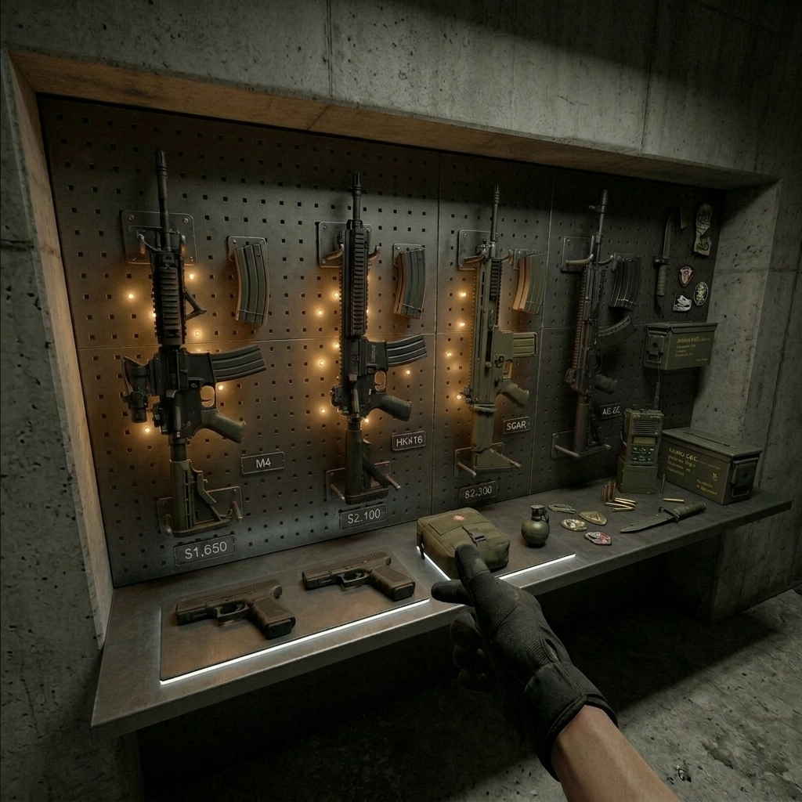
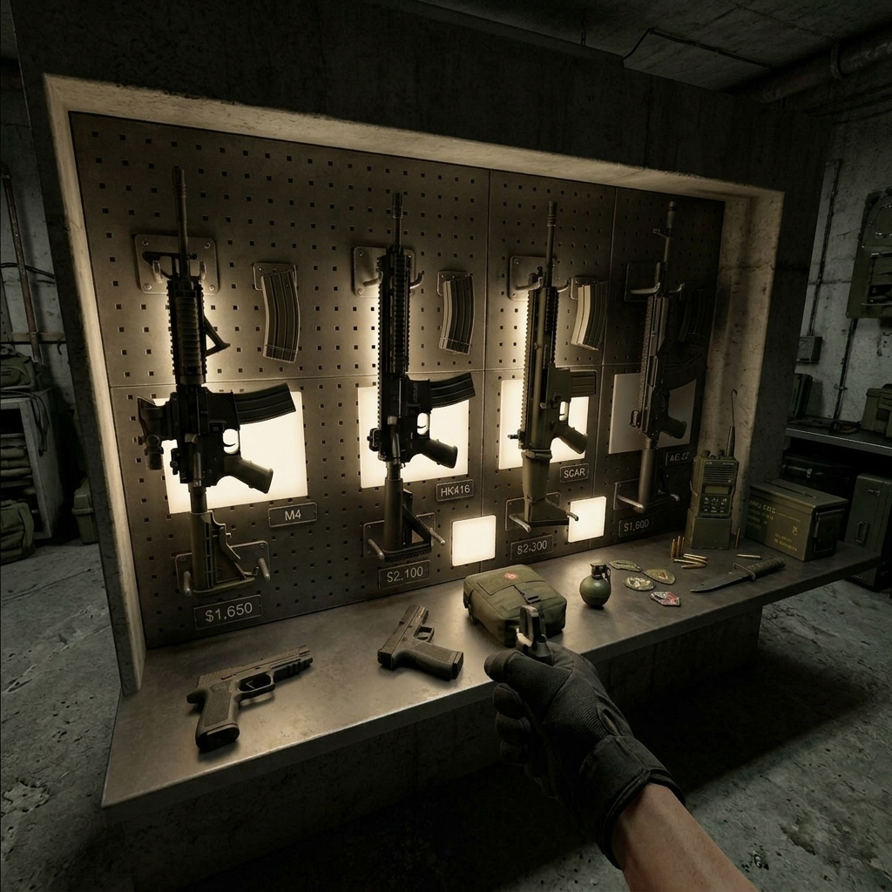
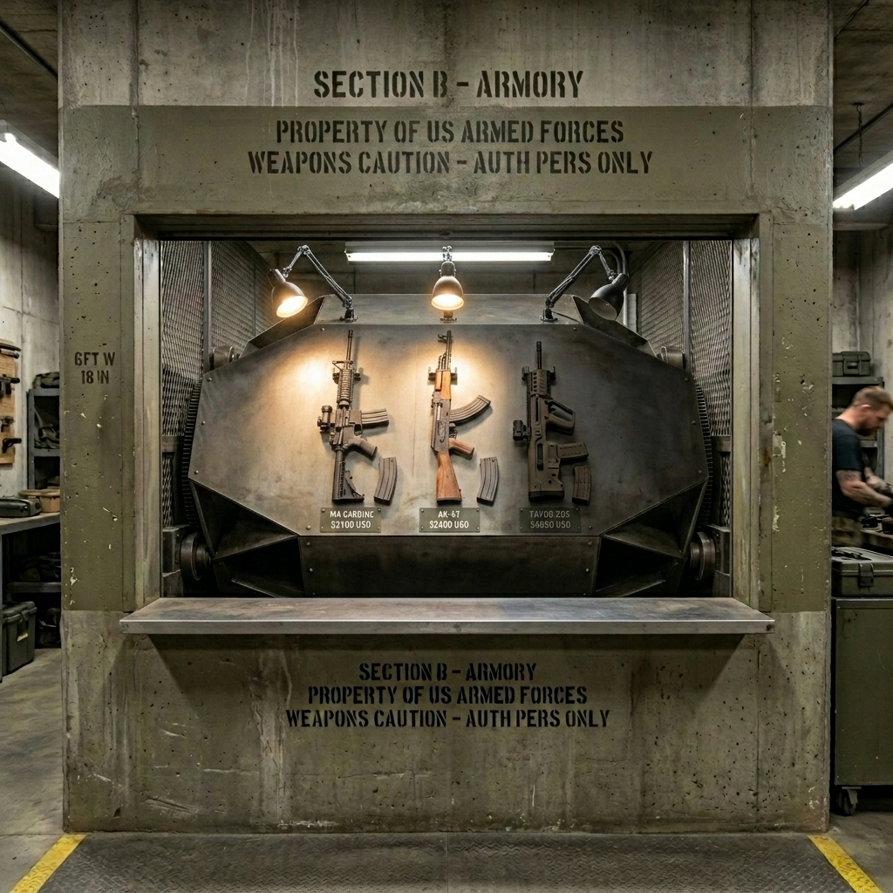
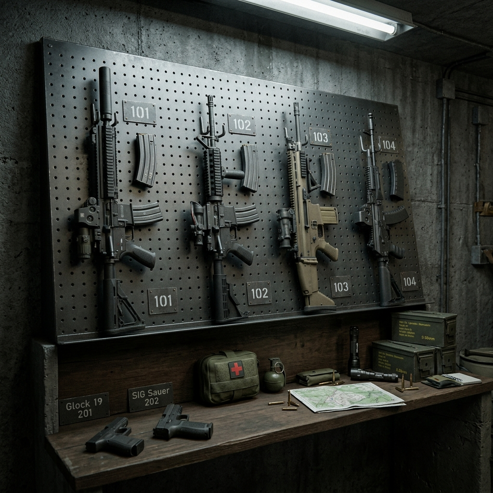

# 🔫 Arsenal Wall — Дизайн-документ механики выбора снаряжения

> **Статус:** Концепт утверждён  
> **Дата:** 2026-04-10  
> **Версия:** 2.0 (замена концепта «барабан» → «стена арсенала»)

---

## 1. Концепция

### 1.1 Проблема
В классических шутерах (CS2, Valorant) выбор снаряжения происходит через 2D UI-меню. В VR это **ломает иммерсию** — игрок выходит из состояния "я внутри игры" в состояние "я в меню".

### 1.2 Решение
**Arsenal Wall** — стена арсенала с двумя зонами: **вертикальная перфопанель** (pegboard) для винтовок и **горизонтальная полка-подоконник** для мелкого снаряжения. Игрок физически подходит к стене и **руками снимает** нужное оружие с креплений.

### 1.3 Референсы из индустрии

| Игра | Подход | Плюсы | Минусы |
|---|---|---|---|
| Pavlov VR | 2D buy-menu | Быстро | Не иммерсивно |
| Contractors | Лобби-лоадаут | Тактическая глубина | Вне геймплея |
| Zero Caliber | Физический арсенал | Максимальная иммерсия | Сложная организация |
| **Наш подход** | **Стена арсенала** | **Всё видно сразу + иммерсия** | — |

### 1.4 Почему отказались от барабана

Изначально рассматривался вращающийся гексагональный барабан. Отклонён по причинам:
- Игрок видит только одну категорию за раз — нужно ждать вращения
- Сложная механика вращения и синхронизации
- Стена арсенала показывает **всё сразу** — быстрее и проще

---

## 2. Финальный концепт

### 2.1 Вид от первого лица (VR)


### 2.2 Общий вид стены


---

## 3. Конструкция

### 3.1 Физическая структура

Стена арсенала состоит из двух зон, образующих **одну непрерывную поверхность** встроенную в нишу стены:

```
    ┌─────────────────────────────────────────────────┐
    │                  БЕТОННАЯ СТЕНА                  │
    │                                                  │
    │  ┌─────────────────────────────────────────────┐ │
    │  │         PEGBOARD (чуть под уклоном)         │ │
    │  │                                             │ │
    │  │  ┌─AK-47──┐  ┌──M4───┐  ┌─FAMAS─┐  ┌─AWP──┐│ │
    │  │  │ ∙ ∙    │  │ ∙ ∙   │  │ ∙ ∙   │  │      ││ │
    │  │  │ ▓▓▓▓▓▓ │  │ ▓▓▓▓▓ │  │ ▓▓▓▓▓ │  │▓▓▓▓▓▓││ │
    │  │  │ +mag∙  │  │ +mag∙ │  │ +mag∙ │  │+mag  ││ │
    │  │  │ $2700  │  │ $3100 │  │ $2250 │  │$4750 ││ │
    │  │  └────────┘  └───────┘  └───────┘  └──────┘│ │
    │  │    ◉ подсвет    ◉ подсвет   ◉ подсвет  ✗ нет│ │
    │  │─────────────────────────────────────────────│ │
    │  │         ПОЛКА-ПОДОКОННИК (горизонт.)        │ │
    │  │                                             │ │
    │  │  🔫Glock  🔫USP   💊Аптечка  💣Граната  📦│ │
    │  │  (дулом↑)  (дулом↑)                    декор│ │
    │  └─────────────────────────────────────────────┘ │
    │                                                  │
    └─────────────────────────────────────────────────┘
                          ИГРОК ↓
```

### 3.2 Ключевые параметры

| Параметр | Значение |
|---|---|
| **Тип** | Стена с нишей (pegboard + полка) |
| **Pegboard** | Вертикальная перфопанель, наклон ~10-15° к игроку |
| **Полка** | Горизонтальный выступ на уровне пояса (~0.9 м) |
| **Соединение** | Pegboard плавно переходит в полку (одна поверхность) |
| **Размещение** | Встроена в нишу/алькову бетонной стены |

---

## 4. Расположение предметов

### 4.1 Верхняя зона — Pegboard (винтовки)

На pegboard размещены **4 винтовки** с достаточным расстоянием для удобного VR-хвата:

| Позиция | Оружие | Ориентация | Крепление |
|---|---|---|---|
| Слот 1 (лев.) | AK-47 | На левом боку, ствол от игрока, grip вверх | 2× U-образных крючка |
| Слот 2 | M4A1 | На левом боку, ствол от игрока, grip вверх | 2× U-образных крючка |
| Слот 3 | FAMAS | На левом боку, ствол от игрока, grip вверх | 2× U-образных крючка |
| Слот 4 (прав.) | AWP | На левом боку, ствол от игрока, grip вверх | 2× U-образных крючка |

**Рядом с каждым оружием:**
- Запасной **магазин** на отдельном маленьком крючке
- Металлическая **табличка с ценой** (трафаретные белые цифры)

**Ориентация оружия:**
- Левая сторона оружия лежит на поверхности (правая сторона вверх, окно выброса видно)
- Стволы направлены **от игрока** (к стене)
- Рукоятки направлены **вверх** — под хват правой рукой сверху

### 4.2 Нижняя зона — Полка (мелкое снаряжение)

На полке-подоконнике предметы **лежат плашмя**:

| Позиция | Предмет | Ориентация |
|---|---|---|
| Слот 1 | Glock 18 | На левом боку, дуло к стене, grip к игроку |
| Слот 2 | USP-S | На левом боку, дуло к стене, grip к игроку |
| Слот 3 | Аптечка | Лежит плашмя |
| Слот 4 | Граната | Лежит плашмя |

> **Правило:** на полке только покупаемые предметы. Никакого декора в интерактивной зоне —
> всё, что лежит на полке, можно (и нужно) брать. См. секцию 5.3.

**Ориентация пистолетов:**
- Дулом **к стене** (от игрока)
- Рукояткой **к игроку** — удобно схватить правой рукой

---

## 5. Подсветка и индикация доступности

### 5.1 Точечная подсветка



Подсветка реализована через **маленькие точечные LED-диоды**, встроенные в отверстия pegboard:

- Каждое оружие имеет **3-5 маленьких светящихся точек** в отверстиях pegboard вокруг него
- Точки частично **скрыты за моделью оружия** — создаётся мягкий ореол подсветки
- Это **единственный акцентный свет** — общее освещение помещения приглушённое

### 5.2 Состояния подсветки

| Состояние | Точечные LED | Визуальный эффект |
|---|---|---|
| **Доступно** | ВКЛ (тёплый белый) | Оружие мягко подсвечено, видно чётко |
| **Недоступно** (нет денег) | ВЫКЛ | Оружие в тени, почти не видно |
| **Выбрано / забрано** | ВКЛ (зелёный) | Пустые кронштейны с зелёной индикацией |

### 5.3 Подсветка на полке

Аналогичные маленькие точечные LED встроены в поверхность полки рядом с каждым предметом снаряжения.

---

## 6. Визуальный стиль

### 6.1 Общий стиль: Реалистичный армейский



Чистый современный военный арсенал без sci-fi элементов.

### 6.2 Материалы

| Элемент | Материал |
|---|---|
| Стена | Бетон, армированный, военные трафаретные маркировки |
| Pegboard | Тёмный металл (gunmetal), равномерная перфорация |
| Крючки/кронштейны | Закалённая сталь, матовая |
| Полка | Тот же тёмный металл, продолжение pegboard |
| Ценники | Металлические пластины, трафаретные белые цифры |
| LED-точки | Маленькие (3-5мм), встроены в отверстия pegboard |

### 6.3 Освещение

- **Общее** — приглушённое, армейское (люминесцентные лампы на потолке, тусклые)
- **Акцентное** — только точечные LED рядом с оружием
- **Контраст** — доступное оружие хорошо видно в подсветке, недоступное тонет в тени

---

## 7. Взаимодействие (VR)

### 7.1 Действия игрока

1. **Подойти** к стене арсенала
2. **Осмотреть** — подсвеченное оружие = доступное, тёмное = нет денег
3. **Снять винтовку** — схватить за grip правой рукой, потянуть вверх/на себя, снимая с крючков
4. **Повесить на спину** — поднести к snap zone кобуры на аватаре
5. **Взять пистолет** — схватить с полки за рукоятку
6. **Повесить в кобуру** — поднести к snap zone на бедре
7. **Взять гранату/аптечку** — схватить с полки, положить в карман снаряжения

### 7.2 VR Ergonomics

| Зона | Высота | Движение руки |
|---|---|---|
| Винтовки (pegboard) | 1.0 - 1.5 м | На уровне груди, хват вперёд-вверх |
| Пистолеты (полка) | ~0.9 м | На уровне пояса, хват вниз |
| Гранаты/аптечки | ~0.9 м | На уровне пояса, хват вниз |

### 7.3 Diegetic Feedback (без HUD)

| Информация | Как показана |
|---|---|
| Цена оружия | Металлическая табличка с трафаретом рядом с оружием |
| Бюджет игрока | Может быть на отдельном табло на стене рядом |
| Доступность | Точечная LED-подсветка ON/OFF |
| Текущий выбор | Пустые кронштейны = уже забрал |

---

## 8. Техническая архитектура (Unity)

### 8.1 Иерархия объектов

```
ArsenalWall (static, стена с нишей)
│
├── PegboardPanel (mesh + material, чуть под уклоном)
│   │
│   ├── RifleSlot_0
│   │   ├── HookBrackets (mesh — 2 U-крючка)
│   │   ├── WeaponAnchor (UxrGrabbableObjectAnchor)
│   │   ├── MagazineHook (mesh + UxrGrabbable на магазине)
│   │   ├── PriceTag (TextMeshPro на металлической пластине)
│   │   └── SlotLights (3-5× Point Light, маленькие, в отверстиях)
│   │
│   ├── RifleSlot_1
│   │   └── ... (аналогично)
│   ├── RifleSlot_2
│   └── RifleSlot_3
│
├── Shelf (mesh, горизонтальная полка-подоконник)
│   │
│   ├── PistolSlot_0
│   │   ├── PistolStand (опционально, маленькая подставка)
│   │   ├── WeaponAnchor (UxrGrabbableObjectAnchor)
│   │   ├── PriceTag (TextMeshPro)
│   │   └── SlotLights (2-3× Point Light)
│   │
│   ├── PistolSlot_1
│   ├── MedkitSlot
│   ├── GrenadeSlot
│   └── DecorationGroup (static — ящики, патроны, рация)
│
├── BudgetDisplay (TextMeshPro, табло на стене рядом)
└── AmbientLight (общее приглушённое освещение ниши)
```

### 8.2 Ключевые скрипты

| Скрипт | Ответственность |
|---|---|
| `ArsenalWallController.cs` | Управление стеной: инициализация слотов, размещение оружия |
| `FirearmSlotController.cs` (база `ArsenalSlotController`; стоит и на слотах полки) | Один слот: подсветка ON/OFF, цена, доступность |
| `ArsenalBudgetManager.cs` | Бюджет игрока, проверка доступности, обновление подсветки |

### 8.3 Интеграция с UltimateXR

- `UxrGrabbableObject` — на каждом оружии (grab с крючков/полки)
- `UxrGrabbableObjectAnchor` — snap zone на кронштейнах (для обратного размещения)
- Привязка к существующим кобурам/карманам на аватаре через систему `WeaponPocket`

### 8.4 Управление подсветкой

```csharp
// Псевдокод управления слотом
public class FirearmSlotController : MonoBehaviour
{
    [SerializeField] private Light[] slotLights;    // 3-5 точечных LED
    [SerializeField] private int weaponPrice;
    
    public void UpdateAvailability(int playerBudget)
    {
        bool available = playerBudget >= weaponPrice;
        foreach (var light in slotLights)
            light.enabled = available;
    }
}
```

### 8.5 Сетевая синхронизация (Mirror)

**Персональный арсенал — каждый игрок видит свою стену:**
- Игроки находятся в одном физическом зале, но каждый видит **свой экземпляр** стены арсенала
- Никто не мешает друг другу при выборе снаряжения
- Свой бюджет, своя подсветка доступности, своё оружие
- Взятие оружия — `[Command]` → серверная валидация бюджета → `[TargetRpc]` конкретному игроку

**Панель жетонов — единственное общее:**
- Жетоны всех игроков команды синхронизированы — все видят, кто снял жетон
- Схватить можно **только свой** жетон (чужие — non-interactable)

---

## 9. Жизненный цикл арсенала

### 9.1 Фазы раунда (относительно арсенала — персональный цикл каждого игрока)

```
┌──────────────────┐     ┌────────────────────┐     ┌──────────────┐
│    PREP PHASE    │ ──► │   TAG GRABBED      │ ──► │ ROUND ACTIVE │
│  Арсенал открыт  │     │   Немедленное      │     │ Арсенал      │
│  Можно брать     │     │   закрытие (~3 сек) │     │ закрыт       │
│  и возвращать    │     │   Возврат невозможен│     │              │
└──────────────────┘     └────────────────────┘     └──────────────┘
```

| Фаза | Триггер / Длительность | Что происходит |
|---|---|---|
| **Prep Phase** | Пока игрок не снял жетон | Арсенал открыт, оружие можно брать **и возвращать** (возврат = refund) |
| **Closing** | Сразу после снятия жетона (~3 сек анимация) | Полка втягивается → ставни закрываются. **Возврат оружия невозможен** |
| **Round Active** | До конца раунда | Арсенал закрыт, ставни-сетка на месте |

> **Ключевое правило:** жетон — точка невозврата. До снятия жетона игрок может
> экспериментировать (взял → вернул → взял другое). После снятия — закрытие мгновенное,
> оружие зафиксировано.

**Начало раунда:** раунд стартует, когда **все** персональные арсеналы закрылись
(т.е. все игроки сняли жетоны и анимации закрытия завершены).

### 9.2 Механизм готовности — жетон (Dog Tag)

Сбоку от ниши арсенала расположена **панель жетонов** — небольшая отдельная доска с крючками, на каждом из которых висит **личный жетон игрока** (dog tag на цепочке).

```
     ┌──────────── НИША АРСЕНАЛА ────────────┐   ┌──────────────┐
     │                                        │   │ DOG TAG RACK │
     │   [оружие на pegboard]                 │   │              │
     │                                        │   │  ⛓ Player_1  │
     │                                        │   │  ⛓ Player_2  │
     │   [пистолеты / снаряжение на полке]    │   │  ⛓ Player_3  │
     │                                        │   │  ⛓ Player_4  │
     └────────────────────────────────────────┘   │              │
                                                   │ [LED-полоса] │
                                                   └──────────────┘
```

**Действие игрока (один шаг):**
- **Снять свой жетон** с крючка — обычный grab (UxrGrabbable)
- Жетон можно повесить на шею или убрать в карман снаряжения

**Почему жетон, а не кнопка:**
- Одно естественное действие — тот же grab-механизм, что и для оружия
- Визуально очевидно: пустой крючок = готов, жетон висит = ещё собирается
- Жетон становится физическим предметом на игроке — дополнительная иммерсия
- Нет риска случайного нажатия — жетон отдельно от зоны оружия

**Жетон как объект:**
- Модель: два металлических жетона на цепочке (классический US military dog tag)
- На жетоне выбито: позывной игрока + номер
- Материал: матовая нержавейка, потёртости
- Размер: ~5×3 см (каждая пластина), цепочка ~15 см

**Визуальная обратная связь:**
| Состояние | Жетон | LED на крючке | Звук |
|---|---|---|---|
| **Не готов** | Висит на крючке | Красный, тусклый | — |
| **Снят (готов)** | У игрока (шея/карман) | Зелёный, постоянный | Звон цепочки + подтверждающий тон |
| **Все готовы** | — | Все зелёные, мигают | Короткий зуммер |

> **Жетон нельзя вернуть обратно.** Снятие = финальное решение, арсенал начинает закрываться немедленно.

### 9.3 Статус команды — панель жетонов = живое табло

Панель жетонов сама является **визуальным индикатором** статуса команды:

```
  ┌──────────────────────┐
  │    DOG TAG RACK      │
  │                      │
  │  ⛓ Player_1  ●(кр.) │  ← жетон висит, не готов
  │  ⌀ Player_2  ●(зел.)│  ← крючок пуст, READY
  │  ⛓ Player_3  ●(кр.) │  ← жетон висит, не готов
  │  ⌀ Player_4  ●(зел.)│  ← крючок пуст, READY
  │                      │
  │  ═══ [ 2 / 4 ] ═══  │  ← LED-счётчик внизу
  └──────────────────────┘
```

**Панель = и табло, и механизм одновременно:**
- Каждый крючок имеет маленький LED-индикатор рядом с именем
- Пустой крючок + зелёный LED = игрок готов
- Жетон на месте + красный LED = ещё собирается
- Внизу панели: LED-счётчик `[2/4]` — сколько готово
- Diegetic — физическая доска на стене, не HUD
- Синхронизация через Mirror — все игроки видят актуальный статус

### 9.4 Механизм закрытия арсенала

Закрытие запускается **немедленно** после снятия жетона конкретного игрока (персональный арсенал):

#### Шаг 1: LED-подсветка гаснет (~0.5 сек)
- Все LED-точки на pegboard и полке **плавно гаснут**
- `UxrGrabbable` на оставшемся оружии → `enabled = false` (нельзя хватать)
- Визуальный сигнал: арсенал «умирает»

#### Шаг 2: Полка втягивается в стену (~1 сек)
```
  BEFORE                          AFTER
  ┌──────────────┐               ┌──────────────┐
  │  [pegboard]  │               │  [pegboard]  │
  │              │               │              │
  ├══════════════┤ ← полка       │              │ ← полка ушла внутрь
  │ 🔫  💊  💣   │               └──────────────┘
  └──────════════┘                     ▼▼▼
                                  (полка задвинута)
```
- Полка-подоконник скользит **горизонтально назад в стену** (как выдвижной ящик)
- Предметы, которые игрок не взял, уезжают вместе с полкой
- Анимация: `Transform.DOLocalMoveZ()` или Animator clip

#### Шаг 3: Бронированные ставни закрываются (~1.5 сек)
```
  ┌──────────────────────────────────────┐
  │          СТАВНИ-СЕТКА                │
  │  ┌──┐┌──┐┌──┐┌──┐┌──┐┌──┐┌──┐┌──┐  │
  │  │▓▓││▓▓││▓▓││▓▓││▓▓││▓▓││▓▓││▓▓│  │  ← закрытое состояние
  │  │▓▓││▓▓││▓▓││▓▓││▓▓││▓▓││▓▓││▓▓│  │     (просматриваемая
  │  │▓▓││▓▓││▓▓││▓▓││▓▓││▓▓││▓▓││▓▓│  │      металлическая сетка)
  │  └──┘└──┘└──┘└──┘└──┘└──┘└──┘└──┘  │
  └──────────────────────────────────────┘
```

**Тип ставен:** Рольставни (rolling shutter) из проволочной металлической сетки:
- Сетка скатывается **сверху вниз** (как рольставни магазина)
- Материал: стальная сетка с ячейкой ~30мм — **видно pegboard за ней**, но руку не просунуть
- Звук: характерный металлический лязг рольставни

**Почему сетка, а не глухие ставни:**
- Игрок видит пустые крючки за сеткой → понимает что арсенал закрыт
- Визуально легче — не "стена из ниоткуда", а просто решётка
- Ambient light проходит через — нет резкого затемнения

#### Итог: Арсенал деактивирован
- Collider сетки блокирует доступ к pegboard
- Все `UxrGrabbable` уже отключены (с шага 1)
- LED-подсветка погашена
- Панель жетонов остаётся видимой (за пределами ставни)

### 9.5 Правило возврата оружия

| Фаза | Возврат на стену | Refund |
|---|---|---|
| **До снятия жетона** | ✅ Можно повесить обратно на крючок / положить на полку | ✅ Деньги возвращаются полностью |
| **После снятия жетона** | ❌ Невозможно (арсенал закрывается) | ❌ — |

- Возврат реализуется через `UxrGrabbableObjectAnchor` — snap zone на кронштейне принимает оружие обратно
- При возврате: LED снова включается, бюджет пересчитывается, подсветка доступности обновляется

### 9.6 Архитектурное правило: Модульные слоты

> **КЛЮЧЕВОЕ ПРАВИЛО:** Каждый слот оружия — **изолированный, самодостаточный prefab** (`Slots/FireArmSlotPrefab.prefab`).
> Стена арсенала **составляется** из таких слотов как из строительных блоков.
> Это позволяет легко менять набор оружия на стене, не трогая layout.

**Один слот оружия содержит:**
- Свою секцию pegboard (geometry — прямоугольная металлическая панель)
- Крепления / крючки для оружия
- `UxrGrabbableObjectAnchor` — snap zone для возврата
- LED-подсветку (Point Light + маленькие точки)
- Ценник (TextMeshPro)
- Отдельный `FirearmSlotController`

**Для полки (EquipSlot)** — аналогичный принцип: каждый слот снаряжения = отдельный prefab.

### 9.7 Иерархия объектов

```
ArsenalWall [ArsenalWallController]
│
├── RiflesSlotsContainer (пустой GO — позиционирование ряда слотов)
│   ├── WeaponSlot_AK47 (instance of FireArmSlotPrefab) [FirearmSlotController]
│   │   ├── PegboardSection (mesh — секция перфопанели)
│   │   ├── WeaponAnchor (UxrGrabbableObjectAnchor)
│   │   ├── MagAnchor (UxrGrabbableObjectAnchor — магазин рядом)
│   │   ├── LEDs (Point Light ×3-5)
│   │   └── PriceTag (TextMeshPro — "$2,700")
│   ├── WeaponSlot_M4A1 (instance of FireArmSlotPrefab) — аналогично
│   ├── WeaponSlot_FAMAS — аналогично
│   └── WeaponSlot_AWP — аналогично
│
├── ShelfMechanism (Animator — slide in/out)
│   ├── ShelfRail (направляющая, static)
│   └── ShelfPlatform
│       ├── EquipSlot_Glock (instance of ShelfSlotPrefab Variant) [FirearmSlotController]
│       │   ├── SlotSurface (mesh — секция полки)
│       │   ├── WeaponAnchor (UxrGrabbableObjectAnchor)
│       │   ├── LEDs (Point Light)
│       │   └── PriceTag (TextMeshPro)
│       ├── EquipSlot_USP — аналогично
│       ├── EquipSlot_Medkit — аналогично
│       └── EquipSlot_Grenade — аналогично
│
├── ShutterMechanism (Animator — roll down/up)
│   ├── ShutterRail_Top (крепление, static)
│   ├── ShutterMesh (MeshCollider — блокировка доступа)
│   └── ShutterMotorSound (AudioSource — лязг)
│
├── DogTagRack (отдельная панель сбоку от ниши)
│   ├── RackBoard (mesh — металлическая доска с трафаретной надписью)
│   ├── TagHook_0
│   │   ├── HookMesh (маленький крючок)
│   │   ├── DogTag (UxrGrabbable — жетон на цепочке)
│   │   ├── HookLED (Point Light — красный/зелёный)
│   │   └── PlayerLabel (TextMeshPro — позывной)
│   ├── TagHook_1 ... TagHook_3 (аналогично)
│   ├── ReadyCounter (TextMeshPro — "2/4")
│   └── TagAudio (AudioSource — звон цепочки)
│
└── CountdownDisplay (TextMeshPro — обратный отсчёт "3... 2... 1..." при закрытии)
```

**Prefab-структура файлов:**
```
Assets/Prefabs/Arsenal/
├── StandardArsenalWall.prefab   ← корневой, содержит контейнеры + шаттер + dog tag + NetworkIdentity
│                                  (единственный префаб стены; заготовка ArsenalWall.prefab удалена, NET-25)
├── Slots/
│   ├── FireArmSlotPrefab.prefab ← один универсальный слот pegboard (настраивается через Inspector)
│   └── ShelfSlotPrefab Variant.prefab ← слот полки (вариант FireArmSlotPrefab)
├── Weapons/                     ← Prefab Variant оружия из UXR samples
│   ├── Arsenal_Shotgun.prefab
│   ├── Arsenal_Grenade.prefab
│   └── ...
└── DogTag/
    └── DogTag.prefab
```

### 9.7 Ключевые скрипты (дополнение к секции 8.2)

| Скрипт | Ответственность |
|---|---|
| `ArsenalLifecycleController.cs` | Управление фазами: Prep → Ready → Closing → Active |
| `DogTagRackController.cs` | Логика жетонов: отслеживание снятия, LED-индикация, синхронизация Mirror |
| `ShutterController.cs` | Анимация рольставни + полки, состояние collider'ов |

---

## 10. Решения по открытым вопросам

- [x] ~~Можно ли вернуть оружие?~~ → **Да**, до снятия жетона. Полный refund. После жетона — невозможно
- [x] ~~Левши~~ → Пока не нужна отдельная версия
- [x] ~~Декор на полке~~ → **Убран.** Правило: «светится + ценник = можно взять»
- [x] ~~Мультиплеер~~ → **Персональная** стена на каждого игрока
- [x] ~~Жетон~~ → **Точка невозврата.** Вернуть нельзя
- [x] ~~Таймер Prep Phase~~ → **Нет.** Игроки сами решают
- [x] ~~Звуки~~ → **Отложено.** AudioSource оставлены в иерархии, звуки добавятся позже

---

## 11. План реализации

> **Примечание:** арсенал разрабатывается как **изолированный prefab**.
> Встраивание в конкретную стену/сцену — отдельный этап (вне scope).

### Этап 1: Прототип (MVP)
- [ ] Собрать геометрию стены (ProBuilder: pegboard + полка в нише)
- [ ] Разместить placeholder-оружие на крючках
- [ ] Настроить UxrGrabbable + UxrGrabbableObjectAnchor (snap zones)
- [ ] Возврат оружия на snap zone → refund
- [ ] Тест в VR — grab с крючков + возврат

### Этап 2: Визуал
- [ ] Импорт/создание модели pegboard с перфорацией
- [ ] Крючки-кронштейны (простые mesh или ассет)
- [ ] Точечная LED-подсветка (Point Light в слотах)
- [ ] Материалы: тёмный металл, бетон
- [ ] Модель/mesh рольставни-сетки
- [ ] Модель dog tag (жетон на цепочке) + панель с крючками

### Этап 3: Механика жизненного цикла
- [ ] `ArsenalLifecycleController` — Prep → Closing → Closed
- [ ] `DogTagRackController` — снятие жетона → триггер закрытия
- [ ] `ShutterController` — LED fade → полка slide in → ставни roll down
- [ ] Collider'ы ставни — блокировка доступа после закрытия
- [ ] Блокировка `UxrGrabbable` при снятии жетона

### Этап 4: Геймплей
- [ ] `ArsenalBudgetManager` — система бюджета, refund при возврате
- [ ] `FirearmSlotController` — LED ON/OFF по бюджету (доступно = светится, нет денег = темно)
- [ ] Ценники (TextMeshPro)
- [ ] Интеграция с существующей системой оружия и кобурами

### Этап 5: Полировка
- [ ] Сетевая синхронизация (Mirror) — персональный арсенал + статус жетонов
- [ ] UX тестирование в VR
- [ ] Звуки (отложено — AudioSource уже в иерархии, добавить клипы позже)

---

## Приложение: Концепт-арт

| # | Описание | Файл |
|---|---|---|
| 01 | **Финальный концепт** — вид от первого лица VR | `concepts/01_final_firstperson.png` |
| 02 | Общий вид стены арсенала | `concepts/02_wall_overview.png` |
| 03 | Пример выключенной подсветки (недоступное оружие) | `concepts/03_unavailable_example.png` |
| 04 | Стилевой референс (армейский стиль) | `concepts/04_military_style_ref.png` |
