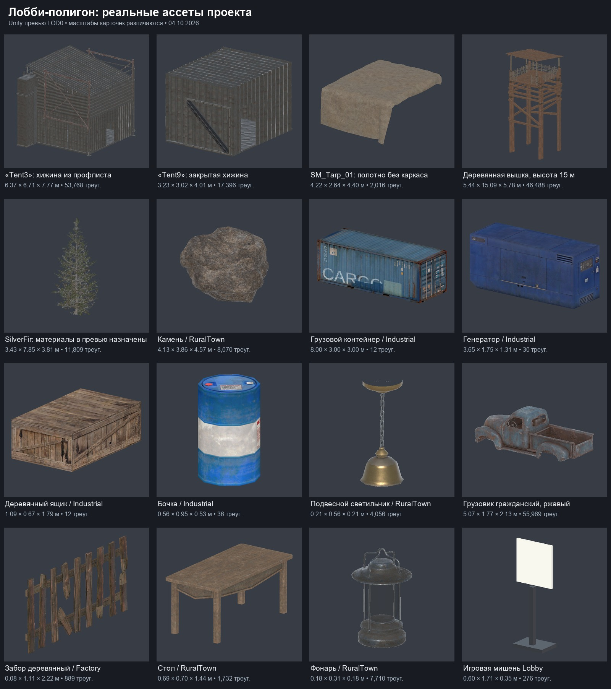
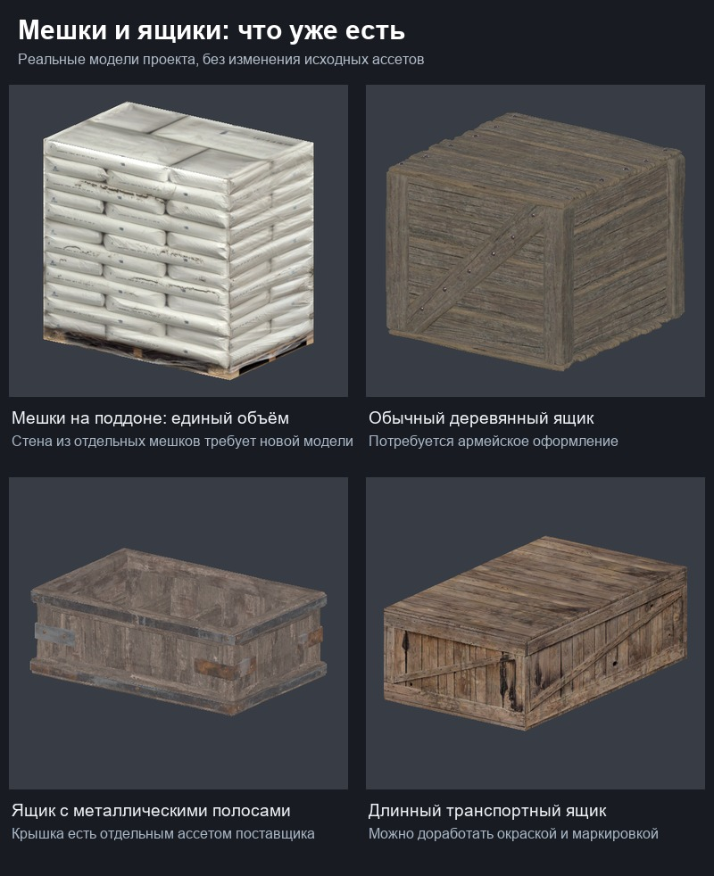

# Ассеты для военного лобби на открытом воздухе

Цель — открытое военное стрельбище с большой палаткой над игровой зоной,
арсеналами, мешками с песком и военными транспортными ящиками. Лесной полигон
рассматривается как основной визуальный вариант; окончательная композиция ещё
не принята. Подбор выполнен по текущим файлам проекта и превью Unity 04.10.2026.

Имеющиеся арсеналы, мишени и большинство фоновых декораций можно использовать
для прототипа. Ключевые недостающие модели — большая открытая каркасная палатка
и отдельные мешки для защитных стенок. Военные ящики можно подготовить на основе
существующих деревянных моделей либо добавить отдельный набор.

## Существующие ассеты

Пути ниже относительны корню проекта. «Есть» означает наличие и проверенную
загрузку выбранного образца; это не подтверждение производительности на Quest.

| Элемент | Статус | Ассет | Применение и необходимая работа |
|---|---|---|---|
| Арсеналы | Есть | `Assets/Prefabs/Arsenal/LobbyDemoArsenalStation.prefab`, `CommonOpenArsenalStation.prefab` | Использовать существующую систему выдачи оружия. Военную отделку делать отдельными материалами/вариантом оформления, сохраняя слоты и механизм развёртывания. Демонстрационный корпус шире игрового; габариты открытого и закрытого состояний учитывать при подборе палатки. |
| Оружие и магазины | Есть | `Assets/Prefabs/Weapons/`, [пресеты арсенала](../../Arsenal/arsenal-presets.md) | Каталог и выдача уже существуют; новые декоративные копии оружия для стендов не требуются. |
| Рабочая мишень | Есть | `Assets/Prefabs/Environment/Lobby/ShootingTarget.prefab` | Существующий щит с реакцией на попадание. Для сходства с концептом потребуется художественный вариант щита/силуэта и обозначения дистанций. |
| Полотно навеса | Частично | `Assets/env_packs/ModularWoodenBuildings/URP/Art/Prefabs/SM_Tarp_01.prefab` | Бежевое полотно без каркаса, примерно 4,22 × 2,64 × 4,40 м, 2016 треугольников LOD0. Подходит для небольшого вспомогательного укрытия; готовой центральной армейской палаткой не является. |
| Контейнеры | Есть | `Assets/env_packs/RPG_FPS_game_assets_industrial/Containers/Cargo_container_v1/` | Открытые/закрытые варианты. Образец `Cargo_container_v1_LD1close.prefab`: 8 × 3 × 3 м. Подходит для служебной зоны; цвет можно согласовать с армейской палитрой. |
| Генератор | Есть | `Assets/env_packs/RPG_FPS_game_assets_industrial/Other_props/Generators/Generator_v1/Generator_v1.prefab` | Фоновое оборудование лагеря; исходный корпус синий. |
| Деревянные транспортные ящики | Частично | `Assets/env_packs/RPG_FPS_game_assets_industrial/Boxes/Wooden_box_v1/` | Длинный закрытый ящик `Wooden_box_v1_LD1.prefab`, примерно 1,09 × 0,67 × 1,79 м. Основа под армейскую окраску и трафаретную маркировку; специальных металлических военных кейсов не заменяет. |
| Ящик с металлическими полосами | Частично | `Assets/env_packs/HauntedFarmHouse/URP/Art/Prefabs/SM_Crate_A_01.prefab`, `SM_Crate_Lid_A_01.prefab` | Корпус около 0,91 × 0,36 × 0,59 м. Корпус проверен в Unity, отдельная крышка найдена в проекте. Кандидат для небольшого ящика боеприпасов после оформления и проверки сборки с крышкой. |
| Бочки и поддоны | Есть | `Assets/env_packs/RPG_FPS_game_assets_industrial/Barrels/`, `Assets/env_packs/RuralTown/URP/Art/Prefabs/SM_Pallet.prefab` | Декор служебной зоны. Проверен `Barrel_v3_single.prefab`; исходная окраска сине-белая. |
| Складские мешки на поддоне | Частично | `Assets/env_packs/RPG_FPS_game_assets_industrial/Other_props/Palets/Bags_on_pallet_v1/` | Два варианта штабеля около 2,50 × 2,53 × 1,60 м. Каждый имеет 10 треугольников: отдельные мешки изображены текстурой единого объёма. Подходят для склада, но не для сборки стенки из мешков с песком. |
| Вышка | Есть | `Assets/env_packs/ModularWoodenBuildings/URP/Art/Prefabs/SM_LookoutTower_01.prefab` | Деревянная наблюдательная вышка около 15,09 м высотой; фон вне игровой зоны. 46 488 треугольников LOD0, есть LODGroup. |
| Освещение | Есть | `Assets/env_packs/RuralTown/URP/Art/Prefabs/SM_TopLight.prefab`, `SM_Lantern.prefab`; `Assets/env_packs/AbandonedFactory/Art/Prefabs/SM_Lamp_01a.prefab` | Подвесные лампы и переносной фонарь. Для современного лагеря предпочтительнее промышленный свет; RuralTown содержит также более старомодные модели. |
| Камни и мелкая растительность | Есть | `Assets/env_packs/RuralTown/URP/Art/Prefabs/SM_Rock*.prefab`, `SM_Smallrocks*.prefab`; `URP/Art/Scanned_Foliage/` | Камни, трава, папоротники и деревья для края полигона. Образец `SM_Rock_01` проверен в Unity. |
| Хвойные деревья | Частично | `Assets/env_packs/RuralTown/URP/Art/Scanned_Foliage/Foliage/SilverFir/` | Шесть FBX размеров S/M/L/XL. Прямой `SM_SilverFir_M_01.fbx` использует `Hidden/InternalErrorShader` из вложенных Meshes/Materials. Рабочие материалы уже есть в соседней папке `Materials`: `M_SilverFir_Bark_01.mat` и `M_SilverFir_Atlas_01.mat`. Назначение этих материалов проверено только на временном клоне; исходный FBX не исправлен. Нужен корректно собранный игровой префаб. |
| Поверхности земли | Частично | `Assets/env_packs/RuralTown/URP/Art/Textures/T_Ground_BC.png`, `T_Ground_N.png`, `URP/Art/Terrain/TL_Ground.terrainlayer`; PostApocalypticTown `Textures/LandscapeMaterial/`, `Terrain/TL_Dirt.terrainlayer` | Существуют текстуры грунта, грязи и песка. Материал ровного игрового пола и переходы к внешнему грунту нужно собрать под выбранную композицию. |
| Машина | Частично | `Assets/env_packs/HauntedFarmHouse/URP/Art/Prefabs/SM_Truck_01.prefab` | Ржавый гражданский пикап, 55 969 треугольников LOD0. Уместен для заброшенного лагеря; современный армейский грузовик этим ассетом не закрыт. |

## Недостающие модели

| Приоритет | Что нужно | Предлагаемый состав |
|---|---|---|
| Обязательно | Центральная армейская палатка | Широкий открытый каркас, крыша, отдельные боковины/поднятые клапаны. Размер проектировать по реальной арене и существующим арсеналам. Визуальное оформление должно учитывать защищённые физические колонны. |
| Обязательно | Мешки с песком | Отдельный мешок, небольшой прямой модуль стенки и угловой модуль. Геометрия должна давать реальный округлый контур; складской текстурный штабель для ближнего плана не годится. |
| Обязательно | Военные ящики | Как минимум длинный оружейный и небольшой ящик боеприпасов. Существующие деревянные корпуса можно оформить краской/маркировкой. Для металлических или полимерных кейсов потребуются новые модели с замками и ручками. |
| Дополнительный декор | Маскировочная сеть | Полотно над вспомогательной зоной или сбоку палатки. Подходящей модели среди найденных паков окружения нет; верёвки сами по себе её не заменяют. |
| Дополнительный декор | Земляной вал и границы стрельбища | Можно создать геометрию с существующими материалами грунта. HESCO не найден; нужен только при выборе такого визуального оформления границ. |
| Дополнительный декор | Канистры, армейская машина, таблички дистанций | Характерные военные предметы для усиления темы после центральной палатки, мешков и ящиков. |

`SM_Tent2/3/4/5/7/8/9_Merged` из PostApocalypticTown имеют вводящие в заблуждение
имена. Визуально проверенные образцы — закрытые хижины из профлиста; это не
большие брезентовые палатки. Не считать их готовым центральным укрытием.

## Бесплатные внешние кандидаты

Подбор на 04.10.2026. Это кандидаты для отбора: архивы не скачаны,
импорт в проект и проверка на Quest не выполнены. Геометрия и совместимость
ниже заявлены авторами/площадками, а не измерены в нашем Unity.

| Элемент | Кандидат | Бесплатность и лицензия | Характеристики и оценка |
|---|---|---|---|
| Отдельный мешок — проверить первым | [Sandbag \[Low Poly Realist\]](https://sketchfab.com/3d-models/sandbag-low-poly-realist-7d52600a15c747749d845d9f906045cf), Islide | Живая карточка с Download 3D Model; CC BY 4.0 | 712 треугольников, 358 вершин. Кандидат для прямых/угловых стенок. Проверить качество вблизи и надписи на текстуре. Исходный формат архива не подтверждён: скачивание требует входа в Sketchfab. |
| Лёгкий военный ящик — проверить первым | [Military Crate](https://sketchfab.com/3d-models/military-crate-ce424b2adaef4a30affd3b67047726cd), Allex_Spark | Живая карточка с Download 3D Model; CC BY 4.0 | 478 треугольников, 256 вершин; текстуры нарисованы в Blender. Деревянный ящик для повторяющихся штабелей/склада. Качество на близкой дистанции и исходный формат ещё не проверены. |
| Более подробный ящик боеприпасов | [Military Chest](https://sketchfab.com/3d-models/military-chest-b725d48377aa4acfa5ae283742d34a37), BaBaBoy | Живая карточка с Download 3D Model; CC BY 4.0 | Около 14,1 тыс. треугольников, 7 тыс. вершин. Автор заявляет реалистичные материалы. Проверить для нескольких предметов возле арсенала; для массового размещения потребуется оптимизация. Формат и открывающаяся крышка не подтверждены. |
| Армейская палатка с подтверждённым FBX | [military tent / палатка военная](https://sketchfab.com/3d-models/military-tent-3a9f25bae3fa4f28aafcfb9df90f4694), teanid | Живая карточка с Download 3D Model; CC BY 4.0 | Автор указывает FBX, 20 776 треугольников, один материал; есть тег текстур 4K. Кандидат для переделки. Открытые боковины, внутренний каркас и габариты не подтверждены; готовым центральным навесом не считать. |
| Запасная армейская палатка | [Game ready Military Tent Unity](https://sketchfab.com/3d-models/game-ready-military-tent-unity-7f11fd2d05a544d285dd157d9a7f8e77), shokhrukhx | Живая карточка с Download 3D Model; CC BY 4.0 | Около 12,5 тыс. треугольников, 6,4 тыс. вершин; автор описывает палаточные казармы. Формат, интерьер и возможность открыть боковины не подтверждены. Unity в названии не доказывает совместимость с нашим URP. |
| Бесплатный Unity-пак лагеря | [Military FREE – Low Poly 3D Models Pack](https://assetstore.unity.com/packages/3d/environments/military-free-low-poly-3d-models-pack-260358), ithappy | FREE; Standard Unity Asset Store EULA | Заявлены Unity 6/URP. [Издатель](https://ithappystudios.com/free/military-free/) перечисляет палатку, ящики, генератор, радиостанцию, барьеры, мишень, вышку и технику; около 26 тыс. треугольников на пакет, три материала/текстуры. Для стилизованного прототипа. Страницы издателя и CGTrader расходятся в количестве моделей — точный состав сверить после импорта. |
| Unity-пак лагерного декора | [Adventure demo kit](https://assetstore.unity.com/packages/3d/props/adventure-demo-kit-330860), HunterCraft Creations | FREE; Standard Unity Asset Store EULA | Заявлены URP/Built-in/HDRP, палатка, стол, табурет, нож, масляный цилиндр; шесть meshes/prefabs и девять текстур 4K. Диапазон 128–4000 **полигонов**, не подтверждённых треугольников. Тип палатки и пригодность для центральной арены требуют проверки. |
| Запасной стилизованный лагерь | [Low Poly Military Base Pack 3D](https://zsky2000.itch.io/military-base-pack), Zsky | Name your own price, бесплатная загрузка; CC BY 4.0 | ZIP 6,7 МБ, больше 20 моделей, включая медицинскую палатку, казармы и вышку. Форматы/геометрия на странице не указаны. Альтернатива для отдельного стилизованного направления после проверки файлов. |

Рекомендуемый порядок отбора: мешок Islide и ящик Allex_Spark, затем палатка
teanid с FBX и запасная палатка shokhrukhx. Military FREE — альтернатива для
стилизованного прототипа. Большая открытая палатка в размерах нашей арены
среди проверенных бесплатных карточек пока не подтверждена: вероятна
переделка боковин/каркаса или отдельное моделирование.

[CC BY 4.0](https://creativecommons.org/licenses/by/4.0/) разрешает коммерческое
использование и переработку с указанием автора, ссылки на источник/лицензию
и отметкой об изменениях. При скачивании сохранить лицензию и авторство вместе
с ассетом. Для Asset Store действует лицензия карточки. Если Sketchfab даст
только GLB/glTF, потребуется подходящий импортёр или конвертация в FBX;
наличие исходного FBX без подтверждения не предполагать.

3D-превью Sketchfab в исследовательском браузере не загрузились. По живым
страницам проверены наличие карточек, кнопки скачивания, лицензии и геометрия;
это не визуальная проверка моделей. Материалы URP, масштаб, двусторонность
полотна, раздельные элементы, текстуры, LOD и стоимость отрисовки проверять
после изолированного импорта. Малое число треугольников само по себе
не подтверждает пригодность для Quest.

### Отсеянные результаты поиска

- [Realistic Sandbags](https://assetstore.unity.com/packages/3d/props/exterior/realistic-sandbags-95964): снят с Unity Asset Store; новый пользователь получить его не может. Доступ может сохраняться у прежних владельцев.
- [Military Tent (Ready for Unreal Engine)](https://sketchfab.com/3d-models/military-tent-ready-for-unreal-engine-0f53aabd53584abd85a442e5692eb1aa) и [Army Tent (Ready for Unreal Engine)](https://sketchfab.com/3d-models/army-tent-ready-for-unreal-engine-008c41ba07844549b4827684b184be88), G4AGamingLabs: поиск показывает старые бесплатные карточки, но живые страницы сообщают `Model deleted`.
- [Military Tent](https://sketchfab.com/3d-models/military-tent-016f79c835e7427a83c434a9d5e8165e), dark-minaz: бесплатный CC BY, около 13,2 тыс. треугольников; автор сообщает об отсутствии интерьера. Для центральной игровой палатки не выбран.
- [Low poly military base tent](https://www.fab.com/listings/a300adee-662d-44fd-b525-9310ecfe041f), kartsa: бесплатная карточка с FBX, но поле лицензии в доступном представлении пустое. До подтверждения лицензии не входит в рекомендуемый набор.
- [Military tent hangar](https://sketchfab.com/3d-models/military-tent-hangar-409eb523e1d345adb7b3bb29a96d3be9): в индексированной карточке CC BY-NC и около 166,2 тыс. треугольников; не выбран для коммерческого Quest-проекта.

## Визуальные доказательства

Измерения и результаты загрузки:
[16 основных образцов](../asset-review/lobby-field-range-assets-2026-10-04.json),
[4 образца мешков и ящиков](../asset-review/lobby-sandbags-crates-2026-10-04.json).
Размеры записаны как X × Y × Z, треугольники — выбранные Renderer LOD0, а не
сумма всех уровней LOD. Каждый предмет на листе превью вписан отдельно;
карточки не показывают взаимный масштаб.

## Проверка и следующий срез

В Unity проверены загрузка 20 выбранных образцов, геометрия, размеры и материалы
в изолированных превью. Неразрешённых/неподдерживаемых материалов в этих превью
нет; для SilverFir это результат назначения существующих материалов только
временной копии. Отдельно загружены игровые арсенал и мишень. Активная сцена
до и после — `Assets/Scenes/Lobby.unity`, `isDirty` до и после — `false`.
Сцены, игровые префабы и исходные материалы этим подбором не изменены.

Далее — выбрать способ получения палатки, отдельных мешков и военных ящиков,
после чего собрать небольшой художественный прототип в размерах текущей арены.
В сгенерированных концептах мишени показаны в одном направлении; существующее
лобби имеет стрельбище вокруг арены. Этот подбор не утверждает смену планировки.
Совпадение с физической ареной, эргономика арсеналов, окончательная композиция,
окклюзия и производительность на Quest требуют отдельной проверки после сборки.
