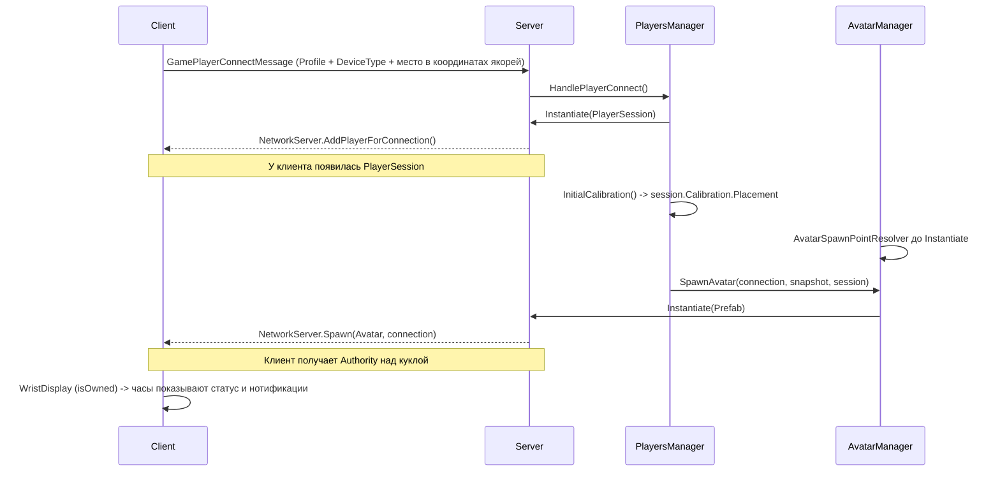

# Архитектура Сессий и Аватаров (Session & Avatar Architecture)

Данный документ описывает новую разделенную архитектуру сетевой сущности игрока, внедренную в проекте. Ранее физический аватар (кукла UltimateXR) был монолитным объектом, представляющим собой `NetworkIdentity` игрока. Это вызывало проблемы при смерти, переподключениях и смене скинов.

## Концепция разделения: Session vs Avatar

На постоянном `SessionContext` живёт `MapRunAuthority` — единственный издатель целого `MapRunSnapshot` текущего запуска карты. Штатный `GameNetworkManager.OnStartServer` спавнит этот же префаб; компонент получает session epoch через обычный Mirror lifecycle. Подписка сразу отдаёт текущий descriptor; dedicated server публикует коммит напрямую, host получает один SyncVar hook. Запуск карты собирает `MapBootstrap` ([устройство](game-manager.md#запуск-карты-mapbootstrap)). **Создание аватара на карте реестра ждёт server Ready**: `AvatarManager.SpawnAvatar` и пересоздание тела после смены карты идут через `MapRunAdmission.TryAdmitAvatar` — до готовности запрос откладывается (один на сессию) и выполняется по допуску; сессия `PlayerSession` создаётся сразу, как раньше.

Сетевое присутствие игрока теперь разделено на два компонента:

### 1. `PlayerSession` (Душа / Сетевой контроллер)
- **Сущность:** Легковесный сетевой объект (Prefab `PlayerSession`), который выдается сервером каждому подключенному клиенту через `NetworkServer.AddPlayerForConnection`.
- **Жизненный цикл:** Создается один раз при подключении к серверу. Не уничтожается при загрузке новых сцен или перерождениях.
- **Ответственность:** 
  - Хранение метаданных игрока (Команда, Индекс, Счет, Статус готовности).
  - Хранение ролей устройства (`ClientDeviceType`: VR, PC, Спектатор).
  - Удержание RPC-каналов общения с сервером независимо от того, есть ли у игрока физическое тело на карте.
  - Сохранение ссылки на текущий активный аватар (`ActiveAvatar`).

---

## Связь сессия ↔ аватар (T-11)

Связь двусторонняя и **реплицируется целиком**, поэтому «где мой аватар» может спросить
и клиент, а не только сервер. Раньше она была собрана из двух разнородных половин:
`[SyncVar] PlayerController.SessionNetId` в одну сторону и обычное C#-свойство
`ActiveAvatar` в другую, из-за чего на клиенте ссылка всегда была `null`, а клиентский
код угадывал аватар в `NetworkClient.localPlayer` (там лежит сессия) и ошибался.

| Что | Где | Роль |
|---|---|---|
| `[SyncVar(hook)] uint ActiveAvatarNetId` | `PlayerSession` | Источник правды о связи. Ставит только сервер. `0` — аватара нет |
| `PlayerController ActiveAvatar` | `PlayerSession` | Разрешённая ссылка. Кэш + отложенное разрешение по netId |
| `[SyncVar(hook)] uint SessionNetId` | `PlayerController` | Обратная сторона связи |
| `PlayerSession Session` | `PlayerController` | Кэш, заполняется в `OnStartServer`/`OnStartClient` |
| `static event LocalAvatarChanged` | `PlayerSession` | Аватар локального игрока появился, сменился или исчез |

**Порядок спавна не гарантирован**, поэтому связь закрывается с обеих сторон:

- хук `ActiveAvatarNetId` разрешает netId, если аватар уже в `spawned`;
- иначе аватар, стартовав, сам зовёт `PlayerSession.NotifyAvatarSpawned` из
  `OnStartClient`/`OnStartServer` — но только если его `netId` совпадает с
  `ActiveAvatarNetId` (авторитет остаётся за сервером);
- сверх того геттер `ActiveAvatar` разрешает netId лениво, если кэш пуст.

**Важно для серверного кода:** `session.ActiveAvatar = avatar` присваивать строго
**после** `NetworkServer.Spawn(avatar, conn)` — до спавна `netId` равен нулю, и клиенты
получат пустую связь. Присвоение до спавна пишет предупреждение в лог.

Хук `SyncVar` на сервере Mirror вызывает только в host-режиме (`NetworkServer.activeHost`),
поэтому на выделенном сервере связь проставляет сеттер свойства, а не хук.

### 2. Физический Аватар (Кукла / Тело)
- **Сущность:** Тяжелый префаб (например, `PlayerControllersCyborgAvatar` или `Military_Soldier_Base_Avatar`), содержащий `UxrActor`, логику передвижения, рендереры рук и HUD-интерфейсы.
- **Жизненный цикл:** Создается и уничтожается по требованию (Respawn, смена скина). Выдается клиенту просто с правами **клиентского авторитета** (`client authority`), но НЕ является главным объектом игрока (`isLocalPlayer=false` для куклы).
- **Ответственность:**
  - Физика гравитации, получение урона (`UxrActor`).
  - IK-анимации, захват предметов (VR Grab).
  - Наручные часы — весь HUD игрока (`WristDisplay`, видны только хозяину; T-46).

---

## Подсистема управления Аватарами (Avatar Subsystem)

Настройка и спавн физических аватаров управляется отдельной подсистемой:

*   **`AvatarData` (ScriptableObject):** Конфигурация скина (имя, префаб, иконка).
*   **`AvatarRegistry` (ScriptableObject):** Реестр всех доступных в игре скинов.
*   **`AvatarManager`:** Singleton в игровой сцене. Управляет запросами от сессий на спавн аватаров, их замену и уничтожение.
*   **`AvatarSpawnStrategy` / `TeamAvatarStrategy`:** Паттерн "Стратегия", позволяющий определять алгоритм выдачи аватара (например, разные скины для Террористов и Спецназа).
*   **`AvatarSpawnPointResolver`:** Отвечает на вопрос «**где** создавать», пока стратегия отвечает на «**что** создавать». Порядок поиска: `TeamSpawnZone` нужной команды → `NetworkStartPosition` из Mirror → начало координат с предупреждением в лог.

### Где создаётся аватар (находка WPN-03)

`ChangeAvatar` обслуживает три разных события, и правильная точка у каждого своя. Правило над всеми: **игра не двигает живого игрока** — ни смена скина, ни смена команды, ни респавн (`PlayerController.Respawn()` точки не принимает). Телепорт только у разработчика (`PlayerController.ServerDevTeleport`: сценарии яруса C и телепорт режима отладки — по id точки, с проверкой прав админа на сервере, см. `ui-menu-architecture.md`):

| Событие | Откуда позиция | Почему |
|---|---|---|
| Смена скина внутри карты | у живого старого аватара | игрок стоит там, куда пришёл сам; смена внешности не повод его телепортировать |
| Пересоздание после смены карты, игрок **не откалиброван** | зона спавна своей команды; без команды режима этой сцены (пришёл из лобби, ещё не выбрал) — нейтральная точка, начало координат, лог `Info` | старого аватара нет — Mirror уничтожил его вместе со сценой, а `GameNetworkManager.OnServerReady` зовёт `ChangeAvatar` заново. Где игрок внутри арены, игра не знает, и зона — разумное «где угодно» |
| Пересоздание после смены карты, игрок **откалиброван** | его собственное место, пересчитанное через якоря новой карты | место задано физически: игрок стоит в комнате. Перенос на базу расклеил бы картинку с телом (CAL-01, T-30) |
| Смена команды | у живого старого аватара (этап Б) | игрок физически стоит в зале, его место задано калибровкой; выбор команды на карте — действие в меню, а не перенос. Раньше (WPN-03) переносило в зону новой команды — это расклеивало картинку с телом. В свою зону игрок приходит сам |

### Место откалиброванного игрока (CAL-01)

Точку до `Instantiate` считает сервер из `PlayerSession.Calibration.Placement`.
Это поза корня трекинга, а не положение головы: игрок ходит внутри неё по физической комнате.
Принятая калибровка по якорям даёт серверу целевую позу сразу, без ожидания
`NetworkTransform`. Смена модели, команды и карты использует один `AvatarSpawnPointResolver`.

`PlayerPlacement` различает отсутствие места, мировую позу и позу относительно якорей.
Откалиброванный игрок переносит привязку через якоря новой карты; при отсутствии якорей
мировой fallback допустим только на карте захвата. Неоткалиброванный при смене карты
остаётся в прежнем мире — арены проекта выровнены, а в зоне команды он появляется впервые.
`SpawnPlaceRegistry` — фасад без словаря: при `MapLoadStarted` передаёт захват владельцу
сессии, пока старая сцена жива. Принятая anchor-pose не затирается запаздывающим корнем.

### Место игрока на пути подключения (CAL-02)

`GamePlayerConnectMessage` несёт целую калибровку с `Placement` из памяти машины.
`PhysicalSpaceSyncManager` ведёт замер, а `PlayerPlacementTracker` наблюдает SDK-переносы
связанного текущего тела: сервер пишет через единственный вход сессии, свой клиент обновляет
память подключения. Отдельных saved-place полей процедуры нет. Перевод в якоря делается
на карте захвата, до её выгрузки.

`PlayersManager.InitialCalibration` выбирает калибровку клиента либо снимок сервера, если
клиент после перезапуска не имеет данных. Живой server world-snapshot той же карты сохраняет
своё место; чужую мировую позу сообщения подключения переносить между картами нельзя.
Калиброванная anchor-pose разрешается в новой системе якорей. Здоровье восстанавливается
по прежним правилам, независимо от положения; умерший snapshot не восстанавливает жизнь.

Единый порядок спавна: `Calibration.Placement` → зона команды → `NetworkStartPosition`
→ начало координат. Отдельного override позиции в `AvatarManager` нет.

**На картах проекта нет ни одного `NetworkStartPosition`** — вторая ступень поиска существует
только как запасной вариант для будущих карт. Единственные реальные точки спавна —
`TeamSpawnZone` внутри префаба окружения карты.

---

## Диаграмма потока данных (Spawn Lifecycle)

---

## Интеграция с Игровыми Режимами (Game Modes)

С внедрением `PlayerSession` все игровые режимы (`EliminationMode`, `RespawnMode`) и менеджеры раундов (`RoundPhases`) были переписаны:
1. Подсчет очков и фрагов ведется путем запросов атрибутов из `PlayerSession`, а не из физического `PlayerController`.
2. Если аватар уничтожается и пересоздается ради смены скина, сохраненный счетчик побед остается нетронутым в сессии.
3. События смерти `UxrActor` перенаправляются в сессию для обработки правил респавна `MapReferee`.

## Восстановление сессий (Session Recovery)
Скомпонован `SessionRecoveryManager`, закладывающий фундамент для функционала реконнектов: позволяет при кратковременном обрыве связи клиенту переподключиться и "занять" свою старую `PlayerSession`, сохраняя счет и текущую команду.

**У снимков есть срок годности (T-20, находка NET-10).** Раньше запись удалялась только при
удачном переподключении того же `deviceToken`, поэтому ушедшие насовсем копились всё время
жизни сервера, а снимок любой давности применялся к новому подключению как свежий. Теперь
`SessionSnapshot` помнит время сохранения, а менеджер настраивается из инспектора:

| Поле | Умолчание | Смысл |
|---|---|---|
| `_snapshotLifetimeMinutes` | 7 | Сколько минут ждать вернувшегося игрока. Ноль и меньше — ждать вечно. |
| `_maxStoredSnapshots` | 32 | Потолок хранилища; при переполнении выбрасывается самый старый снимок. |

Уборка идёт при сохранении и **перед выдачей**: так протухший снимок не вернётся даже в тот
кадр, когда таймер ещё не сработал. Вернувшийся позже срока заходит как новый игрок.
Персистентности нет — это память одного матча.

## Калибровка и пропорции игрока (T-50, T-14)

`PlayerSession.Calibration` — серверный снимок `PlayerCalibration`: смещение пола в метрах,
рост глаз в метрах (0 — рост не измерен), признак калибровки по якорям и поза корня трекинга. Значения переживают
смену модели, карты и переподключение. Единственный серверный писатель —
`ServerAcceptCalibration`; `PlayerCalibrationRules` ограничивает пол до ±1,5 м, измеренный
рост до 0,9–2,5 м и отклоняет нечисловые данные. Живой игрок не меняет калибровку во время
боя режима без калибровки; первичное восстановление при подключении от этого запрета не зависит.

`PhysicalSpaceSyncManager` ведёт процедуру (пол → рост, якоря) и передаёт замеры в
`LocalPlayerCalibration.Submit`. Своя сессия вызывает `RequestCalibration`, нормализует
предсказание и отправляет команду серверу. Значение и номер обработанного запроса реплицируются
через SyncVar; ответ снимает предсказание, при отказе аватар возвращается к серверному значению.
`LocalPlayerCalibration.Adopt` запоминает решение сервера для следующего подключения.

К аватару значения применяет только `AvatarCalibrationApplier`, добавляемый в рантайме.
Камерный пивот = база + пол, `Dummy Forward` = рост глаз / `EyesBaseHeight` этой модели,
поля `UxrBodyIK` = исходные значения × масштаб. Повторное применение не накапливает дельт.
Корень `UxrAvatar` не масштабируется, чтобы не менять расстояния двуручного хвата.
`UxrControllerTracking.HeightOffset` — runtime-поле конкретного устройства (SDK-патч 54).
Его пишет тот же применитель только у своего аватара, включая выключенные устройства,
определённого по `PlayerSession.isLocalPlayer`; глобальный `UxrAvatar.LocalAvatar` при смене
модели ещё может ссылаться на старую. На выделенном сервере применяется тот же снимок явно:
масштаб и пол влияют на коллайдеры попаданий, а SyncVar-хук серверу не гарантирован.

Начальное значение передаётся в `GamePlayerConnectMessage` **до спавна сессии**.
`SessionSnapshot` хранит калибровку целиком. Если клиент принёс локальную запись, сервер
нормализует её; если записи нет, восстанавливает снимок.
После перезапуска процесса клиент без локальной записи не публикует пустое значение поверх
снимка. При приходе данных спавна он принимает решение сервера.

Этап 4: два якоря дают одну целевую root-pose и признак одним `Submit`.
SDK55 `MoveAvatarRootTo` синхронизирует точный корень, сохраняя camera-local pose на каждой машине;
штатный camera-floor replay зависит от запаздывающей камеры получателя. Предсказание и откат
не испускают SDK-событий: один автор `StateEventAuthority` публикует перенос после принятого
ответа на последний запрос. Наблюдатель подавлен на время применения; обновление архива
placement само по себе не телепортирует тело. Повторный принятый ответ не повторяет перенос.

Контракт и приёмка: [T-50](tasks/T-50-player-calibration-owner.md),
[этап 4](tasks/T-50-stage4-design.md).

## Времена жизни менеджеров (T-17)

Двенадцать синглтонов с несовпадающими временами жизни — корень 5 архитектурного разбора.
Ниже для каждого ответ на два вопроса: где появляется и до каких пор живёт.

**Порядок инициализации задан в одном месте** — `Managers/ManagerOrder.cs`. Числа оттуда
подставляются в `[DefaultExecutionOrder]` на самих менеджерах, поэтому очередь `Awake`
не зависит от порядка объектов в префабе. Пара «константа ↔ атрибут» расходится молча,
её стережёт `ManagerInitOrderTests`.

| Менеджер | Где появляется | До каких пор живёт | `Instance` пуст, когда |
|---|---|---|---|
| `PersistentRoot` | префаб `--- MANAGERS ---`, сцена `Offline` | до конца процесса | никогда после `Offline` |
| `PlayersManager` | там же, дочерний объект | до конца процесса | никогда после `Offline` |
| `SessionRecoveryManager` | **нигде не размещён** | — | **всегда** — см. находку ARCH-01 |
| `AvatarManager` | префаб `--- MANAGERS ---` | до конца процесса | никогда после `Offline` |
| `MapLoader` | префаб `--- MANAGERS ---` | до конца процесса | никогда после `Offline` |
| `PhysicalSpaceSyncManager` | корень префаба `--- MANAGERS ---` | до конца процесса | никогда после `Offline` |
| `GameNetworkManager` | префаб `--- MANAGERS ---` | до конца процесса | никогда после `Offline` |
| `DebugOrchestrator` (только редактор) | создаётся сам в начале Play (`RuntimeInitializeOnLoadMethod`), `DontDestroyOnLoad` | до конца Play | если выключен в Bootstrap Settings |
| `SessionManager` | спавн `SessionContext` в `GameNetworkManager.OnStartServer` | до остановки сервера | пока сервер не поднят |
| `NetworkStateRelay` | тот же объект `SessionContext` | до остановки сервера | пока сервер не поднят |
| `Series` | тот же объект `SessionContext` — серия карт и общий счёт | до остановки сервера | пока сервер не поднят |
| `MapRunAuthority` | тот же объект `SessionContext` — описание запуска карты | до остановки сервера | пока сервер не поднят |
| `MapBootstrap` | компонент `MapRoot` **в сцене** карты реестра или отладочного стенда каталога | до выгрузки сцены | в Offline, в окне смены сцены и на стендах без `MapRoot` |
| `MapReferee` | спавн из `MapBootstrap` (`MapRuntimeCatalog`) в сцену карты; сценового судьи нет нигде | до выгрузки сцены (`MapRunScope` снимает его с сети) | в Offline, в окне смены сцены и до CompositionReady |
| `GameMode` (`WarmupMode`/`EliminationMode`/`RespawnMode`) | спавн из `MapReferee`: разминка — по `ServerStartRun` после CompositionReady, режим матча — по «Начать матч» на месте | до смены режима на карте или выгрузки сцены | в окне смены режима и смены сцены |

Читать таблицу так: пустой `Instance` у постоянных менеджеров (до `Series` включительно) — это
сбой, о нём пишет `ManagerBootstrap`. Пустые ссылки у объектов сессии и сцены ниже — норма в
названных окнах, и код обязан их переживать без предупреждений.

### Готовность вместо угадывания

`ManagerBootstrap` (`Managers/ManagerBootstrap.cs`) держит объявленный состав постоянных
менеджеров, проверяет его в `PersistentRoot.Start` (первый `Start` сцены гарантированно
позже последнего `Awake`) и один раз поднимает `Ready`. Опоздавший подписчик не теряет
сигнал — обработчик вызывается прямо при подписке.

Менеджеры он **не создаёт**: они лежат готовыми компонентами на префабе, и создаёт их Unity.
Порядок задаётся атрибутами, здесь — объявление состава и проверка, что он соблюдён.

Два места, где угадывание убрано:

- **`MapLoader.DeferredLoadMap`** ждал первого `PlayerConnected` с таймаутом 5 секунд.
  Таймаут стоял ради Server-only режима без host-клиента: ждать некого, и каждая загрузка
  стоила пять секунд и предупреждение в лог. Теперь условие названо — `ConnectionsSettled()`:
  ни одно соединение не находится в середине `AddPlayer`, то есть нет соединения с `isReady`
  и без `identity`. Соединение, ещё не ставшее `isReady`, не ждём намеренно: оно `AddPlayer`
  не начинало и после `ServerChangeScene` пройдёт путь заново, а ожидание такого клиента
  вешало бы загрузку навсегда на роли наблюдателя (она сессию не создаёт вовсе).
- **`DebugOrchestrator.RetryStartGameplayCoroutine`** («попробуем через кадр») заменена
  подпиской `MapReferee.SubscribeToInstance`. Оркестратор матча живёт в сцене карты
  и появляется позже; подписка отдаёт уже существующий экземпляр немедленно, поэтому
  порядок «подписались раньше / позже загрузки» роли не играет.
