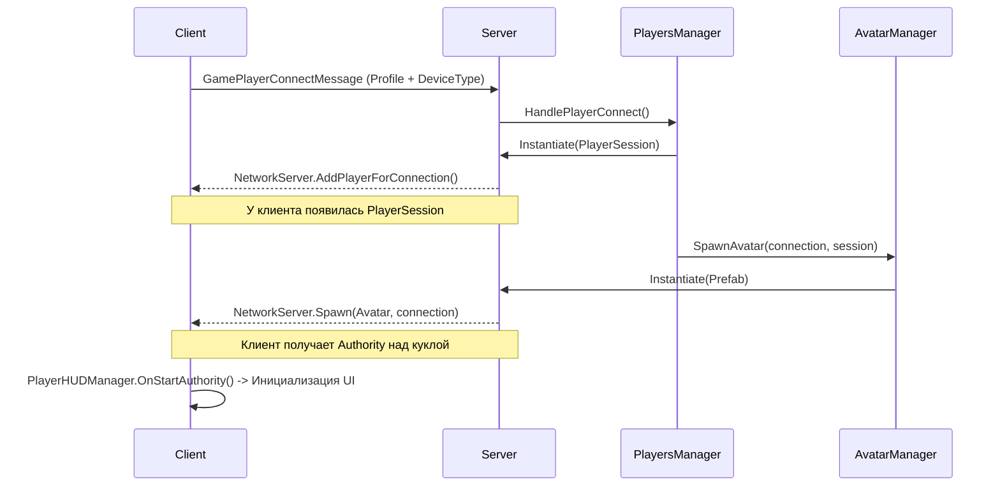

# Архитектура Сессий и Аватаров (Session & Avatar Architecture)

Данный документ описывает новую разделенную архитектуру сетевой сущности игрока, внедренную в проекте. Ранее физический аватар (кукла UltimateXR) был монолитным объектом, представляющим собой `NetworkIdentity` игрока. Это вызывало проблемы при смерти, переподключениях и смене скинов.

## Концепция разделения: Session vs Avatar

Сетевое присутствие игрока теперь разделено на два компонента:

### 1. `PlayerSession` (Душа / Сетевой контроллер)
- **Сущность:** Легковесный сетевой объект (Prefab `PlayerSession`), который выдается сервером каждому подключенному клиенту через `NetworkServer.AddPlayerForConnection`.
- **Жизненный цикл:** Создается один раз при подключении к серверу. Не уничтожается при загрузке новых сцен или перерождениях.
- **Ответственность:** 
  - Хранение метаданных игрока (Команда, Индекс, Счет, Статус готовности).
  - Хранение ролей устройства (`ClientDeviceType`: VR, PC, Спектатор).
  - Удержание RPC-каналов общения с сервером независимо от того, есть ли у игрока физическое тело на карте.
  - Сохранение ссылки на текущий активный аватар (`ActiveAvatar`).

### 2. Физический Аватар (Кукла / Тело)
- **Сущность:** Тяжелый префаб (например, `PlayerControllersCyborgAvatar` или `Military_Soldier_Base_Avatar`), содержащий `UxrActor`, логику передвижения, рендереры рук и HUD-интерфейсы.
- **Жизненный цикл:** Создается и уничтожается по требованию (Respawn, смена скина). Выдается клиенту просто с правами **клиентского авторитета** (`client authority`), но НЕ является главным объектом игрока (`isLocalPlayer=false` для куклы).
- **Ответственность:**
  - Физика гравитации, получение урона (`UxrActor`).
  - IK-анимации, захват предметов (VR Grab).
  - Рендеринг локального HUD-интерфейса (`PlayerHUDManager.OnStartAuthority`).

---

## Подсистема управления Аватарами (Avatar Subsystem)

Настройка и спавн физических аватаров управляется отдельной подсистемой:

*   **`AvatarData` (ScriptableObject):** Конфигурация скина (имя, префаб, иконка).
*   **`AvatarRegistry` (ScriptableObject):** Реестр всех доступных в игре скинов.
*   **`AvatarManager`:** Singleton в игровой сцене. Управляет запросами от сессий на спавн аватаров, их замену и уничтожение.
*   **`AvatarSpawnStrategy` / `TeamAvatarStrategy`:** Паттерн "Стратегия", позволяющий определять алгоритм выдачи аватара (например, разные скины для Террористов и Спецназа).

---

## Диаграмма потока данных (Spawn Lifecycle)

---

## Интеграция с Игровыми Режимами (Game Modes)

С внедрением `PlayerSession` все игровые режимы (`EliminationMode`, `RespawnMode`) и менеджеры раундов (`RoundManager`) были переписаны:
1. Подсчет очков и фрагов ведется путем запросов атрибутов из `PlayerSession`, а не из физического `PlayerController`.
2. Если аватар уничтожается и пересоздается ради смены скина, сохраненный счетчик побед остается нетронутым в сессии.
3. События смерти `UxrActor` перенаправляются в сессию для обработки правил респавна `GameplayManager`.

## Восстановление сессий (Session Recovery)
Скомпонован `SessionRecoveryManager`, закладывающий фундамент для функционала реконнектов: позволяет при кратковременном обрыве связи клиенту переподключиться и "занять" свою старую `PlayerSession`, сохраняя счет и текущую команду.
