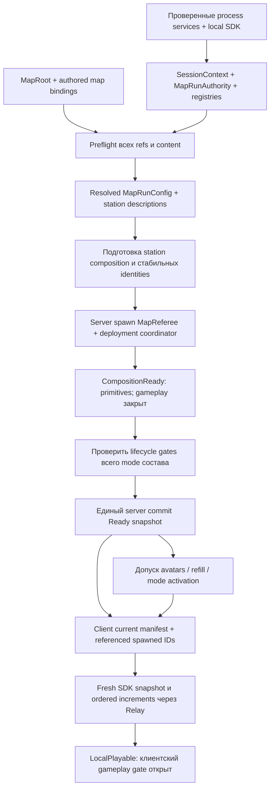

# MapRunConfig и MapBootstrap: единый запуск карты

| Цель | Мы здесь | Осталось | Технический документ |
|---|---|---|---|
| Новая карта запускается из обязательного описания и не требует ручного размещения служебных менеджеров | Первый срез: immutable config/resolver/scope, единый wire snapshot и инертный MapRunAuthority на SessionContext; 20/20 временных probes, Android PASS, исправление teardown принято ревью | Полный baseline lifecycle, native MapRoot/catalog adapters, generator binding handoff, composition/mode gates, Relay identity, миграция, принятие Unity/шлем, постоянные tests | Этот документ; [план](map-runtime-bootstrap-plan.md) |

Дата состояния: 2026-10-05. Контрактный и authoring срезы применены в активном worktree. Runtime composition/admission, mode/Relay gates и миграция остаются впереди. Актуальная передача: [handoff](map-runtime-bootstrap-handoff.md). Действующие AGENTS.md имеют приоритет.

### Реализованный первый срез

Продолжение 2026-10-05: MapRoot authoring entry, native MapRuntimeCatalog и read-only MapRunPreflight реализованы; canonical MapData kind/debug exemptions пока не назначены адресно существующим assets. Root14/0 и adversarial6/0 проверяют canonical asset refs, placement/hierarchy, полные serialized identity namespaces и named failures. [Android PASS (локально)](report/map-runtime-bootstrap/android-authoring-final.json). Runtime bootstrap/admission/actor hooks не применены после автоматического отказа разрешений; [пакет интеграции](map-runtime-bootstrap-runtime-integration.md) остаётся отдельным gate. Новых gameplay guarantees по этим authoring checks нет.

`Assets/Scripts/Maps/Runtime/` содержит MapRunConfig/Key/MatchIntent/StationConfig, MapRunSnapshot с явным bounded Mirror serializer, MapRunResolver и MapRunScope. MapRunAuthority добавлен единственным компонентом на существующий SessionContext; штатный Spawn уже вызывает его OnStartServer. Публичного setter descriptor нет. BeginRun принимает только следующую sequence текущей server session, CommitPrepared проверяет scope identity и revision и публикует лишь CompositionReady. Fail/Retire закрывают scope и выполняют teardown в обратном порядке. Начало gameplay и Ready этим API не разрешаются.

Resolver принимает защищённые data-only MapRunResolverCatalog/MapRunBindings. Native adapters MapRuntimeCatalog/MapRoot уже реализованы; до production run остаются installed catalog, registration/composition и admission proofs. Source assets и меню не становятся wire references. Поля kind/debug exemptions на MapData существуют; существующие assets ещё не мигрированы.

Временный `MapRunContractProbe` (2026-10-07 перенесён в постоянные `MapRunContractTests` и удалён) проверил 18 invariants: immutable copies, unknown IDs/hash/duplicates, explicit fallback/NoMatch, reverse teardown, revision/scope/session rejection, полный Mirror writer/reader, настоящую отдельную initial SyncVar deserialize и одиночное уведомление host. [Отчёт (локально)](report/map-runtime-bootstrap/contracts.json), [Android (локально)](report/map-runtime-bootstrap/android-contracts.json), [SessionContext readback (локально)](report/map-runtime-bootstrap/session-context.json). Это socketless server и local host pair, без двух удалённых процессов и SDK Relay.

Ревью нашло reentrant BeginRun из callbacks отмены/освобождения. Один temporal probe выполнил реальные Retire и NetworkServer.UnSpawn: [2/2 RED (локально)](report/map-runtime-bootstrap/teardown-red.json) → guard записи на время disposal и invalidation session до stop → [2/2 GREEN (локально)](report/map-runtime-bootstrap/teardown-latest.json). Stop публикует локальный Retiring до cancellation; callbacks не создают новую generation. Повторные 18/18 contract probes и [финальный Android (локально)](report/map-runtime-bootstrap/android-final.json) PASS. Malformed-wire probe пока проверяет version rejection; полная cross-field validation будущих Ready/mode statuses остаётся работой следующего среза.

[Существующие EditMode-группы (локально)](report/map-runtime-bootstrap/existing-tests.xml): 20/21 PASS. `PrefabCompositionTests.У_каждого_аватара_один_Legs_Animator_на_humanoid_риге` отказал: Optimized_MEF_Player, Optimized_MEF_Player_Black и PlayerControllersCyborgAvatar имеют ноль LegsAnimator/мостов. Их assets этим срезом не менялись, ожидание не переписывалось. MCP job сообщил init timeout до позднего native RunStarted; завершённый XML сохранён отдельно. Общий regression GREEN не заявляется.

[Baseline (локально)](report/map-runtime-bootstrap/baseline.json) воспроизвёл partial ManagerBootstrap Ready и замену текущей ссылки старым mode. [Дополнительные четыре source probes (локально)](report/map-runtime-bootstrap/lifecycle-baseline.json) теперь воспроизведены в socketless preview fixture: ранняя попытка refill, cleanup кандидата, отсутствие descriptor при initial server lifecycle без SceneChanged и future Selection → GoLive. Минимальный mode factory измерял выбор, не policies; full process SDK startup и remote delivery не заявляются. Gameplay исправления ещё впереди. [Source snapshot (локально)](report/map-runtime-bootstrap/source-baseline.json) сохраняет hashes и foreign dirty список; [native inventory (локально)](report/map-runtime-bootstrap/native-inventory-summary.json) подтвердил world transforms и serialized identities шести карт без коллизий, actual runtime registrations остаются отдельным proof. Generator-owned ArsenalStationCompositionBinding уже существует и foundation producer принят root; второй key writer не создаётся.

## Задача и границы

Автор карты задаёт паспорт карты, Environment, Gameplay, PhysicalArenaLayout и точки размещения. Обязательные служебные системы собирает и запускает MapBootstrap. Сервер разрешает одно описание запуска; все потребители читают его либо неизменяемые производные. Пропущенная зависимость становится именованным отказом до выдачи оружия, спавна аватара и начала режима.

MapBootstrap отвечает за composition, проверку зависимостей, активацию и teardown одной карты. Раунды, урон, торговля, команды, анимация станций, серия и физическая калибровка остаются у своих владельцев. Генератор арсенала, его Preset/Style/Builder, визуал и текущий SDK readiness refactor — отдельные работы; здесь фиксируется только seam их входа и готовности.

## Аудит владельцев и времён жизни

| Время жизни | Фактический владелец и источник | Следствие для bootstrap |
|---|---|---|
| Процесс | PersistentRoot переносит `--- MANAGERS ---` в DDOL; PlayersManager, SessionRecoveryManager, AvatarManager, MapLoader, PhysicalSpaceSyncManager, GameNetworkManager уже размещены в префабе | Не создавать копии при каждой карте. Проверить фактические экземпляры и refs |
| Локальный SDK процесс | UxrManager : UxrSingleton; Instance ищет сценовый объект, Resources prefab, затем создаёт компонент. Базовый NeedsDontDestroyOnLoad=true; UniqueId singleton производится от типа | Не считать map NetworkBehaviour. Использовать единый настроенный локальный SDK root; не спавнить через Mirror |
| Серверная сессия | GameNetworkManager.OnStartServer спавнит SessionContext; SessionManager, Series, NetworkStateRelay живут до остановки сервера | Добавить владельца current run на SessionContext; не расширять SessionManager чужой логикой |
| Будущий выбор | SessionManager.SelectedMaps/SelectedModeId, FindMap/FindModeData и registry refs | Будущий выбор не является текущим run config |
| Серия | Series.ServerBegin/ServerAdvance, результаты, сквозная статистика и очередь; Series.Load вызывает EquipmentStrip и MapLoader.LoadMap | Сохраняет серию между картами. Сейчас режим серии отдельно не фиксируется |
| Запуск карты | MapReferee в scene prefab; CurrentMap ищет собственную сцену в SessionManager.MapRegistry | Будущий MapRoot обязателен и задаёт MapData явно. MapReferee получает resolved config, не ищет выбор |
| Режим | MapReferee.ServerSwitchTo создаёт GameMode, Initialize до Spawn, затем BeginWhenReady; режим хранит счёт/раунды/таймеры | Сохранить владельца механики, добавить gate до побочных эффектов и ключ запуска |
| Пауза карты | MapReferee хранит PauseSnapshot и _pausedMode; CurrentState=Paused, но ActiveGameMode=WarmupMode | Snapshot не помещать в MapRunConfig; Paused не означает frozen live mode instance |
| Авторские сущности карты | TeamSpawnZone, ArsenalStationAnchor.Zone, станции/мишени; стена имеет scene NetworkIdentity и индексированные slots | Сохранять sceneId, authored UXR IDs, мировые transforms и refs при первой миграции |
| Deployment станций | Scene object с именем ArsenalEquipmentCoordinator имеет NetworkIdentity + ArsenalBoundaryWall; отдельного класса EquipmentCoordinator нет | Создавать/настраивать существующий ArsenalBoundaryWall, не изобретать одноимённого второго владельца |
| Ассортимент/позы | MapData.arsenalPreset — source; ArsenalStationPresetBinding.Awake/TryPrepareFromScene/Prepare; Preset.PresentationStyle и производный PresentationPresetCache | В runtime Binding получает тот же resolved source из bootstrap. Cache остаётся derived, не override |

Проверенные ограничения исходников:

- ManagerBootstrap.Verify ставит IsReady=true и вызывает Ready даже при отсутствии Required менеджеров; сообщение прямо говорит «готовы частично». Это уведомление завершения проверки, не строгий success barrier.
- MapLoader.MapLoadCompleted поднимается после вызова ServerChangeScene в корутине. Он не подтверждает завершение асинхронной загрузки, спавна или состава карты. MapLoadStarted нужен текущему SpawnPlaceRegistry для захвата позы до unload и должен сохраниться.
- Vendored Mirror NetworkManager.FinishLoadSceneHost/ServerOnly вызывает NetworkServer.SpawnObjects до OnServerSceneChanged. В initial start без смены onlineScene также есть путь SpawnObjects без OnServerSceneChanged. Единственного позднего scene callback для запуска недостаточно.
- ArsenalWallController.OnStartServer уже пополняет slots; Update повторяет initial refill, если подготовка пришла позже. GameMode.BeginWhenReady уже назначает команды и просит refill до WaitUntil(CanBegin).
- ModeStartCleanup.OnEnable убирает ничьи предметы до подтверждения mode transition. Поэтому просто «спавнить кандидата и проверить позже» не является транзакцией без дополнительных gates.
- Остальные mode policies тоже не inert: ArsenalCheckout подписывается на global take/return в OnEnable; ArsenalOwnershipPolicy.Update пишет owners, OnDisable снимает их; MatchEconomy.OnStartServer подписывается на phase/kill; RoundMagazineRefill, RoundCleanup и StartingSidearmPolicy подписываются в OnEnable. WarmupMagazineSupply.Tick проверяет лишь NetworkServer.active. Gate нужен всему mode lifecycle, включая disposal ещё не принятого кандидата.
- GameMode.OnStartClient регистрируется в MapReferee.Instance по факту появления. Поздний spawn старого mode без проверки поколения может перезаписать текущую ссылку.
- GameNetworkManager.OnServerReady вызывает AvatarManager.ChangeAvatar сразу; новый player также приходит через PlayersManager.HandlePlayerConnect. Оба пути требуют одного допуска по готовности карты.
- Series.Load уже вызывает EquipmentStrip до MapLoader.LoadMap. Поэтому accepted-load preflight должен стать общей границей перед изъятием, иначе игнорируемый/ошибочный запрос может снять снаряжение живой карты без смены сцены.
- HeadlessPrecacheGuard отключает прогрев после sceneLoaded и регистрирует disabled IUxrUniqueId. Он должен сохранить эту побочную регистрацию после поздней генерации новых anchors.
- NetworkStateRelay.OnStartClient/ClientSceneChanged сразу вызывает RequestInitialState; TargetLoadInitialState сразу LoadStateChanges и `_initialStateLoaded=true`. Incoming RpcComponentStateChanged до этого флага именно отбрасывается, pending incoming queue нет. AvatarStateEventGate удерживает outgoing avatar events до ID alignment и не решает initial snapshot admission.
- Docs/session-architecture.md ещё содержит устаревшие строки про отсутствующий SessionRecoveryManager и зоны внутри окружения; текущие source/scene-hierarchy показывают иное. Это адресная актуализация в реализации, не основание копировать старый lifecycle.

## Варианты центральной сборки

**Принято root: явный MapRoot + typed composition + зарегистрированные network prefabs.** MapRoot содержит authoring bindings, локальный MapBootstrap собирает службу карты; только сервер создаёт MapReferee и ArsenalBoundaryWall из центрального MapRuntimeCatalog. Клиенты получают их от Mirror. Авторские станции/мишени на первом срезе сохраняют scene identities. Типизированный список обязательных служб и проверяемые зависимости исключают пропуск менеджера; создание не основано на FindObject по имени.

Цена: ранние побочные эффекты существующих компонентов надо перевести за gate; добавить центральные prefab refs/регистрацию, миграцию сцен и правила generation identity. Выигрыш: новые карты не копируют служебную иерархию; client/host/dedicated проходят один контракт, runtime composition не зависит от asset layout.

**Альтернатива: один обязательный scene prefab MapServices с полным служебным составом.** Editor installer ставит MapRoot и MapServices и валидирует их при build. Это дешевле для Mirror sceneId и существующих tests; refs авторских станций привязываются локально. Но состав по-прежнему сериализован в каждой карте и изменения/удаление prefab instance остаются отдельным классом authoring errors. Допустим как промежуточная миграция; конечный контракт ready/config тот же. Одновременного auto-spawn missing + принятия legacy copies не будет: явный migration mode принимает ровно один состав или отказывает.

## Единственный владелец текущего запуска

Предлагается отдельный `MapRunAuthority : NetworkBehaviour` на SessionContext. Только его private commit пишет canonical snapshot и увеличивает revision. MapBootstrap и MapReferee подают типизированные подготовленные результаты; ни у одного нет второго mutable snapshot. MapReferee остаётся единственным инициатором mode transitions и владельцем PauseSnapshot, а не вторым издателем состояния.

У MapReferee удалить `_currentState` как самостоятельный SyncVar: CurrentState/IsLive/IsPaused читают snapshot authority. `_gameMode` — только проверенный локальный cache ссылки, совпадающий с published RunKey/ModeEpoch/ActiveModeNetId; `_pausedSnapshot` не является реплицируемой копией config. SessionManager.Selected* не копируется в потребителей и не становится alias current.

`MapRunConfig` — data-only immutable resolved value. Не MonoBehaviour, не ScriptableObject, не singleton. Readonly коллекции получают защищённую копию; ссылки на immutable asset data разрешены только в локальном resolved view, по сети идут IDs и fingerprint. Любая замена config создаёт новый целый value. Не перечитывать изменяемые assets на каждом Update.

### Данные запуска и активное состояние

| Данные | Где принадлежат | Правило изменения |
|---|---|---|
| RunKey = SessionEpoch + LoadSequence; Map sceneName; ContentFingerprint; CompositionVersion | MapRunConfig | Новый key при каждой принятой загрузке, включая ту же сцену; Scene handle только local |
| WarmupModeId, согласованный MatchModeId либо явный NoMatch (лобби/стенд) | MapRunConfig | Намерение mode фиксируется Series.ServerBegin, совместимость разрешается для карты один раз до load; неизвестный ID не заменяется silently |
| ArsenalPresetId и hash ассортимента/поз; per-station StationKey и resolved decoration ID/fallback; layout fingerprint | MapRunConfig | Фиксируются для запуска. Style берётся из Preset, не дублируется override в MapRoot |
| Revision, BootstrapStatus, MapState, ModeEpoch, ActiveModeId/NetId, RefereeNetId, CoordinatorNetId, FailureCode | MapRunSnapshot, единственная публикация MapRunAuthority | Целый commit server-only; Revision монотонна внутри RunKey |
| Счёт карты, номер/фаза раунда, таймер, экономика | GameMode и его компоненты | Их нынешняя репликация; не добавлять в config |
| PauseSnapshot, mode для Resume | MapReferee | Только server, сбрасывается Stop/Finished/unload; связан с RunKey и ModeEpoch |
| Общий счёт и индекс серии | Series | Сохраняются при unload карты |

Snapshot реплицируется как один Mirror serializable value с hook, а не набор независимо применяемых SyncVar. Dynamic station descriptors, если велики, сериализуются единым bounded payload либо загружаются из заранее включённого контента по одному manifest ID/hash; нельзя публиковать частично заполненный SyncList как Ready. Клиент разрешает asset refs через единый catalog; mismatch/unknown — named failure и закрытый local gameplay gate, не локальный выбор похожего preset.

### Принятая фиксация режима при запуске серии

Факт: нынешний GoLive при каждом вызове читает SessionManager.SelectedGameModeData и MapModeRules.ResolveMatchMode, даже если выбор уже предназначен следующей серии. Несовместимый выбор заменяется первым совместимым с записью Info; зарегистрированная карта с пустым supportedModes не допускает матч, неизвестная карта допускает общий registry fallback.

**Пользователь выбрал capture режима активной серии.** SessionManager.StartSession передаёт SelectedModeId в Series.ServerBegin вместе с копией карт. Series фиксирует намерение активной серии, MapRunResolver выбирает совместимый MatchModeId один раз до загрузки каждой карты. MapRunConfig сообщает фактически согласованный режим и причину fallback. GoLive/Stop/Resume читают этот run. Правка будущего SelectedModeId во время Warmup/Live/Paused не меняет его и относится к следующей Series. Direct Editor run получает явный debug request, иначе первый совместимый; лобби — NoMatch. UI общего selection не изменяет текущую серию. Config постоянен всю загрузку; transitions увеличивают snapshot revision и mode epoch, не меняют согласованный mode. Решение принято, повторного product gate нет; реализация разрешена пользователем.

### Атомарность переходов

Server сериализует операции по RunKey и ExpectedRevision. MapReferee валидирует целевой режим/restore до разрушительных действий, создаёт и инициализирует inert candidate с RunKey и новым ModeEpoch, проверяет prefab identity и зависимости, затем выполняет существующий EquipmentStrip/ForceStop/cleanup. Кандидат не назначает команды, не чистит пол, не refill-ит, не Begin до commit. MapRunAuthority единожды публикует целый snapshot; затем только committed mode получает lifecycle activation. Fail до commit сохраняет прежний run; fail после разрушительной границы переводит запуск в Failed с закрытыми gates, не заявляет rollback на уничтоженное снаряжение.

Inert — проверенный lifecycle contract, не просто отсутствие Begin. Mode.IsCommitted=true только после canonical descriptor; все прикреплённые policy-компоненты подключают глобальные события, выполняют тики и разрушительный teardown только для activated scope. Dispose кандидата, который не активировался, не очищает владельцев живой стены. Initialize/Restore не публикуют глобальные фазовые события до commit; remote clients также удерживают hooks phase/cleanup до matching descriptor+mode и LocalPlayable после Relay admission. Разрешённая пара сама по себе не открывает клиентский gameplay gate. Предварительная диагностика должна доказать отсутствие side effects всего состава mode prefab. Полная логика правил остаётся в policies; bootstrap добавляет единый допуск их жизни.

| Действие | Published MapState / active mode после commit | Что сохраняется |
|---|---|---|
| Старт карты | Warmup / WarmupMode | Согласованный config; нового матча нет |
| GoLive | Live / согласованный match mode | Config неизменен; новый epoch |
| Pause | Paused / WarmupMode | Снимок прерванного матча; счёт серии и статистика |
| Resume | Live / mode снимка | Restore до spawn/activation; snapshot принадлежит тому же RunKey |
| Stop или Finished | Warmup / WarmupMode | Stop сбрасывает снимок; Finished отдаёт результат Series ровно один раз |
| Load/unload | Retiring/None, затем новый Preparing run | Старые callbacks не могут commit-ить новый RunKey |

`ActiveGameModeChangedLocal` публикуется лишь после локального разрешения canonical descriptor. Spawn candidate, stale OnStartClient/OnStopClient и чужой epoch не становятся событием смены режима. Authority hook и mode spawn notification оба пытаются разрешить пару snapshot+object; любой порядок разрешён. Сетевой commit атомарен по данным, физическая доставка объектов асинхронна: до полной пары local gate закрыт. Счёт режима не дублируется в snapshot ради этой атомарности.

## Минимальный authoring entry

Один `MapRoot` в каждой зарегистрированной сцене, root transform identity. Поля: MapData, EnvironmentRoot, GameplayRoot, PhysicalArenaLayout, ссылки на authored `ArsenalStationCompositionBinding`, zones и дополнительные обязательные для map kind bindings. Canonical StationKey сериализуется только в ArsenalStationCompositionBinding; MapRoot читает key через binding и не хранит independently editable копию. StationAnchor/Zone/placement берутся из связанной shell. MapBootstrap — компонент того же корня. MapRuntimeCatalog назначается в persistent startup, а не копируется по картам.

MapData остаётся единственным паспортом карты: supportedModes, arsenalPreset, предлагаемый MapKind и future decoration selection/catalog ref; MapRoot читает MapKind из MapData, не хранит второй override. Фактическая per-station выбранная decoration — результат разрешения, не ручная mutable копия. StationKey — авторский стабильный ключ места, не sibling index и не имя GameObject. Registered sceneName пока canonical MapId; rename сцены — явная миграция registry/связей, не runtime guessing.

Environment, Gameplay и PhysicalArenaLayout могут остаться отдельными существующими корнями; MapRoot ссылается на них без массового reparent. Runtime services отдельный корень без NetworkIdentity группировки; каждый network service — самостоятельный NI root. Станции — в Gameplay рядом с масштабируемой зоной, `ArsenalStationAnchor.Zone` — явная связь. Environment создаёт автор, bootstrap не переносит пол/стены автоматически. CalibrationAnchors активны, Geometry разметки скрыта, во всей PhysicalArenaLayout нет Collider.

Map kind явен: Lobby, Combat, Debug. Combat требует совместимый match mode и bindings зон для команд; Lobby разрешает NoMatch и свою конфигурацию станций/нейтрального появления; Debug declares capability exemptions явно. Нет общего fallback «неизвестная scene => считать рабочей картой» в production; editor preview может работать отдельно без gameplay network startup.

## Dependency graph и порядок

Readiness — завершённый dependency result с именем отсутствующей службы, а не таймер и не singleton != null. Stages: WaitingPrerequisites → Validating → PreparingComposition → NetworkBound → CompositionReady → Ready; terminal Failed/Cancelled/Disposed. CompositionReady подтверждает только primitives/refs/registrations, не разрешает stock, avatars, warmup или policy events. Ready на сервере требует принятого config и проверенных shared lifecycle gates всего mode состава. Client LocalPlayable дополнительно требует matching local manifests/objects и применённый fresh SDK initial snapshot текущего run; это производное admission result, не второй canonical MapState. Задача 3 плана до выполнения mode gates задачи 4 заканчивается только CompositionReady. Wait допустим на конкретное подтверждаемое событие; diagnostic deadline сигналит отказ и не превращается в success.

Local SDK создаётся/принимается process startup до любого UXR gameplay object из настроенного SDK prefab, проверяется `IsInitialized` и необходимые input modules для client/host. UxrManager автоматически DDOL; bootstrap не уничтожает его при unload. Headless сохраняет UXR identity services/physics и отключает graphics precache, не требует local VR avatar/input. Scene copies SDK не удаляются автоматически runtime-компонентом ради «лечения»: миграция заранее удаляет их адресно, preflight обнаруживает legacy duplicates.

Службы карты создаются из typed `MapRuntimeCatalog`: обязательные refs MapReferee prefab, ArsenalBoundaryWall prefab и game mode prefabs/registered assetIds. Не общий service locator/DI framework и не список Type.GetType для произвольных компонентов. Отсутствующий prefab — build/runtime failure. Optional capability явно объявлена и даёт проверяемый disabled result.

## Mirror и UltimateXR identity

1. Process/catalog preflight проверяет spawnPrefabs и ненулевые уникальные assetId для dynamically spawned MapReferee/coordinator/modes/weapons/magazines. Client OnStartClient уже устанавливает NetworkUxrIdentity handlers после штатной регистрации Mirror; сохранить порядок. Raw Instantiate на клиенте сетевого manager запрещён.
2. Сервер создаёт/configure network service в inactive staging scope, переносит его в целевую scene до spawn. Mode — отдельный NI root, а не nested NetworkIdentity под MapReferee. Привязка к карте по RunKey и scene-local adapter, не по тому, в какой scene Mirror создал client object.
3. Local client при появлении объекта/MapRoot привязывает их по RunKey, переносит dynamic services в правильную loaded scene до разрешения gate. Host использует серверный instance, а не повторно Instantiate.
4. Authored stations/targets сохраняют sceneId и UXR UniqueId. Их OnStartServer/OnStartClient не начинают refill/interaction до server Ready/remote LocalPlayable соответственно. Mirror SpawnObjects может уже зарегистрировать оболочку до bootstrap; network registration, CompositionReady и gameplay readiness — разные состояния.
5. Generated child slots/anchors не получают случайные local GUID. External generator возвращает одинаковый ordered logical/index manifest и exact registered UID readback на server/client/late join по своему IdentitySchemaVersion; bootstrap проверяет отчёт/hashes/refs и завершение регистрации, не рассчитывает seed. Layout version/hash не добавляются bootstrap в semantic identity. До generator identity и Relay proof runtime generated branch закрыт; derived bake допускается только как отдельно принятая correction по измеренному отказу, не автоматический fallback bootstrap.
6. Dynamic UXR предметы выдаёт прежний NetworkUxrIdentity.CreateInstance/SpawnServerObject; handlers выравнивают base prefab IDs по netId до Awake на client. Generated scene anchors — отдельный lifecycle: текущий Align предмета не решает identity всех создаваемых slots.
7. Dedicated повторно регистрирует disabled generated IUxrUniqueId после состава, не рассчитывает на shader precache. Манипуляции сохраняют StateEventAuthority; никакая local readiness не даёт клиенту право server refill.

Первый безопасный срез оставляет готовые authored stations. Полная runtime генерация — dependent slice после external generator contract/probes. MapBootstrap не изобретает собственную геометрию или identity алгоритм параллельно этому владельцу.

## NetworkStateRelay: initial snapshot и текущий run

Здесь SDK initial snapshot (`SaveStateChanges/LoadStateChanges`, byte[]) отличается от `MapRunSnapshot` (canonical config/status/mode descriptor). Готовность второй структуры сама по себе не доказывает, что адресаты первой зарегистрированы. Фактический Relay немедленно запрашивает SDK snapshot на OnStartClient/ClientSceneChanged, применяет Target ответ и открывает канал; incoming increments до этого отбрасываются. Он не имеет incoming queue, проверки RunKey или barrier generated anchors/items. Это обнаруженная source граница, не уже исправленная проблема.

**Владелец seam — bootstrap/network слой, транспорт остаётся NetworkStateRelay.** Generator возвращает actual registered manifest/readback через ArsenalReadyReport; MapBootstrap собирает current local registrations и matching scene/spawned-object refs; NetworkUxrIdentity сохраняет ownership ID assignment. Relay получает проверяемый readiness result текущего RunKey/local epoch и допускает существующий RequestInitialState только после него. Composer не создаёт relay, ACK-подсистему или свой algorithm сетевого snapshot.

Минимальный поток: разрешён current MapRunSnapshot/config → установлены и проверены все station manifests/SDK role IDs → наблюдаемо разрешены необходимые уже существующие spawned IDs и остальные referenced SDK components → запрос **свежего** snapshot этого run → server проверяет текущую generation, сериализует snapshot и отправляет TargetLoadInitialState → client немедленно применяет matching ответ и открывает increments. Запрос после local readiness сам сообщает готовность; отдельный второй ACK не обязательный контракт.

Требуемая гарантия — snapshot-before-increments для этого соединения: изменения до server capture cut включены в fresh snapshot; последующие increments отправляются после него через доказанный reliable ordered путь. Нельзя принять старый snapshot, отложить LoadStateChanges до появления anchors и продолжать отбрасывать RPC: это теряет изменения после capture. Source `[TargetRpc]`/`[ClientRpc]` сам по себе не runtime proof; будущий probe проверяет actual channel/order вместе с spawn messages, state serialization и client object notifications.

Ready result содержит current RunKey, local epoch, matched manifest hashes и проверенные component/object refs. Server/client оба отвергают stale request/response/completion после retire, unload, same-scene reload или cancel. Идемпотентная retry не возвращает старый канал. Минимальный generation scope обязателен, но формат wire correlation token/проверки completion и необходимость bounded queue/resync выбирает network owner только по temporal probe: дополнительные ACK/token/queue не добавляются заранее как самостоятельный protocol. Если локальная проверка не может отличить old-run reply, measured correction должна дать такую корреляцию до открытия канала.

Referenced-object barrier относится к фактическому reference closure текущего snapshot, включая persistent SDK/state и уже созданные avatars/items. Его inventory должен наблюдаемо соответствовать serialized snapshot, а не угадываться из одного wall callback или произвольного «все игроки готовы». Late object arrival может быть покрыт подтверждённым порядком spawn-before-snapshot на той же connection; если это не доказано, snapshot/request admission корректируется или выполняется fresh resync с сохранением ordering. Missing SDK target не допускается silently. Как именно existing serialization предоставляет полный reference inventory — технический gate будущего network probe, сейчас такого API не заявлено реализованным.

Нет цикла `avatar admission → map Ready → SDK snapshot → ещё не заспавненный avatar`. Server Ready зависит от composition и mode policy gates, а не от remote SDK snapshot. После Server Ready сервер может создать avatar/stock; local barrier ждёт только IDs, реально упомянутые в текущем snapshot/reference inventory. Avatar, который ещё не создан и в snapshot отсутствует, не prerequisite. LocalPlayable на remote открывается после Relay initialization; поздние новые объекты проходят штатный spawn/ID alignment и доказанный ordering их increments. Host использует server state без второго запроса/применения, dedicated не ждёт локальный avatar или client hook.

Эти требования — acceptance gate runtime generation и client admission, не гарантия уже работающего транспорта. Недоказанный reference inventory/order останавливает именно этот runtime срез; authored composition и pure contracts можно проверять независимо.

## Seam генератора арсенала

Generator-owned API согласован с [его дизайном](arsenal-generator-design.md) и [планом](arsenal-generator-plan.md): `ArsenalStationResolver.ResolveDescription(ArsenalStationBuildInput) -> ArsenalStationDescription`; `ArsenalStationComposer.PrepareComposition(description, ArsenalCompositionScope) -> ArsenalCompositionHandle`; `ValidateReady(handle) -> ArsenalReadyReport`; `Activate(handle, ArsenalAdmissionToken)`; `ArsenalCompositionHandle.Dispose()`. Bootstrap-owned MapStationBuildInput, если нужен, только одна адаптация к ArsenalStationBuildInput, не отдельный solver/result master.

Input: RunKey, canonical StationKey из ArsenalStationCompositionBinding, source ArsenalPreset, catalog, immutable visual request, station placement/Zone/StandingPoint/ArenaFacing и available placement envelope. Style только через Preset.PresentationStyle. Description хранит frozen geometry/presentation/ordered logical-index manifests/fingerprints/selected decoration; handle владеет staged subtree и registration/readback; ReadyReport подтверждает actual layout/identity hashes и typed failures. Геометрия, semantic seed и UID algorithm принадлежат generator/network identity owners, MapBootstrap их не пересчитывает. Scope адаптирует RunKey/local epoch/scene/cancellation; внешний ArsenalAdmissionToken несёт `(RunKey, Epoch, description hash)` и только допускает Active. Composer Ready означает локальный состав, не LocalPlayable или завершение Relay snapshot.

Bootstrap adapter не реализует Preset/Style/Builder. Resolve вызывается до config publication; prepare не спавнит stock и не управляет торговлей. Authored scene shell/IDs сохраняются первым этапом, station binding имеет exclusive authored/generated mode. Generated path подключается только после identity и Relay gates; исходные authored slots не становятся скрытым fallback master.

Decoration: authored fixed-size prefab; deterministic smallest fit по Pegboard/Shelf capacity и required bounds, стабильный tie-break. Если sized отсутствует — universal default, затем bare functional container. Published ID явно сообщает fallback; отсутствие decorative catalog не invalidates functional preset. Конфиг не растягивает artwork и не передвигает игрока/соседнюю станцию при overflow. Временные Prefab Mode previews не runtime вход и не сериализуемые children; runtime не сохраняет выбор в asset.

Если generator требует bake для SDK identity, cache содержит source fingerprint/version и stable manifest, rebuild обязателен при несовпадении. Он производный и не становится авторским master. Loading Ready с устаревшим bake запрещён.

### Стык жизненного цикла (согласовано с arsenal-generator 2026-10-06)

**Run известен локально — одна точка, и её ведёт MapBootstrap.** Клиентская сборка станций не стартует из
`OnStartClient`, `Awake` станции или подписки генератора на сетевые события. MapBootstrap клиента, увидев
descriptor своей сцены, сам вызывает тот же adapter → `ResolveDescription` → `PrepareComposition`, что и
сервер в Compose, передавая `MapRunKey` и canonical config из descriptor. Seed и детерминированные ID генератора
выводятся только из этого входа. Host-клиент вторую сборку не делает. Условие «run известен»:
`Config.MapScene` совпадает со сценой этого MapBootstrap, статус `CompositionReady`/`Ready`, `SessionEpoch` равен
текущему, а `LoadSequence` строго больше наибольшего ключа, уже принятого любым прежним MapBootstrap этого клиента.
Последнее правило отсекает устаревший descriptor старого запуска той же сцены при `LoadMap` текущей карты и при
«Lobby → карта → Lobby»: порядок прихода SyncVar относительно сообщения о смене сцены не гарантирован.
Для диагностики MapBootstrap отдаёт read-only `LocalRunKey`.

**Готовность клиента для Relay — без реестра участников.** MapBootstrap владеет handles генератора текущего
ключа, поэтому локальная готовность — это его ответ: все handles дали `ValidateReady` passed по фактическим
регистрациям ролей и readback (`ArsenalReadyReport`), авторские станции готовы сразу. Wall Ready не прокси.
Relay спрашивает только MapBootstrap сцены (`IsLocallyReady(MapRunKey)` и событие изменения) и запрашивает
снимок, когда текущий ключ готов. Ответ снимка несёт `MapRunKey`; ответ другого ключа отбрасывается и канал не
открывает. Отдельного интерфейса участника не вводим: забытый участник открыл бы барьер раньше времени.

**Closing до выгрузки.** На `MapLoader.MapLoadStarted` сервер публикует статус `Closing` текущего ключа:
отменяется `MapRunScope.Cancellation`, допуск аватаров и gameplay карты закрывается, генератор и склад по токену
прекращают пополнение и RPC. Reverse teardown (`Retiring`, Dispose поддерева станции, despawn служебных объектов)
остаётся на выгрузке сцены. Удерживаемые и купленные предметы и авторство release — зона генератора и
предметов, их не уничтожают через родителя станции. Клиент, увидев `Closing` своего ключа, закрывает локальные
писатели так же.

## Разные пути старта и завершения

| Сценарий | Поведение |
|---|---|
| Host | Server разрешает/configure/spawn; client half только bind/apply, без второй сборки shared objects и второго refill |
| Dedicated | Нет ожидания local player, графики и ClientRpc как ready; snapshot локально применяется server commit напрямую, не через hook |
| Client | Ждёт server descriptor, matching registrations/objects и fresh Relay SDK snapshot; не выбирает режим/preset/decoration по местному selection |
| Late join | Получает canonical descriptor/config/mode/stations; после local manifest/reference barrier запрашивает fresh SDK snapshot. Hooks/spawn notifications разрешаются в любом порядке, SDK snapshot→increments гарантируются транспортным seam. Paused связывает WarmupMode, не создаёт live mode из match intent |
| Editor direct map | Editor-only adapter использует DebugBootstrapSettings/EditorPrefs/SessionState и existing persistent prefab factory до сети; создаёт единственный process root при отсутствии, затем общий server pipeline. Не пишет personal settings в MapData/scenes. MapRoot обязателен для полноценного run |
| Initial server без scene transition | Root registration + session-start notification + scene binding advance тот же pipeline; не ждать единственного ServerSceneChanged |
| Reload той же карты | Новый RunKey, новый scope; старые pending mode/slot bind callbacks отвергаются |
| Cancel/unload/disconnect | Закрыть gates, отменить scope, снять подписки, destroy/unspawn server owned services, dispose generated children, очистить scene-local refs. Persistent session/process objects сохранить до своего Stop |
| Missing/corrupt config | Named Failed, без stock/avatar/mode Begin; UI/лог показывает map/key/stage/required ref. До scene switch preflight не уничтожает текущий run |

При принятии LoadMap существующий MapLoadStarted остаётся для старых consumers. `MapRunAuthority` начинает retiring старого scope и новую generation только после принятого запроса, не после игнорируемой повторной команды. MapLoader.IsLoading сегодня не держится до actual scene completion: это нужно адресно исправить внутри loader/load token slice, не построить параллельный bypass ServerChangeScene. Все live map transitions всё равно только MapLoader.LoadMap.

## Предварительная проверка

Build preflight охватывает все зарегистрированные MapData/scenes, не hardcoded список шести сцен. Проверяет: уникальные sceneName/IDs; поддержанные modeIds и prefabs/teams; warmup; arsenalPreset source и weapon/mag refs; decoration descriptions/fallback; MapRoot ровно один; explicit refs в своей scene; authored station keys/zone refs/frames; zones для required teams; active calibration frame/Shapes без Collider; Gameplay/Environment boundary; ни одной legacy service duplicate; network assetId/sceneId/UXR identity collisions; derived layout hash.

Любой mandatory failure обнаруживается до gameplay writers. Compatibility fallback — существующая игровая политика, а не оправдание пропущенного asset; выбранный fallback и причина явно входят в resolved result. Отсутствующая decoration остаётся разрешённым fallback. Нет fallback из corrupt weapon layout или orphan Zone в «bare».

## Проверка и пределы

Implementation begins с временных temporal probes, а не новых permanent gameplay tests. Для существующих дефектов воспроизвести actual baseline RED и сохранить sequence; deliberately delayed generated anchor/future corrupt input проверяет новый invariant, но не называется baseline реализации, которой ещё нет. После среза нужен raw GREEN. Probes создают реальные composition/network contexts, server scope для [Server] и serializing late-client view; шум ClientRpc вне сервера не считается проверкой логики.

| Probe | RED условие / GREEN инвариант |
|---|---|
| Missing service / MapRoot / binding | Baseline молчаливый skip или partial Ready; new pipeline Failed до любых stock/avatar/Begin side effects, ошибка exact ref |
| Spawn timing | Scene stations OnStartServer раньше scene callback; new gate не пропускает refill; initial no-onlineScene также достигает Ready |
| Transition atomicity | Candidate OnEnable cleanup или stale OnStartClient меняет active; новый mode не делает side effects до commit, stale epoch отвергнут |
| Client ordering / late join | Descriptor раньше объектов и наоборот; published revision применяется только при matching refs, один ActiveGameModeChangedLocal |
| Mode choice policy | Selection меняется во время Warmup/Live/Paused; active Series mode и MapRunConfig неизменны, следующий Series принимает новый selection; Resume всегда mode снимка |
| Cancel/reload same scene | Pending compose/bind приходит после unload; не commit-ит новый run, нет duplicate subscriptions/services/stock |
| Dedicated / host | Dedicated ready без local player/SyncVar hook; host один spawn/refill, одна local notification |
| Identity/generator seam | Reorder/capacity/fallback/late join; одинаковый slot manifest и IDs до выдачи, invalid hash закрывает gate |
| Relay initial state | Generated anchor отсутствует, stock/avatar приходит позже, snapshot/event order меняется; request только после current refs, fresh state до increments, old-run/cancel reply не применяется и канал не открывает |
| Composition vs gameplay | После задачи 3 primitives корректны, gates mode ещё отсутствуют; статус только CompositionReady, ноль stock/avatar/Begin/policy effects; Ready/LocalPlayable только после соответствующих срезов |
| Authoring | Новая registered test map с одним MapRoot и без ручных managers запускается; missing zones/anchors/refs заранее диагностируется |

AndroidCompileGate под Unity lease после исходников каждого среза. Существующие проверки прогонять по затронутым системам; изменённые игровые ожидания не переписывать до пользовательского Unity/шлем подтверждения. Потенциально устаревающие: GameModes/MatchFlowTests, GameModes/SeriesStatsTests, Maps/MapModeRulesTests (Selected/current mode и старт из OnStartServer), GameModes/GameModeWiringTests (activation), Managers/ManagerInitOrderTests (новый lifecycle), Prefabs/PrefabCompositionTests (состав), Maps/LobbyLayoutTests и Arsenal/ArsenalWallStateReplicationTests (gates; scene station IDs должны сохраниться). Конкретные assertions уточняются source grep перед срезом; отдельные SeriesTests/ModeStartCleanupTests в текущем дереве не обнаружены.

После принятия механики закрепить confirmed ownership/transitions/identity permanent tests; получить свежий зелёный результат соответствующей сборки. Source audit и Android compile не доказывают живую доставку двух клиентов или эргономику шлема. Документированные temporal probes и unit extraction закрывают автономную логику; живые сценарии остаются явно обозначенной human acceptance границей. Held/bought оружие не становится ребёнком retracting visual root; seam генератора сохраняет это существующее разделение.

## Принятые решения и оставшиеся технические gates

1. Пользователь принял capture mode при Series.ServerBegin; future SelectedMode относится к следующей Series, Pause/Resume сохраняют accepted mode. Повторного product выбора нет.
2. Root принял typed registered server prefabs и authored station shells/IDs первым срезом. Реализация разрешена пользователем; публикация gameplay Ready остаётся за lifecycle/identity gates.
3. External generator предъявляет deterministic manifest/registration readback по своему контракту; Relay owner доказывает observable snapshot reference closure, generation correlation и snapshot→increments ordering. Runtime generated UXR slots до этих GREEN не включать; primitives проверяются отдельно без gameplay Ready.
4. Process local SDK root мигрируется только после serialized settings comparison и HeadlessPrecacheGuard ordering checks, как принято root. Default auto-created UxrManager не считается эквивалентом настроенного root. Native/source hypothesis остаётся будущим proof gate.

## Source pointers

- `Assets/Scripts/Managers/{PersistentRoot,ManagerBootstrap,ManagerOrder,MapLoader,SessionManager,Series,MapReferee}.cs`.
- `Assets/Scripts/Network/{GameNetworkManager,NetworkStateRelay,NetworkUxrIdentity,AvatarStateEventGate,HeadlessPrecacheGuard,StateEventAuthority}.cs`.
- `Assets/Scripts/GameModes/{GameMode,ModeStartCleanup}.cs`; `Assets/Scripts/Maps/{MapData,MapRegistry,MapModeRules,TeamSpawnZone}.cs`.
- `Assets/Scripts/Arsenal/{ArsenalStationPresetBinding,ArsenalPreset,ArsenalPresentationStyle,ArsenalWallController,ArsenalBoundaryWall,ArsenalStationAnchor}.cs`.
- `Assets/Editor/VR_Battlegrounds/Arsenal/ArsenalMapMigration.cs`; `Assets/Editor/VR_Battlegrounds/Gameplay/MapGameplayHierarchy.cs`.
- SDK lifecycle: `Assets/ThirdParty/UltimateXR/Runtime/Scripts/Core/Components/Singleton/{UxrSingleton,UxrAbstractSingleton,UxrAbstractSingleton_1}.cs`, `Core/UxrManager.cs`.
- Mirror lifecycle: `Assets/ThirdParty/Mirror/Core/NetworkManager.cs` и `NetworkServer.cs`; отдельный spawn registry contract обязателен.
- `Docs/{README,game-manager,session-architecture,scene-hierarchy}.md`; `Docs/tasks/{arsenal-generator-design,arsenal-generator-plan}.md`; `tmp/map-bootstrap-root-review.md`. Visual handoff уточняет API, но не меняет generator scope.
