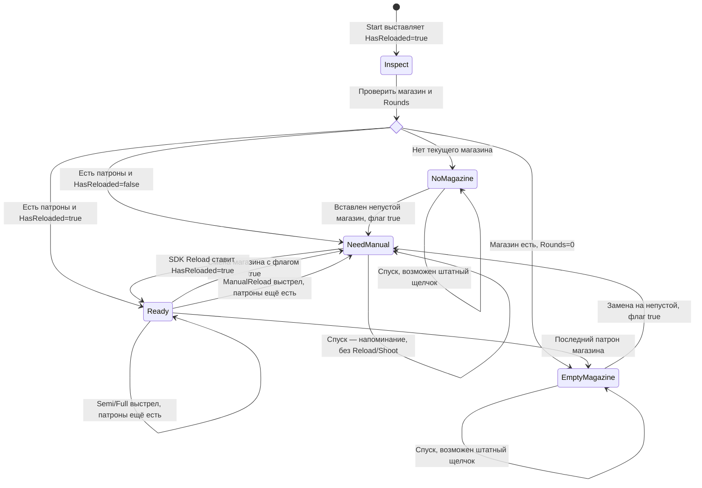
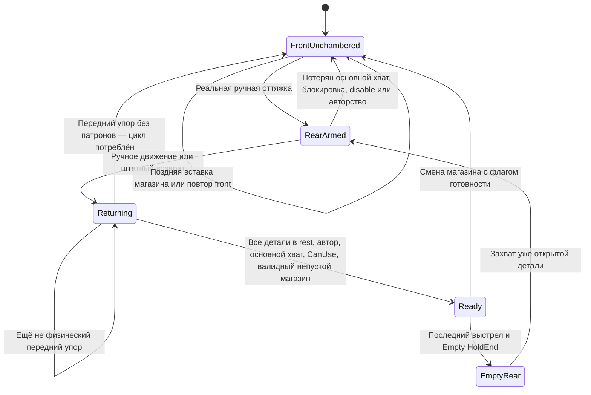

# Пистолеты и общая карта перезарядки

Дата исследования: 2026-10-04. Источники: действующие исходники SDK/игры и сериализованные настройки 20 записей `WeaponRegistry`; инструкции производителей — отдельно. Ручной endpoint и общий игровой Empty-профиль приняты пользователем; временная диагностика настоящего SDK и четырёх imported Empty-профилей прошла 53/53, Android-компиляция прошла. Закрытие нажатием спуска не реализуется этим ручным срезом.

**Режим стрельбы и досылание после смены магазина — разные настройки.** Semi даёт один выстрел на новое нажатие, Auto — очередь при удержании, Manual требует ручного цикла между выстрелами. И Semi, и Auto могут требовать досылания после смены магазина: это задаёт отдельный флаг готовности, а не название режима.

## Что происходит у настоящего пистолета

У Browning Hi Power после последнего выстрела сзади удерживается **затвор-кожух**. После смены магазина готовность появляется при его закрытии; спуск относится к выстрелу уже готового оружия. Инструкция описывает освобождение затвора через slide stop, а не через спуск. Снятие магазина само по себе не извлекает патрон из патронника. Это сведения о семействе Hi Power, а не доказательство точной модификации нашего FBX. [Browning: General Description, Slide Stop, Loading, Unloading](https://www.browning.com/support/owners-manuals/hi-power-pistol.html).

У SIG SP2022 инструкция также разделяет открытый затвор после последнего патрона, его освобождение и последующий выстрел. Заряженный патронник сохраняет патрон при снятом магазине. Этот пистолет — сравнительный пример, не установленный прототип Viper. [SIG SP2022, разделы 4.4, 5.2, 6.0](https://www.sigsauer.com/pub/media/sigsauer/resources/17SIG2245_SP2022OperatorManual8501253-01-REV04_LR.pdf).

У Walther PPK/PPK-S официальный текст раздела 7 подтверждает удержание затвора после последнего патрона; спуск освобождает курок, а не затворную задержку. Конкретное устройство освобождения зависит от модели. Архивная инструкция PP/PPK опубликована самим производителем. Старый американский URL PDF сейчас перенаправляет на каталог; его индексируемая редакция использована для сверки текста, не для определения модификации нашего ассета. [Carl Walther: PP/PPK manual](https://carl-walther.com/uploads/media/manuals/PP-PPK_Bedienungsanleitung.pdf), [официальная американская редакция PPK/PPK-S](https://waltherarms.com/manuals/PPK-Manual-4796001-4796002-and-PPKS-4796004-4796006.pdf).

Термин «ствол остаётся сзади» недостаточен: затвор-кожух и ствол — разные детали. Короткий откат/отпирание ствола и полный ход затвора нельзя объединять одним каналом. У SIG инструкция отдельно перечисляет Slide и Barrel; переносить их относительное движение на наши модели можно только по исходным анимационным данным. [SIG SP2022, Main Parts и Field Strip Diagram](https://www.sigsauer.com/pub/media/sigsauer/resources/17SIG2245_SP2022OperatorManual8501253-01-REV04_LR.pdf).

Автоматическое закрытие от вставки магазина не объявляется общим правилом пистолетов. Индексируемая американская инструкция PPK предупреждает, что чрезмерное усилие вставки может вызвать закрытие; это частный эффект, а не штатная игровая команда. Наш SDK вставкой магазина сбрасывает готовность при соответствующем флаге и не досылает. Точное силовое поведение ассета не проверено. [Walther PPK/PPK-S, Loading](https://waltherarms.com/manuals/PPK-Manual-4796001-4796002-and-PPKS-4796004-4796006.pdf).

Вывод для игры: открытый пистолет сначала закрывает механизм и досылает, затем стреляет. Trigger-assisted закрытие было бы отдельным игровым упрощением, а не воспроизведением подтверждённых инструкций.

## Что на самом деле хранит SDK

- `UxrFirearmWeapon.Start` ставит `RuntimeTriggerInfo.HasReloaded=true`. Последующее событие постановки/снятия магазина сбрасывает его при `UseHasReloadedForSemiAndFullAuto=true`; итог стартовой выдачи зависит от порядка инициализации.
- `IsLoaded` возвращает только этот bool. Он не доказывает наличие магазина, патронов, физическое закрытие или `CanUse`.
- `GetAmmoLeft` читает `UxrFirearmMag.Rounds` у `CurrentPlacedObject` собственного якоря спуска. `Rounds` ограничен `Capacity`. Это оставшиеся патроны **магазина**; отдельного сохранённого патрона в патроннике нет.
- `Reload` только ставит `HasReloaded=true`; патрон из магазина не перекладывается в отдельную chamber-переменную. `TryToShootRound` уменьшает магазин на один при выстреле.
- В `ManualReload` разрешённый спуск сбрасывает `HasReloaded`, поэтому цикл нужен между выстрелами. В Semi/Full с флагом true bool не сбрасывается каждым выстрелом; новая смена магазина снова требует ручного цикла. В Semi/Full без флага bool не ограничивает выстрел.
- `HasMagAttached` проверяет наличие `CurrentPlacedObject`, но не его обратную `CurrentAnchor`. В принятом ручном endpoint предусмотрена отдельная проверка текущего совместимого магазина и якоря; старый SDK predicate сам этого не гарантирует.
- `NeedsManualChambering`: магазин с патронами + false HasReloaded + ManualReload или флаг Semi/Full. Событие `ChamberingRequired` — локальная новая попытка спуска до изменения chamber-bool. При отсутствии/пустом магазине именно подсказка досылания не включается. Отдельный звуковой щелчок уже существует у части оружия: SDK использует ShotAudioNoAmmo и для пустоты, и для отсутствия досылания; BarrelObstruction также использует этот звук при препятствии. Имя аудио не определяет причину отказа.

Источники кода: `UxrFirearmWeapon.cs`, `UxrWeapon.Custom.cs`, `UxrFirearmWeapon.RuntimeTriggerInfo.cs`, `UxrFirearmMag.cs` в `Assets/ThirdParty/UltimateXR/Runtime/Scripts/Mechanics/Weapons/`; `WeaponChamberingReminder.cs`, `AutomaticWeaponSlideFeedback.cs`, `WeaponMechanismVisuals.cs` в `Assets/Scripts/Weapons/`.

Практическое отличие от реального тактического обмена: снятие непустого магазина не сохраняет отдельный chambered round, новый магазин у оружия с флагом true снова требует ручного досылания. Запас «ёмкость магазина + 1», выстрел сохранённым патроном без магазина и достоверное извлечение такого патрона текущей моделью не представлены. Это игровое допущение. Дробовиковое «магазин как одиночный/внутренний патрон» не превращается этим изменением в трубчатый магазин + патронник; отдельное исследование +1 не внедряется.

## Карта текущей SDK-логики

Карта для ManualReload или Semi/Full с флагом готовности. Физическая поза механизма — независимое состояние; текущий HasReloaded может быть true даже при пустом магазине.

Для Semi/Full без флага переход NeedManual не требуется: наличие патронов и остальные условия выстрела решают готовность. Старый feedback вызывал Reload ещё до переднего упора (`slideThreshold*0.9`) и после открытого handoff требовал ещё 2 мм; это дефект ручного автора, а не состояние патронника SDK.

## Принятый общий ручной профиль

После Empty с удерживаемым концом доступная руке деталь остаётся сзади вместе с внутренним механизмом. Это общий игровой профиль, включая **AR-15 с глушителем**: данные обычного Fire остаются независимыми, интерпретация Empty/ручного возврата сопрягает детали. Runtime не выбирает профиль по WeaponId. Реалистичная отдельная bolt-release кнопка этим срезом не добавляется.

Передний упор сравнивается с численным epsilon локальных float-координат и физическими rest-позами Action bindings. Завершение анимации, исходное переднее положение ручки, повторный grab и callback Reload сами по себе не доказывают закрытие. Потребление цикла происходит до синхронизируемого вызова; уведомление завершения — только после фактического успешного Reload.

## Двадцать записей реестра

Сверка сериализованных настроек и наследуемых SDK-префабов; численная идентичность модели по DisplayName не подразумевается. `Флаг` — UseHasReloadedForSemiAndFullAuto. ManualReload использует bool независимо от флага. `Empty` означает наличие игрового удерживаемого Empty-клипа, а не доказанный реальный bolt hold-open. Во всех строках ammo берётся из текущего магазина SDK; отдельного chamber-round нет.

| WeaponId / отображаемое имя | Семья и доступная руке механика | Режим стрельбы | Досылание после смены магазина | Empty HoldEnd сейчас | Ручной endpoint этого среза |
|---|---|---|---|---|
| Gun / Browning Hi-Power | Пистолет, затвор-кожух | Semi: один на нажатие | Да | Есть | Общий feedback |
| PPK / Walther PPK | Пистолет, Slide | Semi: один на нажатие | Да | Нет отдельного motion Empty | Общий feedback; hold-open не моделируется этим клипом |
| Viper / WK-11 Viper | Игровой пистолет, отдельные Bolt/Charging_Handle | Semi: один на нажатие | Да | Есть | Общий feedback и сопряжённый Empty; реальный прототип не установлен |
| SDKGun / SDK Gun | SDK-пистолет; нет игрового feedback | Semi: один на нажатие | Нет (default SDK) | Нет | Не входит в 14 feedback; manual bool не блокирует Semi |
| Revolver / Revolver | Револьвер, барабан/курок | Semi: один на нажатие | Нет | Нет | Нет затворного цикла |
| R08 / R08 | Револьвер, Cylinder/Hammer | Semi: один на нажатие | Нет | Нет | Нет затворного цикла |
| M16 / AR-15 | Винтовка, ручная Action-деталь | Auto: очередь | Да | Нет отдельного Empty | Общий feedback |
| TR15 / AR-15 с глушителем | Винтовка, отдельные Charger/Bolt | Auto: очередь | Да | Есть | Принят общий игровой rear-handle Empty |
| Scar / SCAR-L | Винтовка, ручка затвора | Auto: очередь | Да | Нет motion Empty | Общий feedback |
| AK105 / AK-105 | Винтовка, Charger | Auto: очередь | Да | Нет | Общий feedback |
| Mk14 / Mk14 EBR | Винтовка, BoltCharger/Bolt | Auto: очередь | Да | Нет | Общий feedback |
| SRM12 / Desert Tech SRS | Ручная болтовка, Action-деталь | Manual: цикл между выстрелами | Да; также между выстрелами | Нет | Общий feedback; поворотный VR-затвор ещё не реализован |
| SniperRifle / AX-50 | Ручная болтовка, Slide | Manual: цикл между выстрелами | Да; также между выстрелами | Нет motion Empty | Общий feedback |
| MP5K / MP5K | SMG, ручной затвор | Auto: очередь | Да | Нет motion Empty | Общий feedback |
| Uzi / Uzi | SMG, ручной затвор | Auto: очередь | Да | Нет motion Empty | Общий feedback |
| MKR9 / MKR9 | SMG, отдельные Bolt/Charging_Handle | Auto: очередь | Да | Нет | Общий feedback |
| Machinegun / Machinegun | SDK-автомат | Auto: очередь | Нет (default SDK) | Нет | Не входит в 14 feedback |
| Herrington / Remington 11-87 | Самозарядный дробовик, Bolt | Auto: очередь | Да | Есть | Общий feedback; название семьи не доказывает режим реального оружия |
| ShotgunReal / FABARM SDASS | Помпа SDK, magazine-as-ammo | Manual: цикл между выстрелами | Цикл всегда по режиму; флаг Semi/Auto не применяется | Нет HoldEnd | UxrShotgunPump, вне 14 feedback |
| Shotgun / Shotgun | SDK-помпа, magazine-as-ammo | Manual: цикл между выстрелами | Цикл всегда по режиму; флаг Semi/Auto не применяется | Нет | UxrShotgunPump, вне 14 feedback |

У SDK UxrShotgunPump остаётся отдельный старый путь с `threshold*0.9` и собственным вызовом Reload. Зелёный результат AutomaticWeaponSlideFeedback не доказывает исправление этого SDK-пути; нужна отдельная задача/приёмка. Размеры и баланс магазинов здесь не меняются.

## Сценарии и границы

| Сценарий | Текущая SDK-правда | Принятый ручной endpoint |
|---|---|---|
| Выдача на станции | Start ставит true; поздняя постановка магазина с флагом может сбросить | Не создавать ручной цикл в исходной front-позе; фактический порядок выдачи проверить отдельно |
| Снятие непустого магазина | При флаге true ready=false; отдельный chamber-round отсутствует | Не сохранять выдуманный +1; смена требует принятого цикла |
| Вставлен полный или частично использованный | Rounds>0; при флаге true HasReloaded=false | Открытый механизм можно вернуть без новой оттяжки; закрытый — rear→front |
| Вставлен пустой / магазина нет | ChamberingRequired не возникает; штатный dry click может прозвучать | Закрыть можно, Reload нет, цикл потребляется |
| Непустой магазин, спуск до досылания | ChamberingRequired + обычный отклонённый спуск | Подсказка и слабый haptic; никакого trigger-assisted Reload |
| Уже открыт → front | Старый handoff требовал +2 мм | Только реальное переднее положение всех сопряжённых деталей |
| Закрыт → rear → front | Старый код засчитывал возврат раньше упора | Один Reload при общем физическом endpoint |
| Пустое закрытие → поздняя вставка | Reload сам не проверяет магазин | Поздняя вставка не оживляет потреблённый цикл |
| Неверный CurrentAnchor | Старый SDK GetAmmoLeft может прочитать placed-object | Ручной автор отклоняет несовместимый/чужой якорь |
| Повтор front / release-regrab | Поза сама не должна создавать действие | Нет повторного Reload без нового цикла |
| Чужой автор / SDK replay | Положение копии может пересчитываться | Не начинать/не публиковать Reload; получает действие автора |
| CanUse=false / основной хват потерян | SDK Reload не проверяет эти условия сам | Отменить незавершённое право Reload; отпускание только ручки допускает штатный возврат |

## Проверка и оставшийся UX

Временный probe прошёл: baseline RED 18 PASS / 9 FAIL → GREEN 53/53. Проверены actual feedback LateUpdate и SDK Reload, synthetic main/support hands, current-anchor, no/empty late-insert, authority/replay, blocked/release, независимые contact/internal Empty/Fire каналы. Дополнительные 24 проверки используют imported Browning Hi-Power, Viper, Herrington и TR15: реальный rear grabbable внутри travel, непрерывный rotation handoff, частичный возврат без Reload, обратное движение, точный physical rest/один SDK Reload и повторы. Свежий AndroidCompileGate PASS, Console без ошибок. Артефакты — tmp/manual-chambering-red.txt, tmp/manual-chambering-green.txt, tmp/manual-chambering-common-probe.cs.txt. Это временная диагностика с синтетическими вводом/владением; постоянные gameplay tests до принятия пользователем в Unity/шлеме не переписываются.

Проверка первого нажатия после Reload использует реальный SDK trigger update, ProjectileShot и расход одного патрона; descriptors снарядов намеренно пусты, поэтому projectile trajectory/FX и ощущения шлема этим не проверяются.

Первый imported4 diagnostic оставил четыре временных AudioSource.PlayClipAtPoint root в активной Lobby: delayed Destroy в EditMode не завершился. Exact InstanceID/clipGUID сопоставлены с четырьмя собственными prefab close-audio и forensic baseline; validator очистил только доказанные fixture-объекты до сохранения Lobby. Харнесс теперь подавляет audio только собственных временных копий, не меняя ассеты. Повтор прошёл **55/55**: прежние 53 логические проверки и два равенства полных before/after scene-root/component/dirty и prefab/sharedmaterial fingerprints. Новых объектов и dirty-изменений сцен/материалов нет. Аудио playback не является доказанным результатом прогона. Детали — tmp/manual-chambering-audio-leak-attribution.md и обновлённый tmp/manual-chambering-green.txt; product source не менялся.

Для следующей реализации приняты три политики досылания: ManualReturn, AutoOnMagazineInsert и TriggerAssistPrepareOnly. Они отдельно от Semi/Auto/Manual режима огня. AutoOnMagazineInsert готовит после вставки только при фактическом физическом rest. TriggerAssistPrepareOnly первым нажатием только готовит; следующий выстрел требует отпускания и нового нажатия, удержание не запускает Auto-очередь в момент completion. Прямой Reload из ChamberingRequired сейчас способен пропустить новый bool в тот же SDK switch и дать выстрел тем же нажатием, поэтому такой callback не является реализацией принятой политики. Новые политики этим ручным срезом не внедрены.

## Принятые причины обратной связи: отдельный следующий срез

Пользователь принял три взаимоисключающие причины валидной локальной попытки спуска: **NoMagazine** — текущего совместимого магазина нет; **EmptyMagazine** — магазин установлен, Rounds=0; **ChamberingRequired** — Rounds>0, но нужна ручная готовность. У них будут независимые настройки реакций в общем профиле с необязательным override оружия. Сейчас это контракт следующей реализации, а не уже действующие три события.

Источник причины должен находиться в точке новой попытки спуска, под автором основной локальной руки, без SDK replay. Он проверяет CanUse и совместимый current-anchor до классификации. Препятствие/другой запрет использования сохраняют собственный отклик; их нельзя обозначать отсутствием магазина. Существующее аудио должно иметь одного проигрывателя без двойного щелчка. ChamberingRequired сохраняет действующую подсказку ручки и слабый haptic. Красная подсветка магазина и дополнительные эффекты остаются настраиваемыми получателями будущего среза.

Также принята отдельная настройка конца последнего выстрела: **HoldOpen** либо **ReturnToRest**, независимо от режима стрельбы и политики досылания. Для ManualReturn: HoldOpen + новый непустой магазин → достаточно возврата вперёд; ReturnToRest + новый магазин → rear/front. Движение видимых деталей, доступный руке grabbable и системная готовность обязаны совпадать. Будущие defaults сохраняют текущее source/prefab поведение; настройки валидируются по совместимым Action bindings/travel. Четыре текущих HoldEnd профиля таблицы остаются текущей реализацией, новая настраиваемая политика конца выстрела ещё не внедрена.

Проверка physical rest относится к завершению досылания и удерживаемой Empty-позе. Она не должна блокировать каждый кадр обычной Fire-анимации: независимые каналы движения и SDK частота Semi/Auto сохраняются.

В Unity/шлеме ещё проверить четыре удерживаемые Empty-модели (особенно Charger/Bolt AR-15 с глушителем и поворот Herrington), захват уже сзади и возврат без оттяжки, closed rear/front, отпускание ручки со штатным возвратом, no/empty closure и поздний магазин, blocked/release/regrab, первый последующий спуск и настоящую отдачу/контакт руки. Автоматическое изменение настроек end-pose/chamber-policy не выполнялось. Устаревших постоянных assertions, которые требовали бы +2 мм либо Reload на 90%-пороге, в WeaponFeedbackTests/WeaponSlideTravelTests не обнаружено; они проверяют настройки аудио/хода и не заменяют эту приёмку.
