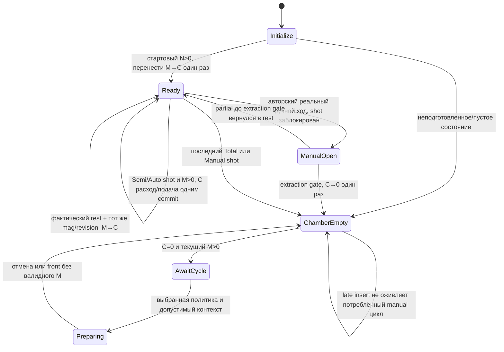
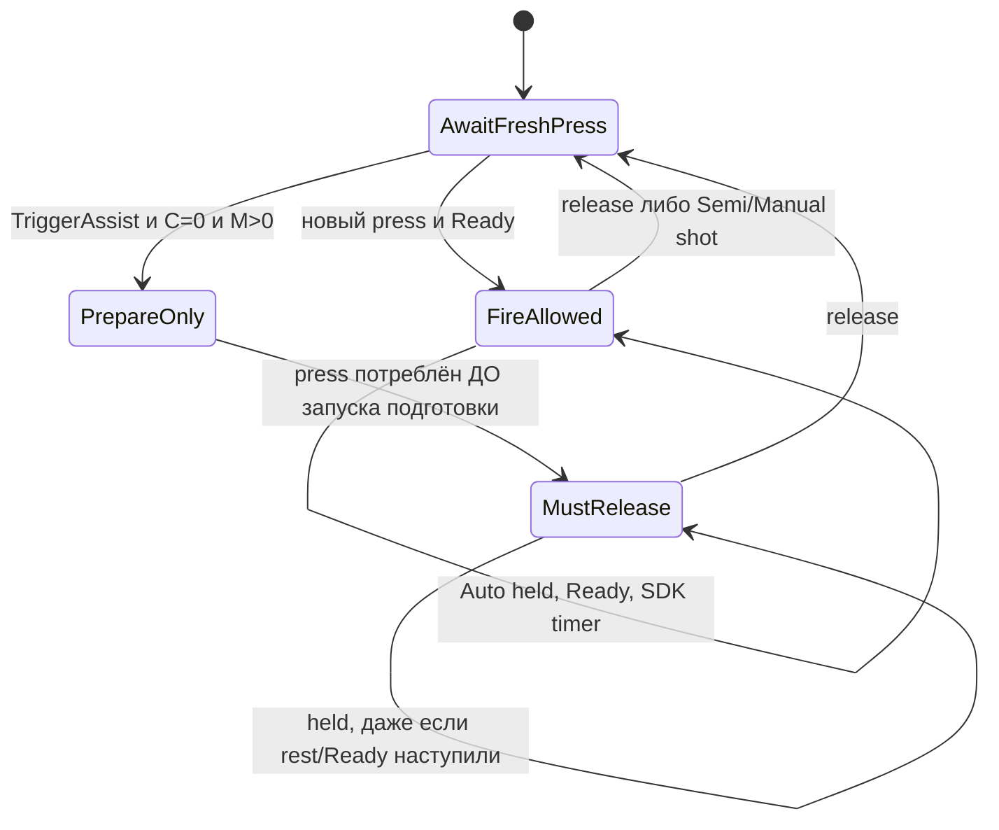

# Готовность оружия, патронник и обратная связь — дизайн и план

Дата: 2026-10-04, обновлено 2026-10-06. Статус: **дизайн одобрен пользователем; этапы 1–3 приняты как зависимость; этап 4 — профили подключены у Herrington и FabarmSDASS (FixedStoreChamber, ручное заряжание), волна HoldOpen (Browning/«Gun», Viper, TR15) подготовлена кодом, но к префабам не применена; этап 5 (S01–S27) ждёт; этап 6 — только после приёмки в шлеме.** Открытый дефект HoldOpen (затвор Herrington закрывается после последнего выстрела) исправлен в коде (см. «Владелец позы HoldOpen»), прогон в Unity и проверка в шлеме ещё не выполнены. Исторический ход прежнего исполнения — [.superpowers/sdd/weapon-readiness-feedback-design/progress.md](../../.superpowers/sdd/weapon-readiness-feedback-design/progress.md).

**Цель:** единый учёт патрона в патроннике для пистолетов и оружия со съёмным магазином, независимые настройки режима огня, досылания и Empty-позы, три причины отклонённого спуска с настраиваемыми реакциями.

**Архитектура:** принят небольшой opt-in контракт в SDK firearm: один владелец боезапаса/патронника/готовности и атомарное синхронизируемое применение состояния. Игровой контроллер определяет политику и проверяет физическое завершение; получатели feedback только показывают результат. Нынешний SDK-путь сохраняется у явно обозначенных legacy моделей.

**Стек:** Unity 6/URP, UltimateXR в `Assets/ThirdParty/`, Mirror и `NetworkStateRelay`, игровой код `VrBattlegrounds.asmdef`. Этот документ фиксирует принятый контракт и порядок реализации. Пользователь уже одобрил письменный план и поручил реализацию: специализированные исполнители `gpt-6.1-sol/medium` выполняют срезы через `superpowers:subagent-driven-development`; root ведёт требования, очередь, ревью и интеграцию, самостоятельно продуктовый код не пишет. Повторное разрешение на согласованный дизайн/SDK patch не требуется; одобрение дизайна не заменяет физическую приёмку.

## Границы и уже проверенное состояние

Принятый ручной срез в `AutomaticWeaponSlideFeedback`/`WeaponMechanismVisuals` сохраняется: already-open → настоящий front без дополнительной оттяжки 2 мм; closed → rear/front; один автор; все Action position/rotation достигают rest; закрытие без валидного непустого магазина потребляет цикл; поздняя вставка не оживляет его. Общий игровой rear-handle Empty принят также для **TR15 / AR-15 с глушителем**, без веток по WeaponId; обычные Fire tracks остаются независимыми.

Проверенные артефакты ручного среза: [RED](../../tmp/manual-chambering-red.txt) — 18 PASS / 9 FAIL; текущий [GREEN](../../tmp/manual-chambering-green.txt) — **55/55** (53 прежние логические проверки + 2 residue/fingerprint-инварианта); [Android](../../tmp/manual-chambering-android-green.txt) — PASS. Четыре imported HoldEnd профиля: Browning Hi-Power, Viper, Herrington, TR15. Native scene roots/components/dirty flags и prefab/shared-material fingerprints до/после совпали. Это результат исправленного ручного probe, **не проверка новых политик или chamber ledger**: новые политики ещё не внедрены, ledger реализуется в этапе 1. Ввод/ownership синтетические, SDK Reload/trigger/−1 Rounds настоящие; аудиовоспроизведение suppressed только в собственных imported clone fixtures, его качество не проверялось. Projectile descriptors пусты: траектория/FX, реальный трекинг, второй клиент и шлем остаются вне проверки. При этой правке документа прочитаны артефакты, Unity/probe reviewer не запускал.

Текущая [атрибуция и устранение residue](../../tmp/manual-chambering-audio-leak-attribution.md) подтверждает адресную очистку четырёх собственных `OneShotAudio` roots по InstanceID+clipGUID+signature+baseline до сохранения Lobby; 12 fixture YAML-документов не были сохранены в исходную сцену, чужие объекты не удалялись. Исправленный probe сохранил прежние 53 gameplay assertions и добавил две проверки чистоты сцены/ассетов; 55/55 подтвердили cleanup и совпадение fingerprints. Для последующих временных стендов сохраняется обязательный контракт: before root instance IDs/allocated objects/scene dirty/native asset fingerprint; в `finally` снять подписки, вернуть настройки/владение и удалить только доказанно собственные fixture/audio/FX объекты; after проверить отсутствие residue и неизменность исходных scene/prefab/shared-material данных. Чужие одноимённые объекты не удалять и пользовательскую сцену не сохранять ради cleanup.

Текущий этап 1 разрешает исполнителю узкие SDK ledger/shot/snapshot правки, временные RED/GREEN probes и compilation gates под собственной согласованной Unity lease. Пользователь явно разрешил и рекомендует SDK patch: необходимый single-writer refactor не подменять игровыми обходами. Дополнительно принят узкий `EndSyncState` try/finally после actual RED исключения подписчика, с проверкой caller End-attempt/Cancel и nesting depth; общего core/relay refactor нет. Production profiles/prefab migration ждут этапа 4; постоянные gameplay tests — human acceptance; баланс, геометрия и коммит сейчас исключены. Reviewer пишет только документацию/отчёт, SDK/Assets/Unity не меняет; доступность Editor определяется действующей lease, а не предположением о занятости.

Этап 1 принят ведущим агентом после фактического RED56/5, ledger GREEN67/0, correction B1/B2 и Android; [независимое correction review](../../tmp/weapon-readiness-stage1-correction-code-review.md) одобрено. Дополнительный origin SDK seam этапа 2 также принят как зависимость: [итоговые доказательства](../../tmp/weapon-readiness-stage2-origin-final-package.md). Это не production/human acceptance и не приёмка всей физической части этапа 2. Синтетический вывод C из legacy IsLoaded не доказывает старый реальный free+1: conservation M+C и фактический Emitted projectile проверяются отдельно. Старые ручные 55/55 не заменяют проверку новой механики.

Поштучное заряжание, трубчатый магазин и отдельный +1 дробовиков остаются **только исследованием** [shotgun-per-shell-research.md](shotgun-per-shell-research.md). Два `UxrShotgunPump` всё ещё имеют свой старый 0,9-порог; GREEN общего feedback не исправляет помпы. Новый поворотный VR-затвор SRM12 и реалистичная отдельная bolt-release кнопка TR15 также вне этого среза.

## Подтверждённые точки исходников

Пути ниже относительны корню проекта. Это чтение актуальных файлов, а не доказательство нового поведения в runtime.

| Файл:строка | Факт и следствие |
|---|---|
| `Assets/ThirdParty/UltimateXR/Runtime/Scripts/Mechanics/Weapons/UxrFirearmWeapon.cs:60`, `:74`, `:82` | IsLoaded читает HasReloaded; Reload только синхронизирует true. Сам Reload не проверяет руку, физическую позу или магазин. |
| тот же файл `:99`, `:138`, `:169` | HasMagAttached/GetAmmoLeft/SetAmmoLeft работают через CurrentPlacedObject; ammo = Rounds магазина, отдельного патронника нет. Нет anchor → GetAmmoLeft возвращает int.MaxValue: отсутствие anchor нельзя объявлять отсутствием магазина без capability. |
| тот же файл `:227`, `:246`, `:264`, `:284` | TryToShootRound проверяет CanUse и таймер, расходует магазин до Source.Shoot, затем вызывает ProjectileShot. Не проверяет IsLoaded самостоятельно: прямой вызов бота обходит trigger FSM. |
| тот же файл `:378`, `:390` | Start ставит HasReloaded=true; порядок постановки стартового магазина важен для миграции. |
| тот же файл `:474`, `:489`, `:496`, `:501` | Локальная trigger decision отделена от чужой руки; ChamberingRequired вызывается до switch. Inline Reload из callback может разрешить выстрел тем же нажатием. ManualReload сбрасывает bool до успешного TryToShootRound. |
| тот же файл `:543`, `:551` | Один dry-audio условный блок смешивает ammo=0 и bool=false у Semi/Auto. Имя/проигрывание ShotAudioNoAmmo не даёт тип причины. |
| тот же файл `:578`, `:610`, `:640`, `:766` | Auto release синхронизирует только ammo; установка/снятие магазина при флаге сбрасывают bool. SyncAmmoLeft записывает в магазин, который текущий в момент replay, без ожидаемой identity. |
| `Assets/ThirdParty/UltimateXR/Runtime/Scripts/Mechanics/Weapons/UxrWeapon.Custom.cs:56`, `:66`, `:113`, `:129` | Read-only accessor anchor уже есть; NeedsManualChambering зависит от mag+bool; Source_ShotFired копии отдельно расходует Rounds. Нельзя добавлять расход из ProjectileShot. |
| `Assets/ThirdParty/UltimateXR/Runtime/Scripts/Mechanics/Weapons/UxrProjectileSource.cs:112`, `:139`, `:150` | Shoot синхронизируется и создаёт projectile/ShotFired на каждой машине. Дополнительные дробины — самостоятельные Source.Shoot; их нельзя считать дополнительными trigger rounds. |
| `Assets/ThirdParty/UltimateXR/Runtime/Scripts/Mechanics/Weapons/UxrFirearmWeapon.RuntimeTriggerInfo.cs:92`, `:112`, `:115`, `:158` | Snapshot-класс version=0; Clone/Serialize/Equals имеют только старые поля. Новые поля требуют обновления всех трёх путей. |
| `Assets/ThirdParty/UltimateXR/Runtime/Scripts/Mechanics/Weapons/UxrFirearmWeapon.StateSave.cs:15`, `Assets/ThirdParty/UltimateXR/Runtime/Scripts/Mechanics/Weapons/UxrFirearmMag.StateSave.cs:15` | Full/ChangesSinceBeginning сохраняет runtime triggers и отдельно rounds; incremental логика ожидает синхронизируемые события. |
| `Assets/ThirdParty/UltimateXR/Runtime/Scripts/Core/UxrManager.cs:170`, `:1776`; `Core/StateSync/UxrStateSyncImplementer.cs:19` | Top-level state events по умолчанию единственные; вложенный Source.Shoot можно включить в один firearm commit. Требуется проверить реальное подавление вложенного события в probe, не менять глобальный флаг. |
| `Assets/Scripts/Network/StateEventAuthority.cs:53`, `:66`, `:97`; `NetworkStateRelay.cs:168`, `:238`, `:259`, `:306`, `:329` | Автор удерживаемого предмета — автор аватара; вне рук — мир. Relay исполняет SDK event на сервере, исключает host/origin echo, late join загружает ChangesSinceBeginning; новая отдельная Mirror-копия боезапаса не нужна. |
| `Assets/Scripts/Weapons/AutomaticWeaponSlideFeedback.cs:336`, `:347`, `:358` | Уже имеются main-hand/author/replay/CanUse/current-compatible-anchor guards и физический front endpoint; здесь старый bool-only Reload заменить командой единственного ledger. |
| `Assets/Scripts/Weapons/WeaponMechanismVisuals.cs:64`, `:76`, `:147`, `:234` | Сейчас Empty выбирается по mag ammo=0; проверка rest всех Action существует. При новой модели Empty надо выбирать по total-after-shot, а Fire не превращать в постоянный readiness gate. |
| `Assets/Scripts/Weapons/WeaponChamberingReminder.cs:36`, `:69`, `:107`, `:115` | Единственный Action-highlight writer; haptic 0,15/0,08 с, cooldown 0,6 с, main local hand. Новый router должен заменить его источник, сохранив поведение. |
| `Assets/Scripts/Weapons/BarrelObstruction.cs:85`; `WeaponUseBlocker.cs` | Препятствие уже играет PlayTriggerNoAmmoSound+haptic; блокировку пишет отдельный общий компонент. Это отдельный отклик, не один из трёх ammo reasons. |
| `Assets/Scripts/Bots/BotGunner.cs:347`, `:350`, `:353`; `Assets/Scripts/Debug/E2E/Scenarios/WeaponHitDamageScenario.cs:417`, `:560` | Бот напрямую пополняет mag и вызывает TryToShootRound под authority; E2E тоже вызывает прямой shot. Миграция должна сохранить бот через явную команду refill/prepare, E2E — через явное начальное состояние. Других game-side setters Rounds/SetAmmoLeft и gameplay Reload, кроме общего feedback, scoped rg не обнаружил. |
| `Assets/Prefabs/Weapons/Gun/Gun.prefab:646`, `Machinegun/Machinegun.prefab:843`; `Assets/ThirdParty/UltimateXR/Samples/FullScene/Prefabs/ShootingRange/Weapons/Gun.prefab:84`, `:95`, `:198`; `Machinegun.prefab:421`, `:432`, `:583` | SDKGun/Machinegun наследуют SDK samples; в source по одному UxrGrabbableObject на оружие, free translation/нулевые limits, Semi/Auto. Game variants не добавляют Automatic feedback/MechanismVisuals. Это NoAction source-контракт; source flag отсутствует в YAML и default bool false в `UxrFirearmTrigger.cs:28`. |
| `Assets/Tests/EditMode/Prefabs/WeaponFeedbackTests.cs:249`; `WeaponSlideTravelTests.cs:103`; `Interaction/WeaponSpreadTests.cs:153` | Тестовые helpers определяют chambering через старый bool-флаг; стартовый loaded проверяется через вложенный магазин; spread harness вручную пишет HasReloaded. Эти ожидания перечислить, менять только после human acceptance. |

## Принятые настройки и данные профиля

Три оси ортогональны. `FireMode` использует существующий `UxrShotCycle`: Auto стреляет очередью при допустимом удержании, Semi — один выстрел новым нажатием, ManualReload — ручной цикл между выстрелами. `ChamberPolicy` применяется, когда патронник пуст и требуется подготовка: `ManualReturn`, `AutoOnMagazineInsert`, `TriggerAssistPrepareOnly`. `EmptyPose`: `HoldOpen` или `ReturnToRest`, по **последнему доступному патрону оружия**, а не по Rounds=0 магазина, пока C=1.

Предлагаемые файлы данных: `WeaponReadinessProfile.cs`, `WeaponFeedbackProfile.cs` в `Assets/Scripts/Weapons/`; общий default asset в `Assets/Data/Weapons/Profiles/`; ссылка на необязательный override в `WeaponInfo.cs`. Runtime prefab хранит применённый profile/capability binding; спавн не ищет asset через AssetDatabase. Режим/темп/ёмкость остаются исходными; readiness profile не пишет balance-поля и не дублирует второй FireMode рядом с SDK trigger. Несогласованность конфигурации — ошибка preflight.

`ResolvedReadinessProfile` фиксирует ChamberPolicy, EmptyPose, ammo capability (`DetachableMagazineChamber` либо `LegacyAmmo`), physical capability (`ActionTravel` либо `NoAction`), реакцию на каждый reason. Common default — ManualReturn + ReturnToRest; мигратор записывает явные совместимые overrides для текущих исключений. Общий default не должен случайно превратить SDK no-action образец в ручное оружие. Runtime решений по WeaponId/DisplayName нет.

Feedback-профиль содержит независимые настройки `NoMagazine`, `EmptyMagazine`, `ChamberingRequired`: audio, haptic, highlight, прочие подключённые обработчики. Для невыбранных новых реакций default выключен; уже имеющийся dry click сохраняется через одного audio owner, ChamberingRequired сохраняет Action-highlight/haptic. Новые звуки/красная подсветка не навязываются глобально.

## Один владелец ammo/chamber/ready

Рассмотрены две альтернативы.

| Вариант | Выгода | Цена/риск |
|---|---|---|
| **Рекомендуется: opt-in ledger в partial UxrFirearmWeapon** | Trigger, прямой TryToShootRound, replay и runtime snapshot используют одно хранилище; никакого post-shot исправления ammo. Игровая политика и физика остаются снаружи SDK. | Узкий SDK patch затрагивает shot/trigger/snapshot seams; его надо записать в sdk-patches. Старый HasReloaded становится проекцией ledger для opt-in. |
| Game-layer ammo provider, generic SDK interface | Учет целиком в Assets/Scripts; удобнее будущей иной ammo topology. | Всё равно нужны seams до shot/replay/getters и snapshot; новый UxrComponent/identity и перенос current-mag rounds дают больше шансов двум writer/snapshot. Требует собственного согласованного save path. |

Выбор ledger одобрен пользователем; SDK API этапа 1 стабилизируется по actual probe и отдельному ревью перед зависимыми срезами. Будущая tube/per-shell механика может использовать provider отдельно; она не причина делать её сейчас.

Единственный writer — opt-in `UxrFirearmWeapon.Readiness.cs`: все команды проходят его проверку revision/identity и один `ApplyReadinessCommit`. SDK не ссылается на VrBattlegrounds; game-layer передаёт authority validation delegate и физическое свидетельство. Политика не выполняется в feedback callback. `UxrFirearmMag.Rounds` остаётся единственным store магазина; ledger хранит C, pending/cycle state и revisions, **не второй расходуемый magCount**. Payload commit содержит after-values конкретного mag для replay; это снимок изменения, а не независимый live store.

Предлагаемые типы/сигнатуры для реализации:

- `UxrFirearmReadinessState`: `bool ReadinessInitialized`, `UxrGrabbableObject CurrentMagazine`, `bool ChamberRound`, `bool ChamberCyclePending`, `bool ActionOpen`, `uint CycleSequence`, `uint ExtractedCycleSequence`, `uint Revision`, `uint ShotSequence`; состояние runtime по trigger. CurrentMagazine — identity/ожидаемая принадлежность, не второй store Rounds. ReadinessInitialized сохраняется и предотвращает повтор initial M→C после snapshot/enable. `HasReloaded` для opt-in только проекция `ChamberRound && !ChamberCyclePending && !ActionOpen`.
- `UxrFirearmReadinessCommit`: trigger, expectedRevision, nextRevision, referencedMagazine (`UxrGrabbableObject`/его UXR identity либо null), magazineRoundsAfter, chamberAfter, cyclePendingAfter, actionOpenAfter, cycleSequence/extractedCycleSequence, operation. SDK sealed class реализует `IUxrSerializable` с явно проверенным порядком/версией полей и roundtrip ссылки; передавать произвольный game struct в object[] sync без такого контракта нельзя. Специальный shot commit также содержит shotSequence, SDK enum `UxrFirearmShotEmissionOutcome` (Emitted/NotEmitted/Indeterminate) и **готовые** source position/orientation. Первоначальный snapshot сохраняет те же семантические поля, не только C.
- `bool TryCompleteChamber(int triggerIndex, uint expectedRevision, UxrGrabbableObject expectedMagazine)` — авторская команда; получает физическое свидетельство текущего контроллера, повторно проверяет identity/совместимость/rounds и переводит один патрон M→C.
- `bool TryBeginManualAction(int triggerIndex, uint expectedRevision, uint cycleSequence)` и `bool TryExtractChamberRound(int triggerIndex, uint expectedRevision, uint cycleSequence)` — единственный gate открытия/извлечения; допустимы только от физического автора, никогда от Fire tracks/FX. Повтор одного cycleSequence не извлекает ещё раз.
- `bool TryToShootRound(int triggerIndex)` сохраняет public API, но opt-in сначала обновляет физический opening state через тот же pre-shot port, затем проверяет ledger/authority/CanUse/таймер и коммитит один расход C. Direct callers не получают typed feedback и не обходят chamber gate.
- `GetMagazineRounds(int)`, `HasChamberRound(int)`, `GetTotalAmmoLeft(int)`, `IsReadyToFire(int)` — явные read-only запросы. Существующий `GetAmmoLeft` оставляет mag-only смысл, `GetAmmoCapacity` — capacity магазина; это предотвращает скрытый +1 в старых setters/UI.
- `bool TryInitializeReadiness(int triggerIndex)` — одноразовая авторская миграция после установления стартового anchor; `bool TryRefillAndPrepareForAutomation(int triggerIndex)` — явный restricted маршрут бота, сохраняющий начальный total и нынешнее отсутствие физической reload-анимации у ботов. BotGunner вызывает его при C=0, пополнение total только когда total=0; нельзя добавлять capacity поверх сохранённого C. Для человеческого trigger этот маршрут недоступен. Это сохранение уже действующего bot-контракта, а не новая автоматика ручного оружия игрока.
- `WeaponReadinessController.RequestChamber(ChamberRequestOrigin origin, uint pressSequence)`, `TryGetPhysicalCompletion(out ChamberCompletionEvidence)`, `CancelPendingCycle()` — игровой policy/physical adapter. Он не пишет C, Rounds или HasReloaded напрямую.
- SDK-owned `UxrFirearmNotReadyReason` имеет ровно NoMagazine/EmptyMagazine/ChamberingRequired; SDK-owned `UxrFirearmTriggerDecision` различает FireAllowed, NotReady(reason), PrepareOnlyConsumed, OtherDenied. Игровой `WeaponTriggerAttemptContext` содержит immutable snapshot новой попытки. Rate limit не получает ammo reason. Типы seam находятся в `UxrFirearmReadinessTypes.cs` SDK assembly; game-layer потребляет их, SDK не использует типы из VrBattlegrounds.
- `Func<int, bool> CanAuthorReadinessAction` и `Func<int, UxrGrabber, UxrFirearmTriggerDecision> EvaluateLocalTriggerAttempt` — opt-in SDK ports, устанавливаемые контроллером. Первый не применяется при committed replay; второй вызывается только свежим local press после основного guard. Перед ним `Action<int> RefreshPhysicalActionState` обновляет ручное opening/extraction по актуальной позе **до** возможного shot. Completion использует `Func<int, uint, UxrGrabbableObject, bool> ValidateChamberCompletion`, которое проверяет одноразовое evidence контроллера; SDK после этого сам повторно проверяет revision/anchor/M и пишет состояние. Пока ports не назначены, opt-in не активируется, вместо permissive fallback.

### Сохранение патрона и инварианты

Для detachable профиля `M >= 0`, `C ∈ {0,1}`, `Total = M + C` (без магазина M=0). `Ready = C=1 && !ChamberCyclePending && !ActionOpen`; CanUse, authority, основная рука и fire timer — отдельные разрешения действия. Нет ammo reason только потому, что магазина нет или он пуст, если Ready и C=1. Фактический незавершённый ручной ход при C=1 даёт OtherDenied, а не ложный NoMagazine/EmptyMagazine/ChamberingRequired.

Досылание: если C=0, валидный текущий магазин M>0 и завершён допустимый физический цикл, `M -= 1; C=1`. Total сохраняется. Повтор completion ничего не меняет. Semi/Auto успешный выстрел расходует C; штатная самозарядная подача при M>0 переводит следующий M→C в том же commit. Total уменьшается **ровно на один**, ROF остаётся SDK. ManualReload после выстрела оставляет C=0 при оставшемся M и требует очередной ручной цикл; postmag policy не отменяет этот межвыстрельный контракт.

Снятие/замена магазина отменяет pending подготовку прежнего магазина, но **не уничтожает уже сохранённый C**. Новый полный магазин при C=1 даёт capacity+1; можно стрелять сразу. При снятом магазине C=1 допускается ровно один выстрел, затем NoMagazine. При пустом вставленном магазине C=1 также один, затем EmptyMagazine. У Auto после этого очередь останавливается; feedback не начинает сигналить каждый кадр удержания.

Стартовая миграция **не создаёт бесплатный +1**: для текущего starting total N>0 и ready/rest профиля перенести один из стартового магазина в C: M=N−1, C=1. Неподготовленное стартовое состояние: M=N, C=0. N=0 → C=0. Capacity, WeaponInfo.MagazineSize, reserve/price/rate не меняются. Миграция выполняется один раз под world/item author после валидного anchor, не в Awake каждого клиента и не после каждого enable/refill; полученный snapshot не проходит миграцию повторно.

Числа полного нового магазина остаются capacity; поэтому **поздняя тактическая смена** закономерно отличается от initial migration. Нельзя использовать oldMag.Rounds>0 вместо C: manual профилю могут остаться M>0 при пустой камере, а при последнем chamber round M уже равен нулю.

**Пользователь явно принял повторный ручной цикл при C=1: извлечь сохранённый патрон и дослать следующий из магазина.** Авторское реальное открытие сразу ставит ActionOpen и запрещает shot, а на подтверждённом extraction gate один раз делает C→0 и фиксирует ExtractedCycleSequence. Полный front того же допустимого цикла при M>0 делает M→C; без/с пустым магазином остаётся C=0. Учёт: до `C=1/M=n` → после `Ejected=1/C=1/M=n−1` при n>0; иначе `Ejected=1/C=0`. Повтор rear, reverse, release/regrab и replay не извлекают повторно. Cancel после извлечения не возвращает потерянный патрон; до извлечения сохраняет C, но до физического закрытия ActionOpen блокирует shot.

Extraction gate — **общий механизм с проверяемым gate каждого профиля**, а не одна глобальная доля хода всех ассетов или выдуманное расстояние реальной экстракции. Для ActionTravel стартовая рекомендация — существующий `_slideThreshold` конкретного профиля, фактический направленный ход из RestrictLocalOffset и согласованное открытие сопряжённых Action bindings. Перед Apply каждого из 15 detachable ledger профилей требуется source/prefab readback: gate достижим, grabbable/bolt endpoint и весь обратный ход внутри declared travel, mapping соответствует исходным Fire/Empty/manual каналам. В обычном SDK feedback rear latch сейчас находится в `AutomaticWeaponSlideFeedback.cs:212`; эту настройку не менять скрыто. Profile binding содержит `RequiredChamberActionBindings` и их captured rest/rear mapping; extraction требует, чтобы минимальный направленный normalized progress этих bindings и grabbable достиг валидированного gate с численным float epsilon, а не только текущая ручка. Rotation-only binding проверяется тем же captured progression mapping; если mapping не единственный, Apply отклоняется. Для раздельного Charger/Bolt одной передней/сдвинутой ручки недостаточно; replay/cosmetic Fire не являются evidence. NoAction профили SDKGun/Machinegun не имеют ручного extraction gate: отсутствие Action явно отражается в preflight, ручное извлечение/HoldOpen/ManualReturn для них отклоняются. Повторный cycleSequence появляется только после завершённого/отменённого цикла и нового авторского физического жеста; на уже rear повторный grab не новый extraction.

Обычный partial pull до extraction gate: патрон остаётся C=1, shot заблокирован фактическим открытием; после реального возврата rest без extraction C снова доступен, без переноса M→C. Нельзя случайно заменить извлечение сбросом C на каждый sub-epsilon дрейф. При неоднозначных/некоррелированных source tracks preflight отклоняет новый extraction capability до явного validated binding, не выводит причинность из клипа с названием Empty.

Обязателен **учёт извлечённого патрона**, но новый подбираемый свободный cartridge/inventory item пользователь не заказывал. `WeaponInternalAmmoEjection` двигает существующий magazine-as-shell при Remove и не годится как реализация нового chamber extraction. В базовом срезе публикуется `ChamberRoundExtracted` с cycle/revision для read-only эффектов, если есть совместимые исходные каналы; спавн свободного живого патрона с physics/pickup — отдельный optional срез, без бесплатного возврата в запас.

## Диаграммы состояния

NoMagazine/EmptyMagazine/ChamberingRequired — классификация попытки, а не три независимых bool/счётчика. Если C=0: нет current-compatible mag → NoMagazine; есть и M=0 → EmptyMagazine; есть и M>0, цикл ещё необходим → ChamberingRequired. Неактивное оружие/anchor, смерть, блокировка, потеря main hand, replay/чужой автор дают OtherDenied, без этих трёх сигналов.

Release может произойти до completion: новая попытка до Ready остаётся отклонённой; она также потребляется. Автоматическая подготовка или manual completion **никогда сами не начинают held Auto** после первоначального отклонения. Общая защёлка accepted trigger episode разрешает Auto только fresh press, который уже принят в Ready; повторное удержание после enable/authority handoff требует нового release→press.

## Физические политики и Empty

`ManualReturn`: закрытый механизм требует rear→front; уже rear после HoldOpen допускает front-only. Новый магазин до завершения фиксируется в evidence; пустой/no-mag front потребляет цикл. Initial front, повторный grab, callback Reload и cosmetic Fire не создают completion.

`AutoOnMagazineInsert`: при C=0 и валидной новой вставке M>0 запускает подготовку. Если механизм уже находится в физическом rest, можно сразу M→C. Если rear — надо согласованно вернуть доступную руке деталь и все Action bindings; Ready только после rest. Пока рука держит Action, автоматический driver не телепортирует её: ждёт допустимого освобождения/ручного возврата и отменяет по общим guards. Новая вставка после потреблённого manual цикла — **новый запрос выбранной auto policy**, а не оживление старого pending.

`TriggerAssistPrepareOnly`: только валидный fresh press при C=0/M>0 запускает ту же подготовку, сначала ставя MustRelease. Даже closed/rest мгновенное досылание не стреляет тем же press. Для движущегося механизма используется существующее направление/travel, auto-return speed и captured rest; источник не выдумывает новый AnimationClip. Отдельные internal rotations возвращаются непрерывно, включая Herrington handoff; итог проверяется общей физической функцией.

`HoldOpen` разрешён только при capability с согласованной достижимой rear-позой Action/grabbable и SDK constraints; при последнем Total commit система имеет C=0, визуал/доступный grabbable занимают тот же rear. `ReturnToRest` заканчивает Empty в rest, C остаётся 0; у Manual нужен новый rear/front. Настройка без нужных tracks/bindings/travel отклоняется preflight, не превращается в bool-only Reload. NoAction допускает автоматическую data-only подготовку, но ManualReturn/HoldOpen для него не представимы и отклоняются.

### Владелец позы HoldOpen

Пока SDK state = `PostShotEmptyAction && !ChamberRound && !ActionOpen && !ChamberCyclePending`, профиль `HoldOpen` и ручной цикл не начат, поза Action принадлежит удерживаемой Empty-позе. Единственный предикат — `WeaponReadinessController.HoldsEmptyActionOpen` (входит в `OwnsActionPose` вместе с return driver); он читает только SDK state и профиль, поэтому одинаков у автора, наблюдателя и после late join. Каждый rest-writer обязан его спрашивать: пружина ручки `AutomaticWeaponSlideFeedback` (не тянет вперёд), `WeaponMechanismVisuals.RefreshOwnedManualPose` при отпускании ручки без цикла и `ResetVisuals` (не сбрасывают Action в rest, а отдают позу контроллеру — Deferred, затем повторная проекция validated rear). Начатый ручной цикл (BeginAction) снимает PostShotEmptyAction — с этого момента работают обычные правила, front-only толчок досылает патрон.

Нарушенное допущение, которое это закрывает: HoldOpen был реализован как одноразовая проекция (`RestoreSavedEmptyPresentation` → HoldSettled), а владельцем позы считался только return driver. Пружина ручки возвращала её в rest за ~0,06 с после проекции, вложенный затвор уезжал вместе с ней. Тот же класс — `ResetVisuals` во время Source-фазы: обнулял клип, но оставлял фазу «в процессе», и Empty больше не завершался (ни HoldOpen, ни EmptyRest ACK); теперь фаза переводится в Deferred.

Fire cosmetic цикл остаётся отдельным владельцем позы. Во время принятого Auto эпизода ненулевой Fire offset **не снимает Ready** и не нарушает MaxShotFrequency. Только начатая chamber-gated подготовка/ручной цикл и удерживаемая Empty передают управление pose adapter. Нельзя глобально делать `all Action in rest` обязательным перед каждым штатным выстрелом. Cancel выключает право commit, а не выдаёт патрон после ResetVisuals.

Отмена подготовки обязательна при replaced/removed mag, blocked/CanUse=false, main grip release, disable/despawn и смене автора. Evidence содержит trigger, ожидаемые mag+anchor+revision, cycleSequence/extraction latch, допустимый источник цикла и физический endpoint; оно потребляется до вызова synced commit. После отмены только новый допустимый запрос/цикл может подготовить C. Если извлечение уже произошло, Cancel не возвращает C; сохранённый и ещё не извлечённый C не уничтожает. После восстановления использования нужен новый trigger episode; всё ещё физически открытый Action не готов к shot.

## Типизированный источник и получатели

Один источник — SDK fresh-press decision seam **до fire switch**, после CanUse/main local hand/author/!IsInsideStateSync. Игровой контроллер возвращает SDK-owned `UxrFirearmTriggerDecision`; SDK фиксирует consumed/accepted episode до вызова внешних событий. После этого `WeaponTriggerAttemptRouter` публикует `NotReadyAttempted(context, reason)` ровно один раз на валидный новый press; подготовка политики вызывается отдельным command path, не подписчиком feedback. Этот результат единожды классифицирует ledger, receiver его не пересчитывает.

Context: firearm, trigger, main grabber/side, pressSequence, ledger revision, current mag/anchor, M/C и выбранная policy. Он read-only; обработчик не может стать вторым decision source. Remote/replay не публикуют локальные подсказки. Для PrepareOnly press причина ChamberingRequired может сообщаться один раз, затем профиль решает подсказку; нет второго сигнала по frame/completion.

`WeaponAttemptFeedback` маршрутизирует независимые audio/haptic/highlight/other receivers. Для opt-in SDK старый shouldPlayNoAmmoSound не проигрывает дополнительно: dry audio вызывает один receiver. Legacy fallback также должен иметь ровно один хозяин аудио. `WeaponChamberingReminder` становится получателем typed ChamberingRequired и read-only readiness changes; остаётся единственным Action-highlight writer и сохраняет proximity/latch/haptic cooldown. Router не дублирует его haptic. `BarrelObstruction` сохраняет собственный dry/haptic, но OtherDenied предотвращает параллельный ammo click. Receiver exceptions не изменяют расход/подготовку.

## Shot, sync, replay, late join

Для opt-in автор делает проверку и рассчитывает after-state один раз. **Рекомендуемый пакет выстрела — один top-level `CommitShotSynced` firearm**, содержащий revision, shotSequence, after M/C/pending, referencedMagazine и готовый pos/rot. Он применяет ledger, внутри вызывает штатный Source.Shoot, с вложенным sync; на author ProjectileShot поднимается один раз после успешного выстрела. Это использует существующий top-level механизм, но требует отдельного RED/GREEN доказательства на фактическом relay/event serialization.

Payload proof обязателен до включения opt-in. `UxrMethodInvokedSyncEventArgs.SerializeEventInternal` сериализует method name/object[] (`Core/StateSync/UxrMethodInvokedSyncEventArgs.cs:79`), а `UxrStateSyncImplementer_1.cs:95` выбирает метод reflection по имени/точным типам или при null — по числу аргументов. Поэтому `CommitShotSynced` имеет одно уникальное имя без перегрузок. `UxrVarType` поддерживает primitive/enum/Vector3/Quaternion/IUxrUnique/IUxrSerializable; `BinaryWriterExt.cs:506` записывает version+type+данные DTO, `BinaryReaderExt.cs:647` восстанавливает тип через GetUninitializedObject и вызывает Serialize. Выбран SDK DTO `UxrFirearmReadinessCommit : IUxrSerializable`; сериализация не должна зависеть от конструктора, ссылка на mag идёт только через UXR unique identity. Альтернатива при провале DTO proof — перечисленные native primitive arguments плюс unique reference с тем же уникальным method name. Смена формата payload фиксируется до dependent slices; произвольный неподдерживаемый struct/reflection DTO не внедряется.

Temporary proof проходит настоящие `SerializeEventBinary` → deserialize/`ExecuteStateSyncEvent` → вызов метода на registered копии, включая null magazine, resolved identity, enum/version, before/after C/M/revisions и duplicate suppression. Отдельно baseline→commit→`SaveStateChanges(ChangesSinceBeginning)`→load подтверждает регистрацию component/runtime/mag changes, Clone/Equals и отсутствие повторной initialization. Нужно увидеть один внешний packet, один source projectile и один debit на авторе/копии; чтение флага TopLevelOnly или только прямой вызов DTO этого не доказывает. Android compile проверяет типы, а Android/IL2CPP acceptance дополнительно — reflection/type preservation.

Отказы Source.Shoot/ShotFired/ProjectileShot subscribers — часть контракта shot commit. Каждый открытый BeginSync, включая вложенный Source.Shoot, закрывается ровно один раз в `finally` через корректный End/Cancel; depth после успеха/исключения равен captured depth до вызова. Нужный узкий рефактор `UxrProjectileSource.cs:112` для balanced scope разрешён: текущий метод без finally не считается доказанно exception-safe. Preconditions source/descriptor/origin валидируются до ammo commit; после записанного commit sequence/расход не откатываются и duplicate не расходует повторно. Пакет фиксирует outcome `Emitted` / `NotEmitted` / `Indeterminate`: known pre-emission отказ применяет state без projectile replay; known emission сохраняет ровно один projectile несмотря на отказ FX/handler; неопределённый частичный отказ не запускает автоматический retry и отмечается как failure для восстановления/диагностики. Replay использует утверждённый outcome, не угадывает его по звуку. Отказ handler после emission не превращается в второй выстрел и не пропускается как полностью успешная проверка; отдельно отчёт emission/ledger/FX, GameLog error и failed acceptance. Процедурно остановить defective opt-in профиль до устранения такого отказа; не возвращать bool полного успеха для известного NotEmitted/Indeterminate. Fault injection доказывает эти исходы и баланс sync depth, а не только happy path.

На remote replay `CommitShotSynced` не спрашивает локальную руку/CanUse и не повторяет решающий TryToShootRound: применяет утверждённое состояние и один вложенный Source.Shoot. Source_ShotFired не расходует ammo opt-in, играет recoil/audio/ProjectileShotReplayed один раз. `_shootingLocally` защищает авторские эффекты. Дополнительные дробины продолжают отдельный Source.Shoot и не трогают ledger; ProjectileShot у наблюдателя не поднимается. Если nested Source.Shoot всё-таки публикуется из-за настройки или IgnoreNestingCheck, интеграционный guard выявляет лишний пакет и блокирует включение профиля; не менять UseTopLevelStateChangesOnly глобально ради одного оружия.

Commit использует монотонный revision/shotSequence/cycleSequence и принимает duplicate/старый пакет как no-op **до projectile/FX/extraction эффекта**. Поправка направления/дроби и recoil вычисляются у автора; копия не выбирает trajectory заново. Поломанный referencedMagazine не перенаправляет расход в новый текущий mag: применять snapshot конкретного указанного объекта. При невозможности разрешить identity использовать existing initialization/state gate до разрешения объекта либо остановить применение и запросить текущий initial snapshot; этот recovery следует проверить отдельно, существующий relay сам такого per-item восстановления не доказывает. Без локального догадочного −1.

`SyncAmmoLeft` для opt-in заменяется полным reconciliation commit (mag identity + rounds + C/pending/revision), не оставляет mag-only запись поверх более свежей смены магазина. Release/grip placement синхронизируют финальное состояние; отмена pending не досылает. MagTarget callbacks сохраняют collider effect, но не пишут HasReloaded false параллельно ledger; авторский attach/remove command обновляет ownership/revision, копии только применяют commit и визуал.

RuntimeTriggerInfo serialization version увеличивается; Clone/Serialize/Equals/GetHashCode включают новые семантические поля. Version-0 load мигрирует один раз по совместимому snapshot/старому total; сетевой mixed-version клиент не поддерживается. Initial late-join snapshot включает C/pending/revisions и актуальные rounds всех mag, включая снятые. Gameplay-local MustRelease/feedback latch не replay-события; после snapshot/нового владельца сбросить episode в requires-fresh-press. Pending физический жест старого автора не наследуется как разрешение commit. Восстановление Empty pose опирается на saved semantic state и валидированный binding, без нового ammo transfer и без звуков/подсказок.

Новые поля должны регистрироваться в существующем SDK state-save пути, чтобы ChangesSinceBeginning на сервере видел chamber changes. Одна serialization version сама этого не доказывает: temporary probe делает save→load на копии с C=1/no-mag, C=1/full replacement, C=0/rear и pending cancel, затем первый допустимый trigger/shot. Mirror relay/host-origin фильтры сохраняются; глобальный сетевой рефактор не входит в этап. Нынешний relay не является серверной anti-cheat валидацией входного payload — этот план сохраняет действующий контракт одного автора.

## Миграция 20 записей реестра

Фактические исходные режимы/Empty взяты из [pistol-reload-state-research.md](pistol-reload-state-research.md); применённые профили надо повторно readback-проверить до включения. Таблица задаёт направление миграции, **не обещает runtime PASS всех 20**. SDK defaults/capabilities берутся из resolved source prefab, не из DisplayName. ID здесь только аудит, не runtime branch.

| WeaponId / имя | Исходный режим | Chamber default | Empty default / capability | Ammo migration |
|---|---|---|---|---|
| Gun / Browning Hi-Power | Semi | ManualReturn | HoldOpen / Action | Detachable ledger |
| PPK / Walther PPK | Semi | ManualReturn | ReturnToRest / Action | Detachable ledger |
| Viper / WK-11 Viper | Semi | ManualReturn | HoldOpen / coupled Action | Detachable ledger |
| SDKGun / SDK Gun | Semi, старый flag=false | AutoOnMagazineInsert | ReturnToRest / NoAction source подтверждён | Detachable ledger; сохраняется немедленная стрельба после вставки |
| Revolver / Revolver | Semi | Legacy без нового обязательного цикла | Текущие Cylinder/Hammer | Legacy; не навязывать съёмный mag+chamber |
| R08 / R08 | Semi | Legacy без нового обязательного цикла | Текущие Cylinder/Hammer | Legacy; тот же предел |
| M16 / AR-15 | Auto | ManualReturn | ReturnToRest / Action | Detachable ledger |
| TR15 / AR-15 с глушителем | Auto | ManualReturn | HoldOpen / coupled Charger+Bolt | Detachable ledger, без ID-special-case |
| Scar / SCAR-L | Auto | ManualReturn | ReturnToRest / Action | Detachable ledger |
| AK105 / AK-105 | Auto | ManualReturn | ReturnToRest / Action | Detachable ledger |
| Mk14 / Mk14 EBR | Auto | ManualReturn | ReturnToRest / Action | Detachable ledger |
| SRM12 / Desert Tech SRS | ManualReload | ManualReturn | ReturnToRest / существующий Action | Detachable ledger; межвыстрельный цикл сохраняется |
| SniperRifle / AX-50 | ManualReload | ManualReturn | ReturnToRest / Action | Detachable ledger; то же |
| MP5K / MP5K | Auto | ManualReturn | ReturnToRest / Action | Detachable ledger |
| Uzi / Uzi | Auto | ManualReturn | ReturnToRest / Action | Detachable ledger |
| MKR9 / MKR9 | Auto | ManualReturn | ReturnToRest / Action | Detachable ledger |
| Machinegun / Machinegun | Auto, старый flag=false | AutoOnMagazineInsert | ReturnToRest / NoAction source подтверждён | Detachable ledger; исходный Auto сохраняется |
| Herrington / Remington 11-87 | Auto | ManualReturn, существующий feedback | HoldOpen / Action+rotation | Legacy magazine-as-shell; отдельный tube/chamber/+1 не внедрять |
| ShotgunReal / FABARM SDASS | ManualReload | Legacy UxrShotgunPump | Текущий pump | Legacy; отдельный 0,9 endpoint и per-shell research |
| Shotgun / SDK Shotgun | ManualReload | Legacy UxrShotgunPump | Текущий pump | Legacy; то же |

Таким образом, тактический контракт камер применяется общей capability к 15 профилям съёмного магазина, включая пистолеты и автоматы, а не только одному семейству. Три дробовика и два револьвера сохраняют исходный ammo store; для них feedback adapter использует текущую SDK-готовность, не выдумывает физический C. Наследуемые ограничения помп явно отображаются в preflight/report. Полный provider для других топологий — отдельный дизайн. Изменение механики дробовиков не следует из общей таблицы.

Migration preflight → снимок → ограниченный Apply → readback → повторный Apply (идемпотентность). Snapshot включает prefab GUID/root fileID/NetworkIdentity, magazine references/Capacity/Rounds, SDK trigger settings/rate, Action constraints/rest/tracks, profile bindings. Builders должны воспроизводить эти profile bindings после rebuild: `HandsPackWeaponBuilder`, `HandsPackLegacyRebuild`, `KinemationWeaponBuilder`, `WeaponInteractionInstaller`. Не менять source motion asset ради override HoldOpen; policy использует validated playback choice/return adapter. Не менять GUID, цены, масштаб, grabs/pose и composition аватаров.

## Матрица сценариев приёмки

| № | Ввод / состояние | Ожидаемый результат |
|---|---|---|
| S01 | Initial ready total N>0 | M=N−1, C=1, total=N; enable/snapshot не добавляют +1 |
| S02 | Semi/Auto выстрел, M>0 | total−1, refill C из M, один основной projectile/event, исходный ROF |
| S03 | Manual выстрел, M>0 | C=0, новый ручной цикл обязателен; не сбрасывать готовность при rate-limit отказе |
| S04 | C=1, смена mag на full/partial/empty | C сохранён, следующий fresh press стреляет сразу; full total=capacity+1 |
| S05 | C=1, снять mag, нажать/Auto held | Один выстрел; затем C=0/NoMagazine только новым valid press, нет frame spam |
| S06 | C=1/M=0 mag установлен | Один выстрел, затем EmptyMagazine; первый press не получает ammo hint |
| S07 | C=0, нет/пустой/непустой mag | Только NoMagazine/EmptyMagazine/ChamberingRequired соответственно |
| S08 | Closed ManualReturn + новый M>0 | Initial front не ready; rear/front→один M→C |
| S09 | HoldOpen ManualReturn + новый M>0 | Front-only без 2 мм; Charger/Bolt/rotation actual rest→один M→C |
| S10 | Front completion без mag/M=0, потом вставка | Старый цикл потреблён; Manual требует новый цикл; auto policy вправе создать отдельный новый insert request |
| S11 | Auto insert closed/rear | Closed physical rest→prepare; rear→согласованное движение, до rest не готов; held Auto не стартует само |
| S12 | TriggerAssist closed/rear, Semi/Auto | Первый press только prepare, ни projectile, ни −1 total; после release+fresh press выстрел |
| S13 | Release во время подготовки, новый press до rest | Не стреляет; completion не начинает удержанную очередь; следующий release/press нужен |
| S14 | Removed/replaced mag в пути / неверный backlink | Отмена, нет переноса из нового/чужого mag; сохраняется ранее C=1 |
| S15 | Main release, blocked/dead, disable, новый автор | Нет ammo reason/commit; отмена pending; восстановление требует свежего episode |
| S16 | Fire cosmetic ненулевая поза на Auto | Сохраняется timer/темп; readiness не глобально блокируется all-rest check |
| S17 | Последний total, HoldOpen/ReturnToRest | Semantic C=0 согласован с actual доступной руке позой; различный следующий Manual путь |
| S18 | Remote, host/origin echo, duplicate shot commit | Один основной projectile/FX, одна total−1, без локального feedback/нового Reload |
| S19 | Late join / save-load при C=1 и no-mag | Снимок даёт один сохранённый выстрел; C не создаётся миграцией повторно |
| S20 | Old reconciliation после смены mag | Не пишет в новый магазин и не откатывает revision/C |
| S21 | Дополнительные дробины / direct bot shot | Дробины не расходуют trigger ammo; bot продолжает стрелять через explicit refill/prepare |
| S22 | Config HoldOpen/Manual у NoAction/без travel | Preflight отказ до Apply; без придуманной анимации/позы |
| S23 | Legacy revolver/shotgun, исходный default | Без изменения баланса/контейнера/режима; известный SDK pump предел остаётся честно отмечен |
| S24 | C=1, авторский rear/front, M>0 | ActionOpen блокирует shot; одно извлечение C→0; front переносит один M→C; total−1/ejected1 |
| S25 | C=1, rear/front без/с пустым mag | Одно извлечение; front остаётся C=0; следующая valid попытка NoMagazine/EmptyMagazine |
| S26 | C=1, partial до extraction gate → front | Во время открытия OtherDenied, потом тот же C=1; нет расхода/переноса/фиктивного extraction |
| S27 | Extracted cycle: reverse/regrab/cancel/author change/replay | Никакого второго извлечения/восстановления C; stale completion не досылает |

## Последовательный план реализации

Каждый срез — ограниченное поручение специализированному исполнителю `gpt-6.1-sol/medium` с одним владельцем файлов и зависимостями ниже. Root остаётся оркестратором требований, reviewer и интегратором; новую реализацию сам inline не пишет. На новой архитектурной неоднозначности зависимые правки останавливаются и вопрос возвращается на high-review. Design review завершён прямым одобрением пользователя; subagent-driven implementation уже начат с этапа 1. Этапы 2–5 запускаются по принятию producer-контрактов предыдущих этапов. Не закреплять новую gameplay механику постоянными тестами до проверки пользователем в Unity/шлеме (AGENTS.md); временные RED/GREEN probes не выдавать за окончательную приёмку. Коммит кода — только после human acceptance.

### 1. Ledger и атомарный shot/snapshot seam

**Файлы:** создать `Assets/ThirdParty/UltimateXR/Runtime/Scripts/Mechanics/Weapons/UxrFirearmWeapon.Readiness.cs`, `UxrFirearmReadinessTypes.cs` в том же каталоге; изменить `UxrFirearmWeapon.cs`, `UxrWeapon.Custom.cs`, `UxrFirearmWeapon.RuntimeTriggerInfo.cs`, при необходимости `UxrFirearmWeapon.StateSave.cs` и `UxrProjectileSource.cs` (только balanced shot sync/outcome seam). Документировать в `Docs/UltimateXR/sdk-patches.md` и неочевидные replay/snapshot ограничения в `Docs/UltimateXR/known-issues.md`. Игровые profiles пока opt-in только в временном probe, prefabs не мигрировать.

**Контракт:** типы ledger/commit и query/command API выше; SDK generic hooks без ссылки на game assembly. Один writer; legacy fallback unchanged. Shot top-level commit и nested Source.Shoot; replay без mag−1. Узкий source exception-safety seam необходим при незащищённом BeginSync; полный core/relay rewrite не нужен, если сериализация/registration/вложенный вызов доказаны probe.

- [ ] Зафиксировать RED нового probe `tmp/weapon-readiness-ledger-probe.cs.txt`: S01–S06, S18–S21, S24–S27 на реальных SDK methods; отдельно duplicate/reordered revisions, serialization roundtrip и direct TryToShootRound bypass. Старый runtime должен провалить retained/no-mag/+1/extraction и snapshot C, а не только отсутствие нового типа.
- [ ] Реализовать единственный ledger writer, identity-aware commits, migrated starting total, versioned snapshot/Clone/Equals и atomic shot. Не писать C из event consumers.
- [ ] Получить GREEN тех же assertions: total conservation, одна bullet/debit/FX, default nested Source.Shoot не уходит вторым state event. Actual binary/reflection DTO roundtrip, null/unique magazine, before/after ChangesSinceBeginning snapshot/load, duplicate sequence и fault injection Source.Shoot/handlers с неизменным sync depth обязательны; unsupported DTO/незарегистрированное поле — отказ включения. Проверить legacy path; AndroidCompileGate PASS под собственным lock.

**Зависимость:** обязательное review seam/packet/source callbacks перед этапом 2. Это более сложный срез; medium исполняет принятый контракт, root проверяет replay и snapshot интеграцию.

### 2. Единый physical/policy контроллер

**Файлы:** создать `Assets/Scripts/Weapons/WeaponReadinessController.cs`, `WeaponReadinessProfile.cs`; изменить `AutomaticWeaponSlideFeedback.cs`, `WeaponMechanismVisuals.cs`. Использовать существующие Motion/Action/travel/rest APIs; не менять imported motion data.

**Потребляет:** ledger commands/revision и queries этапа 1. **Производит:** chamber request/completion evidence/cancel, три ChamberPolicy, два EmptyPose, validated physical capability. Feedback только сообщает физический цикл; bool-only `_firearm.Reload` больше не второй writer opt-in.

- [ ] Новый временный RED probe для физических сценариев S08–S17 и S24–S27, включая TriggerAssist prepare-only request без Source, открытие C=1 и extraction gate на actual linked Action. Полный same-frame-rest/held Auto контракт первого нажатия проверяется на trigger/router seam этапа 3; контроллер не создаёт второй episode latch. Сохранить текущую 55/55 диагностику как базу (53 ручных assertions + 2 residue/fingerprint); после source changes повторить её как регрессию, но не при проектировании.
- [ ] Реализовать policy-driven return driver на существующем travel/speed/captured rest; единый ownership pose priorities; C=0 pending completion только actual rest/current mag, один author extraction по валидированному gate конкретного профиля. Readback correlated grip/bolt rear/front endpoints внутри declared travel до Apply; NoAction не получает extraction. Gate ручного открытия обновлять до обоих путей — SDK trigger decision и прямого TryToShootRound бота/стенда, а не только поздним LateUpdate после возможного shot; cosmetic Fire игнорировать. Отделить Empty total от mag-only и сохранить independent Fire.
- [ ] GREEN: закрытый/открытый/manual/auto/assist, Herrington rotation continuity, partial/reverse/regrab/no/empty late-insert и cancellation. Android PASS; actual imported Browning/Viper/TR15 плюс Herrington **только его legacy manual/pose**.

### 3. Fresh-press episode и типизированные реакции

**Статус 2026-10-05:** реализация импортирована, временные RED→GREEN и Android PASS
получены. Frozen пакет `tmp/weapon-readiness-stage3-final-package.md` передан ведущему
агенту и принят как bounded dependency после независимого APPROVE; запись —
`tmp/weapon-readiness-stage3-root-acceptance.md`. Production linking этапа 4 и human
acceptance не выполнены. Этап4 реализуется; exact native inventory/asset plan —
`tmp/weapon-readiness-stage4-inventory.json` и `tmp/weapon-readiness-stage4-asset-plan.md`.

**Файлы:** создать `Assets/Scripts/Weapons/WeaponTriggerAttemptRouter.cs`, `WeaponTriggerAttemptContext.cs`, `WeaponFeedbackProfile.cs`, `WeaponAttemptFeedback.cs`; изменить `UxrFirearmWeapon.cs`/`UxrWeapon.Custom.cs` в decision seam и `WeaponChamberingReminder.cs`. Typed reason использует SDK `UxrFirearmNotReadyReason` этапа 1. `BarrelObstruction.cs` менять только при доказанном duplicate audio; writer блокировки не менять.

**Потребляет:** queries/controller этапов 1–2. **Производит:** immutable attempt context/result, ровно один event новой валидной попытки; consumed/accepted episode latch до SDK switch; три независимых reaction records. Event naming без On-префикса.

- [x] Временный RED S05–S07, S12–S15 с подсчётом события/audio/haptic; blocked/remote/replay/NotReady-ROF refusal не classified. Inline подготовка в первый press не даёт projectile.
- [x] Типизированная классификация в одном до-switch seam; политика — command path, receivers — read-only. Reminder .15/.08/.6 и один Action writer сохранены без двойного события/звука.
- [x] Временный GREEN: максимум один reason на нажатие, first assist press total неизменен, held Auto после completion ждёт release+fresh press, SDK dry click один раз. Android PASS. Эти отметки не заменяют ревью/физическую пользовательскую приёмку.

### 4. Профили, миграция и действующие producers

**Файлы:** создать `Assets/Editor/VR_Battlegrounds/Gameplay/WeaponReadinessMigration.cs`; изменить `Assets/Scripts/Arsenal/WeaponInfo.cs`, `Assets/Scripts/Bots/BotGunner.cs`, `Assets/Scripts/Debug/E2E/Scenarios/WeaponHitDamageScenario.cs` (явная подготовка/актуальный текст), `Assets/Editor/VR_Battlegrounds/Gameplay/WeaponInteractionInstaller.cs`, `HandsPackWeaponBuilder.cs`, `HandsPackLegacyRebuild.cs`, `KinemationWeaponBuilder.cs`; только принятые `Assets/Data/Weapons/Profiles/`, WeaponInfo и prefab пути, возвращённые resolved registry preflight. Уточнить список конкретных prefab файлов из GUID readback **до Apply**, не wildcard whole-folder запись.

**Потребляет:** stable APIs этапов 1–3. **Производит:** Report/Preflight/Apply по явным paths, common profile+overrides, 20 строк capability report, сохранённый bot route. WeaponBalanceApplier не переопределяет readiness; изменения баланса запрещены.

Текущий ограниченный source checkpoint: `WeaponInfo` содержит ссылки профиля и common/override feedback;
`BotGunner` допускает прежний native refill только для явной Legacy capability, иначе требует
ledger и Controller. `RequestAutomationPreparation()` использует одноразовую reservation и
корреляцию собственного init/Shot; восстановленный либо отменённый closed C0 не получает
разрешение по форме состояния. Actual NoAction lifecycle RED55/1 → GREEN59/0 сохранены в
`tmp/weapon-readiness-stage4-automation-controller-lifecycle-*.json`: повторные real-shot/refill,
точное снятие собственного port/subscriber, сохранение чужого delegate и отказ после Cancel.
Профили подключены у Herrington и FabarmSDASS (`ManualLoadingMigration`, FixedStoreChamber). Компоненты готовности на префабе пишет один writer — `WeaponReadinessAuthoring` (контроллер, mapping из `TryBuildPreparedActionMapping`, router, attempt feedback); его вызывают `ManualLoadingAuthoring`, сборщик `HandsPackWeaponBuilder` по полю рецепта `ReadinessProfile` (Viper, TR15 в `KinemationWeaponBuilder`, BrowningHiPower в `HandsPackLegacyRebuild`) и адресная миграция `WeaponReadinessMigration` (меню `Tools/VR Battlegrounds/Gameplay/Weapon Readiness/`: Preflight/Apply HoldOpen Wave → Readback). Волна HoldOpen: Browning/«Gun», Viper, TR15 с общим профилем `Assets/Data/Weapons/Profiles/DetachableHoldOpenReadiness.asset` (Detachable, ActionTravel, ManualReturn, HoldOpen). Код волны компилируется офлайн; preflight/apply/readback в Unity ещё не выполнены, профиль-ассет не создан. Пока ассета нет, пересборка этих трёх стволов сборщиком откажет с понятной ошибкой — запускать её только после Apply. Viper — стартовый пистолет (`WeaponRegistry.DefaultSidearm`): Apply меняет механику всех игроков. `BotGunner` без профиля у оружия не стреляет — Apply включает ботам стрельбу из этих трёх стволов через `RequestAutomationPreparation`. E2E `WeaponHitDamageScenario` выбирает оружие и пишет отчёт по `GetTotalAmmoLeft` (магазин + патронник). Остальные 15 стволов — план: следующая волна ReturnToRest (PPK, M16, Scar, AK105, Mk14, MP5K, Uzi, MKR9, SRM12, SniperRifle), NoAction (SDKGun, Machinegun — AutoOnMagazineInsert), legacy без ledger (Revolver, R08, Shotgun) — после проверки волны HoldOpen в шлеме.

- [ ] Временный RED preflight: несовместимый HoldOpen/NoAction, stale profile, двойной writer, отсутствие serializer/unique id; snapshot исходных source/prefab IDs/rounds/rate/capacity. Перечислить старые assertions/helpers постоянных tests без их изменения.
- [ ] Ограниченный Apply только валидным профилям; 15 detachable chamber opt-in, 5 legacy явно отмечены. Builders воспроизводят profile binding; BotGunner использует total и single-writer refill/prepare вместо SetAmmoLeft bypass. E2E selection/тексты, считающие no-mag всегда отказом (`WeaponHitDamageScenario.cs:336`, `:1196`), используют explicit total/ready query; штатный GetAmmoLeft сохраняет mag-only compatibility. Сценарии выдачи/станции/кармана не дают бесплатный initial +1.
- [ ] Readback всех 20, repeated Apply no-diff, четыре pose profiles, SDKGun/Machinegun noAction, revolver/pump legacy. GUID/root fileID/network identity/scale/grabs/balance unchanged; GREEN S01/S04/S21–S23 и Android PASS. Никаких avatar edits.

### 5. Интеграционная проверка и приёмка

**Файлы:** временные probes/outputs в `tmp/weapon-readiness-*`; актуализировать `Docs/gameplay.md`, `Docs/troubleshooting.md`, `Docs/UltimateXR/sdk-patches.md`, `Docs/README.md`, `Docs/CHANGELOG.md` только по собственному срезу. Новый постоянный тестовый код пока не добавлять.

- [ ] Под согласованным Unity lock проверить сцены без autosave пользовательских dirty сцен: AndroidCompileGate, console errors, source/prefab identity readback и полный S01–S27 temporary GREEN. Каждый fixture проверяет before/after root IDs/allocations/native scene asset hash и finally cleanup, включая OneShotAudio/FX roots; отдельно повторить baseline manual55 (53 assertions + 2 fingerprint-инварианта). Новую проверку не объявлять сохранившей сцену до её собственного cleanup GREEN. Называть результаты отдельно от физической/сетевой приёмки.
- [ ] Save→load/serialized relay probe проверяет C/no-mag, full replacement, Empty pose, ownership transfer, stale reconciliation, host/origin suppression и отсутствие двойных SourceShot/pellets; возвращает временные настройки/ownership после себя. Mirror вне сервера Error — дефект probe, не отказ ammo.
- [ ] Пользователь в Unity/шлеме принимает Semi+Auto тактическую замену и один выстрел без mag; повторный cycle C=1 с извлечением и новым досыланием, no/empty mag и partial без извлечения; manual HoldOpen front-only и ReturnToRest rear/front; все три policy; first assist press/held Auto; mesh+grabbable+rotation contact; три независимых реакции; blockage/death/holster/regrab. Два живых клиента проверяют observer ammo/FX и late join после тактической замены/извлечения. Для недоступной сети изолировать state logic и доказать serialized replay, указав предел живого подтверждения.
- [ ] После явного принятия новой механики записать принятое состояние; только затем шаг 6. Пока принятия нет, задача новой механики остаётся открытой даже при compile/probe GREEN.

### 6. Постоянные регрессии после human acceptance

**Файлы:** создать `Assets/Tests/EditMode/Weapons/WeaponReadinessTests.cs`, `WeaponTriggerAttemptTests.cs`, `WeaponReadinessStateSyncTests.cs`; актуализировать `Assets/Tests/EditMode/Prefabs/WeaponFeedbackTests.cs`, `WeaponSlideTravelTests.cs`, `Assets/Tests/EditMode/Interaction/WeaponSpreadTests.cs` только в принятой механике. Проверить фактический namespace/assembly расположения по существующим тестам до создания.

- [ ] Перенести принятые S01–S27 в meaningful logic/SDK harness tests, с mutation-negative контролями одного класса ошибки: второй debit/extraction, fake oldMag predicate, samepress fire, resurrection, stale-mag write и пропавший chamber snapshot. Не писать assertion-only mirrors реализации.
- [ ] Переписать старые bool helpers на profile/query contract с комментариями причины; source/station loaded tests сохраняют начальный **total**, а не обещают полный магазин плюс бесплатный C.
- [ ] Запустить `run_tests(mode="EditMode", assembly_names=["VrBattlegrounds.Tests.EditMode"])` → completed GREEN `get_test_job`, затем AndroidCompileGate PASS. Review scoped diff/SDK patch/doc status; коммит только после пользовательской Unity проверки по правилам проекта.

## Review focus и критерий готовности плана

Пять главных рисков привязаны к проверкам: двойной расход/снаряд (этап 1, S18/S21); бесплатный +1/повтор migration (1/4, S01/S04/S19); samepress/held Auto (2/3, S12/S13); неверный новый магазин/revision после cancellation (1/2, S14/S20); cosmetic Fire как глобальный readiness block (2, S16). Текущие ручные 55/55 сами по себе не покрывают ни один новый chamber/snapshot контракт.

Приняты SDK ledger seam и single top-level shot commit, сохранение chamber round при смене/снятии магазина, одно извлечение при повторном ручном цикле и conservation starting total; ограничения legacy дробовиков/револьверов и optional физического подбираемого патрона сохранены. Этап 1 реализуется; subsequent gates — actual RED/GREEN, Android и отдельное spec/code review, затем зависимые этапы 2–5. Постоянные gameplay tests этапа 6 ждут human Unity/headset acceptance; повторного design review не требуется.
