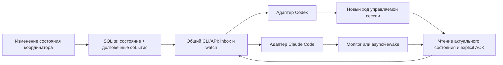

# Межклиентный событийный монитор агентов

Вспомогательный план задачи [координации агентов](Readme.md).

Дата: 2026-10-07. **Статус: запланировано, не реализовано.**

| Цель | Текущее состояние | Следующий шаг |
|---|---|---|
| Codex и Claude Code получают события общей координации без ручного опроса человеком | Проверены официальные описания клиентских механизмов; подготовлен проект, runtime не менялся | Согласовать этот план, затем проверить адаптеры на установленных клиентах |

Этот документ — единственный актуальный план монитора. Он дополняет [протокол координации](Readme.md), реализация которого ведётся отдельно. В рамках подготовки документа службы, мониторы, хуки и новые LLM-сессии не запускаются, настройки клиентов и `.agent-state` не изменяются. Документ пока не означает принятие архитектуры или разрешение её развёртывания.

## Мотивация и критерий результата

Новая задача, пересечение этапов, запрос изменения контракта и завершение предшественника должны доходить до участвующих агентов. Встроенный `SendMessage` отдельного клиента не подходит как общий транспорт Codex и Claude Code. Общий журнал должен переживать завершение чата, потерю фонового процесса и перезапуск машины.

Долгоживущий процесс может ждать события без запросов к модели. Для реакции LLM требуется второй, клиентский механизм: доставка строки в контекст, возобновление существующей управляемой сессии либо начало нового хода. Работоспособный daemon сам по себе не доказывает, что агент прочитал событие. Целевой результат — подтверждённая реакция конкретной зарегистрированной сессии на конкретный `event_id`, с повторной доставкой после сбоя и без повторного выполнения принятого действия.

«Бесконечный процесс» трактуется как возобновляемое наблюдение до явной остановки, включая перезапуски. Это не бесконечный ход LLM и не разрешение выполнять любую вновь опубликованную задачу: сообщение о задаче ещё не назначает владельца и не выдаёт допуск этапа.

## Подтверждённые возможности клиентов

Проверка ниже — чтение официальной документации на указанную дату. Версии, настройки и поведение установленных клиентов в этой задаче не проверялись.

| Механизм | Что подтверждено документацией | Граница применения |
|---|---|---|
| Claude Code `Monitor` | Строки stdout фоновой команды поступают Claude в той же сессии; агент может реагировать на события. Deadline: 5 минут по умолчанию, максимум 30 минут, для `-p` максимум 10 минут. Windows требует Git Bash; инструмент недоступен при некоторых провайдерах и настройках отключения трафика | Не является постоянным daemon. Нужны перевыставление наблюдения и локальная проверка доступности. [Tools reference](https://code.claude.com/docs/en/tools-reference#monitor-tool) |
| Claude Code command hook `asyncRewake` | Фоновый hook с exit code `2` пробуждает Claude даже в idle; stderr, либо stdout при пустом stderr, передаётся как system reminder. Обычный `async` ждёт следующего хода. Для `asyncRewake` сохраняется timeout; повторные запуски hooks не дедуплицируются | Это конкретный документированный механизм пробуждения живой сессии. Нужны lifecycle-запуск и защита от нескольких watchers. Выход самого приложения он не переживает. [Hooks reference](https://code.claude.com/docs/en/hooks#run-hooks-in-the-background) |
| Codex `app-server` | Управляющий клиент может выполнить handshake, `thread/start`/`thread/resume`, затем `turn/start` для начала генерации. `turn/completed` содержит итоговый статус | Подходит для собственной явно зарегистрированной управляемой сессии. Доступ к серверу и thread ID уже открытого пользовательского чата не подтверждён. [App Server](https://learn.chatgpt.com/docs/app-server) |
| Codex `Stop` hook | `decision: "block"` с `reason` создаёт continuation prompt; доступен также exit code `2` с причиной в stderr | Работает в момент завершения хода. Пробуждение уже остановленной idle-сессии этим механизмом не установлено; бесконечное удержание `Stop` не рекомендуется. [Hooks](https://learn.chatgpt.com/docs/hooks#stop) |

Наблюдение за завершением обычного shell-процесса в произвольном клиенте Codex не принято за гарантию нового хода LLM. Вывод процесса может оказаться только в файле или в результате, который нужно прочитать вручную. Возможность автоматического продолжения должна быть отдельно проверена в выбранном host-клиенте. `app-server` предоставляет явный путь начала хода, но не доказывает подключение к текущему чату.

Идентификатор задачи, логический ID потребителя и внутренний ID клиентского чата различаются. Последний записывает только адаптер, получивший его через подтверждённый интерфейс своей сессии. Чтение скрытых баз приложения, извлечение ID из нестабильных transcript-файлов и имитация ввода через UI не входят в предлагаемый MVP.

## Архитектура и владельцы

Единственный владелец состояния координации — ядро из основного протокола. SQLite располагается в `<git-common-dir>/../.agent-state/coordination/`; разрешение пути берётся из общего API, одинаково для всех linked worktree. Монитор не создаёт вторую базу задач, не выдаёт допуски и не вызывает editor-broker. Код общей доставки и адаптеров принадлежит `agent-infra`; продукт может содержать только штатную заглушку CLI и этот документ.

Изменение состояния и соответствующее событие фиксируются одной транзакцией. Watchers читают через CLI/API, а не правят SQLite напрямую. Опрос с ограниченной частотой допустим как реализация ожидания; уведомление файловой системы служит лишь ускорителем, потому что не заменяет чтение журнала. Никакой Unity-аренды во время ожидания.

## Контракт доставки

Имена ниже — предлагаемый интерфейс следующей реализации; их нужно согласовать с фактическими моделями ядра, сохранив одного владельца.

- Событие: монотонный `event_id`, версия схемы, тип, время, `task_id`, автор, адресаты/области интереса, ссылка на сущность и её ревизию, ключ идемпотентности, короткое описание. События не содержат токены, ключи доступа, полные transcript или исполняемые команды.
- Виды событий: регистрация/назначение задачи, требование порядка пересекающихся этапов, запрос/предложение/активация ревизии контракта, изменение допуска, принятие/вливание предшественника. Heartbeat не становится событием для LLM.
- Потребитель регистрирует устойчивый `consumer_id`, интересующие задачи и клиентскую возможность доставки. Отдельный `session_binding` описывает актуальное подключение. Новый процесс получает новую generation; прежний процесс не может подтвердить доставку от её имени.
- Per-consumer scan cursor продвигается только вместе с долговечным учётом найденных адресованных событий в inbox. Отфильтрованные записи можно пропустить; адресованная запись остаётся pending до explicit ACK. Чтение или печать stdout не являются ACK.
- `ACK(event_id, consumer_id, generation)` означает, что агент прочитал событие и актуальное состояние. Это не согласие с контрактом и не принятие этапа. Семантические подтверждения выполняются отдельными командами ядра с точной ревизией.
- Гарантия — **at-least-once** до ACK. Повторный ACK безопасен. После обрыва между доставкой и ACK запись придёт снова. Побочные действия используют ключ идемпотентности ядра и актуальный guard; exactly-once выполнение LLM не обещается.
- Один активный доставщик на `consumer_id`: короткий lease только доставки, generation и fencing при смене процесса. Этот lease независим от допуска этапа и аренды Unity. Недоступность клиента оставляет события pending, а не отмечает их прочитанными.
- Coalescing сокращает пробуждения: одна сводка по задаче/сущности содержит все покрытые `event_id` и актуальную ревизию. Исходный журнал сохраняется. Запросы решения не исчезают при свёртке; ACK явно покрывает каждый ID. Новое событие, поступившее во время обработки сводки, остаётся pending.
- Backpressure ограничивает размер сводки и частоту пробуждений. Остаток читается страницами. При отказе клиента повторяются доставки с backoff, без автоматического снятия pending; состояние ошибки видно оператору.

Событие — уведомление о факте, а не источник разрешений. При реакции агент перечитывает каноническую запись и проверяет допуск. Текст стороннего автора не становится инструкцией более высокого приоритета; адаптер передаёт структурированные поля и ссылки, не конструирует shell-команду из payload.

## Рекомендуемый MVP и альтернативы

**Рекомендация: общий ограниченный `watch` плюс адаптеры клиентов, без постоянной службы и без новой интеграции модельного API.**

Предлагаемая форма: `watch --consumer <id> --until-event --timeout <seconds> --format jsonl`. Команда сразу проверяет pending, затем ждёт ограниченное время и возвращает компактную сводку без ACK. Нормальный режим: `0` — найдены события, отдельный согласованный код — timeout без события, другой код — ошибка. Адаптер Claude `asyncRewake` преобразует «событие найдено» в exit `2` и короткий reminder; ошибка ожидания не маскируется под координационное событие. Коды и точные аргументы должны стать частью CLI-контракта при реализации.

1. **Claude Code:** при наличии `Monitor` подключить JSONL-поток общего watch. Альтернатива — `asyncRewake` hook с ограниченным `watch --until-event`; он обеспечивает документированное idle-пробуждение. До активации проверить нужный lifecycle-hook, timeout, rearm после завершения и единственность watcher. Документация подтверждает примитив пробуждения, но этот составной цикл ещё не испытан.
2. **Codex:** использовать watch как результат уже запущенного tool call только там, где host-клиент действительно возобновляет агента при завершении. Если этого нет, MVP доставляет inbox при следующем штатном входе/ходе; это честный fallback без обещания idle-пробуждения. Для полностью автоматической реакции следующий вариант — отдельная собственная управляемая сессия `app-server` с известным binding, которая получает `turn/start` от адаптера. Подключение к текущему пользовательскому чату требует отдельного подтверждённого интерфейса.
3. **Общий обязательный fallback:** `read-before-stage` перед записью, Unity request/begin и заявкой вливания. Непрочитанное требование координации видно при входе; актуальный guard ядра блокирует конфликтующие действия независимо от работоспособности уведомлений. ACK уведомления не подменяет этот guard.

Альтернатива следующего этапа — один постоянный daemon, обслуживающий подписки и перезапуски watch-адаптеров. Его преимущество — единый supervision без циклов на стороне модели; цена — установка, управление жизненным циклом и отдельные клиентские bindings. Даже daemon не может оживить завершённый чат без клиентского интерфейса. Для первой реализации он добавляет эксплуатационную сложность до проверки самого слабого места — доставки в живую LLM-сессию.

## Ограничения длительного наблюдения

Закрытие приложения, logout, отсутствие сети, лимит модели или явная остановка пользователем переводят binding в недоступное состояние. События сохраняются; новая разрешённая сессия забирает их при регистрации. Нельзя автоматически возобновлять явно отменённую задачу или создавать платные ходы только ради пустого poll.

Daemon при последующей реализации должен запускаться скрыто, иметь явные start/status/stop, heartbeat, supervised restart и bounded backoff. Это отдельное развёртывание инфраструктуры с окном обслуживания по AGENTS.md. Автоматическое создание новой LLM-сессии, выбор credentials, доступ к существующим чатам и пересылка между встроенными средствами клиентов остаются за пределами этого плана.

## План следующей реализации и проверок

Все пункты пока не выполнены. Проверки инфраструктуры — во временных Git/SQLite-стендах, без изменения игрового кода и без Unity.

| Этап | Содержание | Критерий проверки |
|---|---|---|
| 1. Согласовать интерфейс с ядром | Установить владельца inbox, курсоров, ACK, bindings и lease доставки; выбрать имена команд и коды завершения | Нет второй копии состояния задач; stale generation отклоняется; ACK не меняет согласование контрактов |
| 2. Реализовать CLI ожидания | Pending-first, bounded watch, пагинация, JSONL, timeout, отмена, read-before-stage | Событие между проверкой и ожиданием не теряется; фильтр и restart сохраняют pending; ожидание не занимает Unity-аренду |
| 3. Проверить восстановление | Kill до доставки, после stdout, до ACK, после ACK; два watchers; duplicate publish; SQLite busy | Не теряются адресованные события; допустим повтор; ACK идемпотентен; прежний доставщик не подтверждает новую generation |
| 4. Проверить Claude локально | Установленная версия, Git Bash/провайдер, разрешения, Monitor и asyncRewake отдельно | В idle приходит конкретный ID и начинается реакция; измерены задержка, timeout/rearm и поведение после закрытия приложения |
| 5. Проверить Codex локально | Host completion adapter и отдельно управляемый app-server, только после разрешения интеграции | Подтверждён новый ход в нужной сессии; `failed`/`interrupted` не считаются реакцией; доступ к чужому/current thread не предполагается |
| 6. Проверить межклиентный сценарий | Событие Claude → ядро → Codex и обратное; новый контракт, смена ревизии, независимая задача, медленный/отключённый потребитель | Правильные адресаты, explicit ACK, сохранность всех ревизий, отсутствие повторного действия, независимая работа продолжается |
| 7. Подготовить активацию | Инструкция включения/отключения, отчёт проверок, пределы polling/сводок, fallback, затем окно обслуживания | Пользователь проверяет живую реакцию; пакет развёртывания конкретен; закрытие приложения не теряет события |

К отдельному этапу daemon переходить после проверки клиентских адаптеров. Критерий его приёмки: перезапуск восстанавливает все подписки и pending; bounded polling без LLM-запросов в тишине; stop прекращает автоматическую доставку; read-before-stage продолжает работать при остановленной службе.

## Итог анализа на 2026-10-07

Долговечный общий транспорт реализуем независимо от клиентов. Для Claude Code найден документированный механизм idle-пробуждения `asyncRewake` и потоковый `Monitor`; оба требуют локальной проверки и управления сроком жизни. Для Codex найден явный механизм начала хода `app-server`, применимый к доступной управляемой сессии. Автоматическое пробуждение уже открытого пользовательского чата Codex пока не установлено. Ни один из этих путей в проекте ещё не реализован и не испытан.
