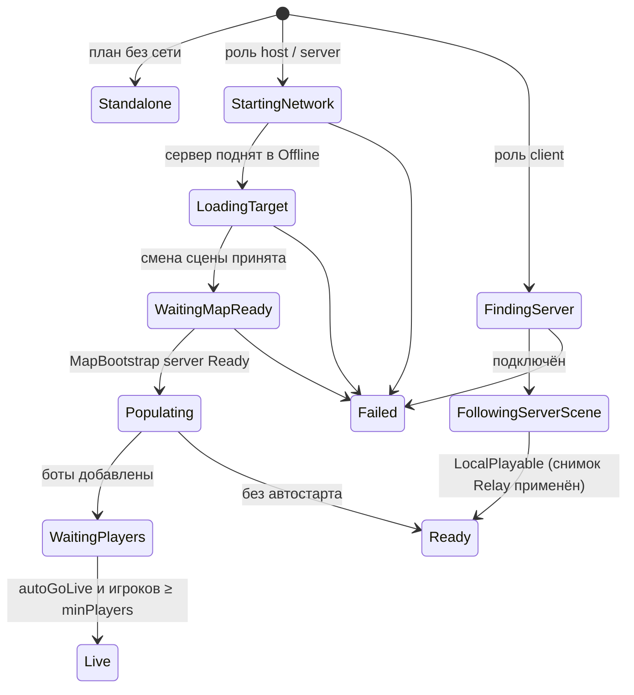

# play-launch — единый запуск Play в редакторе (предложение)

Владелец: сессия Claude Code (`owner` `map-runtime-bootstrap`), worktree
`F:\CodexWorktrees\map-runtime-bootstrap\Vr_Battlegrounds_ai`, ветка `claude/map-runtime-bootstrap`,
база `origin/dev` 5aafcbc4. Начинается после вливания этапа `generated-stations` задачи
[map-runtime-bootstrap](Readme.md). Состояние на 2026-10-08.

| Цель | Мы здесь | Осталось выполнить | Технический документ |
|---|---|---|---|
| Один непротиворечивый механизм запуска Play, которым пользуются человек (окно) и агент (API), без побочных записей в проект | Проект архитектуры. **Ждёт решений пользователя** по открытым вопросам и по согласованию с тестовым стендом `vr-test-stand`. Код не менялся | Решения → реализация → проверка в редакторе | Этот документ |

## Цель и мотивация

Play в редакторе сейчас собирают пять механизмов, которые не знают друг о друге. Из-за этого Play из карты идёт
через лишнее лобби, стенды конфликтуют за стартовую сцену, а агенты в worker меняют файлы под Git и личные
настройки пользователя. Задача заменяет их одним конфигом, одним планировщиком и одной машиной состояний.

## Границы

- **Входит:** стартовая сцена Play, отладочный запуск роли, карты, режима и ботов (`DebugOrchestrator` → `PlayLaunchDirector`), окно и API запуска для агентов, разметка сцен, перевод стендов на этот API, `LocalMenuManager` (лобби по `MapRunKind`).
- **Не входит:** путь игры в сборке и в шлеме (`onlineScene = Lobby` не меняется), `MapBootstrap` (задача map-runtime-bootstrap), код тестового стенда `vr-test-stand` (согласование ниже), Mirror без решения по вопросу 1.

## Что сейчас и почему это ломается

Запуск Play собирают пять механизмов, которые не знают друг о друге:

| Механизм | Что делает | Проблема |
|---|---|---|
| `PlayModeStartFromOffline` + галочка «Start from Offline Scene» | ставит стартовую сцену Offline; при Play из карты пишет карту в `AutoLoadMapScene` | галочка для карт уже ничего не значит (карта всегда через Offline); открытая сцена молча подменяет карту сценария |
| `PlayModeStartFromOffline.TrySetTemporaryStartScene` | одноразовая стартовая сцена стенда (AvatarPuppetStand, ClipScrub, SightCalibrationBench, BotCombatStand) | у каждого стенда своё меню, свой ключ владельца, своя очистка |
| `DebugBootstrapSettings` + окно Bootstrap Settings | роль, админ, карта, режим, автостарт, боты | хранится в **EditorPrefs** — это реестр Windows, общий для **всех** проектов Unity на машине: настройки в worker агентов и в редакторе пользователя — одни и те же ключи |
| `DebugOrchestrator` | по настройкам: роль, загрузка карты после Lobby, боты, GoLive | карту грузит только после того, как хост пришёл в Lobby (`onlineScene` сетевого менеджера) |
| `BotCombatStandEditor.Prepare` | на время прогона переписывает Bootstrap Settings, добавляет сцену стенда в `EditorBuildSettings`, подменяет реестр карт | пишет файл под git (`ProjectSettings/EditorBuildSettings.asset`) и личные настройки; сорванный прогон оставляет их изменёнными; в worker агент меняет настройки редактора пользователя |

Отсюда наблюдаемое: Play из карты идёт Offline → Lobby → карта; стенды конфликтуют за стартовую сцену;
в worker появляются изменённые файлы проекта. `EditorSettings.asset` под git пишет проба тестового стенда
(`vr-test-stand`, `Tools/TestStand/worker_probe.py` меняет `EditorSettings.enterPlayModeOptions` и возвращает); при
записи Unity заодно переводит файл в формат текущей версии — это и увидел брокер.

## Требования

1. **Один источник правды**: всё, что определяет Play, — один конфиг; окно и агент меняют один и тот же объект.
2. **Без побочных записей**: запуск и остановка не пишут файлы под git (`ProjectSettings/*`, ассеты, сцены) и
   не пишут общие для машины настройки (EditorPrefs). Конфиг живёт в игнорируемом git `UserSettings/` этого
   checkout: у пользователя и у worker — разные файлы.
3. **Offline — точка инициализации по умолчанию, без галочки.** Игровая сцена всегда стартует через Offline.
4. **Лобби не обязательно.** Хост и сервер из Offline переходят сразу в целевую сцену. Лобби — цель только когда
   другой игровой сцены нет (Play из Offline или из неразмеченной сцены, либо явный выбор).
5. **Клиент** из Offline сразу попадает в текущую сцену сервера.
6. **Стенды** помечены в сцене и стартуют сами, мимо Offline.
7. **Предсказуемость**: до нажатия Play видно, что именно произойдёт; во время Play видно состояние; отказ — с
   именованной причиной.

## Модель сцен

Вид сцены определяется **содержимым сцены**, а не папкой или галочкой:

| Вид | Признак | Как стартует Play |
|---|---|---|
| `ProcessRoot` | `Assets/Scenes/Offline.unity` | Offline → цель конфига (по умолчанию Lobby) |
| `Game` | в сцене есть `MapRoot` (kind из `MapRunKind`: Lobby, Combat, Debug) | Offline → эта сцена |
| `Standalone` | в сцене есть новый маркер `StandaloneSceneMarker` | сама сцена, без сети и менеджеров |
| `Unmarked` | ни того, ни другого | сама сцена + предупреждение в окне и логе (см. вопрос 2) |

Сетевые стенды (BotCombatStand) — это `Game` с `MapRunKind.Debug`: им нужны сеть, менеджеры и MapBootstrap,
поэтому они идут через Offline, как карты. «Мимо Offline» стартуют только `Standalone`: AvatarPuppetStand,
ClipScrub, SitCandidates, сцены `Assets/Scenes/Tools/*`, ArsenalLayoutAuthoring, стенд калибровки прицела.

Вид чужой (не открытой) сцены редактор определяет без открытия: индекс по тексту `.unity` (GUID скриптов
`MapRoot` и маркера), обновляется `AssetPostprocessor`. Правило «папка `Scenes/Dev` — стенд» удаляется.

## Конфиг запуска

```json
{
  "scene":  { "source": "active", "path": "" },      // active | lobby | scene
  "role":   "host",                                   // host | server | client | ask
  "client": { "address": "" },                        // пусто — поиск сервера в сети (discovery)
  "host":   { "admin": true },                        // профиль хоста: VR-игрок с правами админа
  "match":  { "modeId": "elimination", "autoGoLive": true, "minPlayers": 1 },  // null — без серии
  "bots":   0,
  "editor": { "pauseOnFocusLoss": true }
}
```

- `scene.source = active` (по умолчанию): цель — открытая сцена, если она `Game`; если открыт Offline или
  `Unmarked` — Lobby. `lobby` — всегда обычный старт игры. `scene` — конкретная сцена из `path`.
- Роль в виртуальных игроках Multiplayer Play Mode по-прежнему задаёт их тег (Host/Server/Client) — он главнее
  `role`. Конфиг читает только главный редактор.
- Скриншот по кнопке B — личный инструмент, не часть запуска: остаётся отдельной настройкой, но тоже
  переезжает из EditorPrefs в `UserSettings/`.

### Два слоя

| Слой | Где | Кто пишет | Срок жизни |
|---|---|---|---|
| **Профиль** | `UserSettings/VrBattlegrounds/play-launch.json` | окно (человек) | постоянно, только этот checkout |
| **Разовый запрос** | `SessionState` редактора | стенд, агент, кнопка окна «Play с этим» | один Play; снимается при возврате в Edit Mode |

Действующий конфиг = разовый запрос, если он есть, иначе профиль. Запрос несёт владельца (`owner`); второй
запрос при живом первом — отказ с именем владельца. Агенты **никогда не пишут профиль** — только запросы.
Стенды больше не трогают ни профиль, ни стартовую сцену напрямую.

## Планировщик (Edit Mode)

Чистая функция без побочных эффектов, покрывается EditMode-тестами:

```
Plan(действующий конфиг, вид открытой сцены, индекс сцен) → LaunchPlan
  StartScene   — что ставится в EditorSceneManager.playModeStartScene (Offline / сама сцена)
  Target       — сцена, куда сервер переходит из Offline (карта / Lobby / нет)
  Role, Match, Bots, Warnings[]
```

`playModeStartScene` выставляет только он, перед входом в Play. Окно показывает план строкой:
«Play: Offline → TestMap1 · хост, админ · серия elimination · ботов 2 · автостарт матча».

## Машина состояний (Play)

`PlayLaunchDirector` заменяет `DebugOrchestrator`: исполняет план и публикует состояние. Сборка — только
редактор, как сейчас; E2E-прогоны отключают его через `DebugBootstrapGate.Suppress`, как сейчас.



- **Хост и сервер без лобби.** На время отладочного Play `onlineScene` не используется: сервер поднимается в
  Offline, затем директор делает **тот же вызов, что меню админа**: серия `SessionManager.SetSeries(mode, [цель])
  + StartSession` для сцены с матчем, иначе `MapLoader.LoadMap(цель)` (Lobby, стенд без режима). Путь игры в
  сборке и в шлеме (`onlineScene = Lobby`) не меняется.
- **Клиент.** Mirror при подключении присылает текущую сцену сервера (`SceneMessage`), клиент грузит её из Offline
  сам — лобби у клиента уже нет; директор только ждёт `MapRunAdmission.IsLocalPlayable`. Проверить на прогоне.
- **Отказы** именованные: `SceneNotLoadable`, `MapNotReady` (таймаут MapBootstrap), `ModeIncompatible`,
  `ServerNotFound`, `RequestOwnerBusy`. Отказ — `GameLog.Debug.Error` и состояние `Failed(код)`, без молчаливого
  отката на Lobby.
- Каждый переход — строка лога `[PlayLaunch] A → B`.

## Окно «Play Launch»

Заменяет окно Bootstrap Settings и галочку «Start from Offline Scene».

1. **План** — строка, что сделает Play сейчас, и предупреждения (неразмеченная сцена, несовместимый режим).
2. **Разовый запрос** — если есть: владелец, конфиг, кнопка «Снять».
3. **Профиль** — поля конфига (сцена: открытая / лобби / выбрать; роль; адрес; админ; режим, автостарт, минимум
   игроков; боты; пауза при потере фокуса), «Сбросить».
4. **Во время Play** — текущее состояние машины, время в нём, причина отказа.
5. Кнопки: «Play» (по профилю), «Play с изменениями один раз» (разовый запрос владельца `window`).

## API для агентов

Статический класс редактора, вызывается через `execute_code`; вход и выход — JSON:

| Вызов | Что делает |
|---|---|
| `PlayLaunch.Plan(json?)` | план для конфига (или действующего) без запуска |
| `PlayLaunch.Request(json, owner)` | разовый запрос; отказ, если занят чужим владельцем |
| `PlayLaunch.Play(json, owner)` | запрос + вход в Play |
| `PlayLaunch.Status()` | `{state, since, plan, owner, error}` |
| `PlayLaunch.Cancel(owner)` | снять свой запрос / выйти из Play своего запуска |

Стенды переходят на тот же API: «Run Smoke» стенда ботов = `Play({scene: BotCombatStand, role: server,
match: {modeId: respawn, autoGoLive: false}, bots: 0, editor: {pauseOnFocusLoss: false}}, "bot-stand")` плюс
его собственный прогон тестов поверх состояния `Ready`. Меню Standalone-стендов становятся «открыть сцену и Play».

## Сцены вне списка сборки

Mirror грузит сцену по имени через `SceneManager`, а он видит только сцены из Build Settings. Поэтому стенд ботов
сейчас дописывает себя в `EditorBuildSettings` на время прогона. Варианты (вопрос 1):

- **A. Отладочные сетевые сцены постоянно в Build Settings**, а релизная сборка (`GameBuilder`) и
  `E2EPlayerBuilder` берут список сцен из `MapRuntimeCatalog` без `MapRunKind.Debug`. Одна правка списка в git,
  дальше никаких записей при запуске. **Рекомендую.**
- **B. Загрузка по пути только в редакторе** (`EditorSceneManager.LoadSceneAsyncInPlayMode`) — нужен патч Mirror
  (смена сцены на сервере и на клиенте), то есть правка ThirdParty.

## Что удаляется и переезжает

- Галочка `Start from Offline Scene`, `TrySetTemporaryStartScene`/`ClearTemporaryStartScene`, правило папки
  `Scenes/Dev` → планировщик и разовые запросы.
- `DebugBootstrapSettings` (EditorPrefs) и окно Bootstrap Settings → профиль в `UserSettings/` и окно Play Launch;
  при первом открытии значения переносятся из EditorPrefs один раз.
- `DebugOrchestrator` → `PlayLaunchDirector`.
- `BotCombatStandEditor.Prepare/Restore`: подмена настроек и Build Settings уходит; подмена реестра карт уходит,
  когда стенд будет в каталоге (`DebugMaps` уже есть).
- `LocalMenuManager` определяет лобби по `onlineScene`; переходит на `MapRunKind.Lobby` из `MapRoot` — иначе
  меню в отладочном запуске не узнает лобби.

## Открытые вопросы к пользователю

1. Сцены вне Build Settings: вариант **A** (рекомендую) или **B**?
2. Неразмеченная сцена (`Unmarked`) при Play: стартует сама с предупреждением (рекомендую — старые и временные
   сцены продолжают работать) или Play запрещён до разметки?
3. Профиль один или именованные пресеты («2 бота, elimination», «стенд ботов») с выбором в окне? Предлагаю начать
   с одного профиля, пресеты — когда понадобятся.

## Порядок реализации после решений

1. Модель сцен: маркер, индекс, разметка Standalone-стендов. Планировщик + тесты на все виды сцен и источники.
2. Конфиг и слои (профиль, запрос), перенос из EditorPrefs, API для агентов.
3. Директор: машина состояний, хост/сервер без лобби, клиент; `LocalMenuManager` по `MapRunKind`.
4. Окно Play Launch; удаление старых механизмов; стенды на API.
5. Build Settings по решению 1. Проверка в редакторе: Play из Offline, из карты, из стенда ботов, из Standalone,
   клиент в Multiplayer Play Mode; worker после прогона — без изменённых файлов проекта.

## Согласование с vr-test-stand

Тестовый стенд `vr-test-stand` (`PlayModeTestStand`, [test-stand.md](../../Docs/test-stand.md)) управляет тем же
запуском Play. Пилот стенда уже в `dev`. Что стенд делает с запуском:

- **Стартовая сцена.** Стенд задаёт её через сценарий Multiplayer Play Mode (`m_InitialScene`) и на время прогона
  подменяет `ActiveScenario` временной копией сценария.
- **Общие EditorPrefs.** На время прогона стенд пишет `DebugBootstrap.Enabled`, `DebugBootstrap.HostIsAdmin` и
  паузу XR при потере фокуса, после прогона возвращает их. Это те самые общие для машины настройки, которые
  требование 2 этого проекта убирает.
- **Настройки проекта.** `Tools/TestStand/worker_probe.py` пишет `EditorSettings.enterPlayModeOptions` и возвращает
  его. Это запись в `ProjectSettings/EditorSettings.asset`, файл под Git.
- **Защита оркестратора.** Стенд добавляет в `DebugOrchestrator` правило «во время стенда не работать». В базе
  5aafcbc4 этой защиты ещё нет. `PlayLaunchDirector` заменяет `DebugOrchestrator`, поэтому правило придётся перенести.
- **Блокировка.** Стенд держит её в `Temp/` с `OwnerPid` владельца. Это второй механизм владения запуском
  рядом с `owner` разового запроса.
- **Порты.** Стенд подменяет порты транспорта и discovery до старта сети.

- **Пересечение планов.** В координаторе у `vr-test-stand` зарегистрирован этап `play-launch-integration`
  (worktree `F:/CodexWorktrees/vr-test-stand/...`). Его `writes` пересекаются с этапом `implementation` этой задачи:
  `Assets/Editor/VR_Battlegrounds/Debug/**`, `Assets/Scripts/Debug/Bootstrap/**`, `DebugBootstrapGate.cs`,
  `BotCombatStandEditor.cs`, `Assets/Scenes/Dev/**`, `Assets/Scenes/Tools/**`, `Docs/testing.md`, `Docs/README.md`,
  `Docs/CHANGELOG.md`. Кроме того, он объявляет `StandaloneSceneMarker.cs` — маркер из модели сцен этого проекта.
  Зависимости `after` между этапами нет, поэтому первый же `begin` получит `UNORDERED_OVERLAP`. Порядок и разделение
  работы нужно согласовать с владельцем `vr-test-stand`.

Что из этого следует для проекта:
- стенд и разовый запрос должны иметь одного владельца запуска;
- сценарий MPPM — ещё один источник стартовой сцены;
- записи стенда в EditorPrefs и `EditorSettings` противоречат требованию 2.

**Вопросы к пользователю:**
1. Работает ли `PlayLaunchDirector` в прогонах стенда? Если нет — стенд снимает директора явно, как
   `DebugBootstrapGate.Suppress`. Если да — стенд становится обычным владельцем разового запроса.
2. Входит ли сценарий MPPM (стартовая сцена, роли виртуальных игроков, порты) в конфиг Play Launch? Или он
   остаётся внешним слоем стенда, а планировщик только читает его?
3. Вливать ли стенд `vr-test-stand` до Play Launch? Если да, Play Launch переносит его защиту и записи настроек на
   свой API. Если нет, стенд сразу строится на API Play Launch.

## Критерии приёмки

- Запуск и остановка Play, в том числе стендом и агентом, не меняют файлы под Git (`ProjectSettings/*`, ассеты, сцены) и не пишут общие для машины EditorPrefs. Worker после прогона — без изменённых файлов проекта.
- Play из Offline, из сцены карты, из стенда ботов и из Standalone-сцены стартует так, как показывает строка плана в окне. Хост и сервер идут из Offline сразу в целевую сцену, без лобби.
- Клиент в Multiplayer Play Mode из Offline попадает в текущую сцену сервера и доходит до `LocalPlayable`.
- Второй разовый запрос при живом первом получает отказ `RequestOwnerBusy` с именем владельца. Отказы именованные, молчаливого отката на Lobby нет.
- Планировщик покрыт EditMode-тестами на все виды сцен и источники конфига.
- Прогон `vr-test-stand` проходит в согласованном варианте (вопросы выше).
- Приёмка пользователем в редакторе.

## Следующие действия

1. Зарегистрировать задачу. Протокол допускает одну задачу на worktree (`OWNER`), а этот worktree занят
   `map-runtime-bootstrap`. Поэтому регистрация возможна из отдельного worktree (тогда поле `worktree` меняется)
   либо после закрытия `map-runtime-bootstrap`.
2. Получить решения пользователя по открытым вопросам 1–3 и по вопросам согласования с `vr-test-stand`, включая
   порядок этапов с `vr-test-stand/play-launch-integration`.
3. Обновить этот документ по решениям, при необходимости уточнить `writes` и зависимости от `vr-test-stand`.
4. Начать этап `implementation` после вливания `map-runtime-bootstrap/generated-stations` в порядке раздела
   «Порядок реализации после решений».
