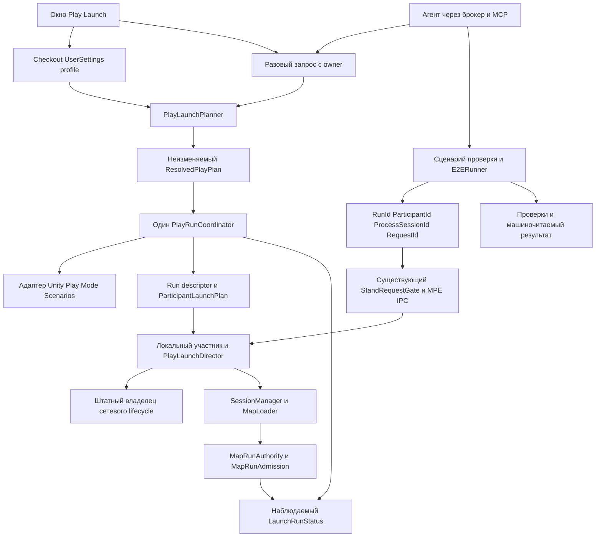

# Play Launch и адресный стенд: подробности архитектуры

Исходный анализ: 2026-10-07. Перенос на текущий протокол: 2026-10-08.
Согласованная архитектура ниже реализуется по прямому поручению пользователя; текущий статус — только [Readme.md](Readme.md).

## Регистрация и зависимости

### Штатный launcher release

По уведомлению1681 выполнен rebase на ce765889: launcher1e169ec9 принят через origin/dev.
До перехода сохранён полный checkpointf16f674b1280796e1a25fa406c8d0dac9a379a8d
с tracked/untracked и аварийным launcher; staged diff отсутствовал, пересечений untracked
с входящими файлами не было. Аварийный launcher до rebase уже совпадал с origin/dev;
rebase --autostash прошёл без конфликтов, launcher стал чистым относительно HEAD.
Его diff в gameplay commit не включается. Publication333 проверяется отдельно:
заявка публикации не является доказательством смены фактической базы worker.

### Регрессия Renderer в принятой базе

Пользователь передал стек _avatarRenderers UnassignedReferenceException от weapon-system:
Renderer.set_enabled → UxrAvatar.SetAvatarRenderMode → RenderMode → Start.
Принятый SDK уже использует _avatarRenderers?.ForEach, значит null самого списка защищён,
но битые/удалённые Renderer внутри списка нет. Задача avatar-renderer-regression подтверждает
14 ссылок старой ветки Ghost в Cyborg; исправленный snapshot48e1ce7f ещё не принят в origin/dev.
Владелец отвечает за сборщик/префаб и приёмку; наша задача не вносит конкурирующий SDK patch.
Переданы адресные сообщения1534 владельцу и1536 weapon-system с просьбой указать runtime inputSHA.
Наши307/309 используют edcb79e8 и не включают невлитое исправление. Связь этой ошибки с
конкретным LaunchNotReady TestMap2 остаётся неподтверждённой; нужны контекст запуска и actual роль.

### Роль управляемого запуска и JSON

Unity JsonUtility восстанавливает отсутствующий массив ролей как пустой. Null и пустой массив
AdditionalPlayerRoles означают default client; непустой список обязан совпадать с ClientCount.
RED→GREEN локального конфигурационного harness:31/1→32/0. Это проверка инфраструктурного
контракта сериализации, а не тесты изменённого gameplay до пользовательской приёмки.

В managed scope единственный источник роли — frozen request участника, связанный sceneLoaded
до Start сети. Нативный MPP-тег больше не конкурирует с ним; без managed scope сохраняется
прежний приоритет тега над legacy fallback. Provider снимается только собственным delegate.
Отчёт309 не доказывает фактическую сетевую роль при отказе: его Role — raw MPP Tags после
cleanup. Для повторной проверки добавлены RequestedRole/NetworkRole и ограниченная statusTrace.
Исправление приоритета закрывает подтверждённый конфликт источников, но не принимается как
доказанный fix таймаута TestMap2 без следующего живого прогона.

### Размещение Editor-provider

PlayLaunchSettings размещён в Assets/Editor/VR_Battlegrounds/Debug/Bootstrap.
Asmref ссылается на существующую VrBattlegrounds.DebugBootstrap (UNITY_EDITOR), поэтому
DebugBootstrapSettings не получает обратную зависимость на Assembly-CSharp-Editor.
GUID provider сохранён; чистые configuration/profile store остаются в прежней Editor-only сборке.
Реальный RED компиляции297 вызван отдельным дефектом meta ProfileStore: 33 символа GUID,
Unity Asset ignored → CS0246. Исправление GUID и перенос требуют повторного Unity-прогона;
локальная EditorBinding подтверждает только C# привязки.

### Границы конечных проверок

Первый worker-пакет проверяет Server+2Client, Client+Host и прямой Server→TestMap2.
Ready подтверждает сеть и допуск карты; session/avatar и серверный список сессий ожидаются
отдельно с конечным сроком. Baseline сравнивает native scenario, playModeStartScene,
профиль checkout, EditorPrefs и ProjectSettings после каждого Cancel.

Последующие пакеты: обычный toolbar Play и native single-editor route (включая отказ
конфликтной роли); размеченный Standalone без сети; один Bot T01 smoke; managed E2E
session-recovery-on-reconnect с фактическими завершёнными результатами всех участников.
Native Ready не оценивается через managed manifest: проверяются фактические сцена/роль.
Настоящий domain reload — отдельное recovery-покрытие: новые ProcessSessionId,
отказ старым адресам и завершение/очистка после reload. Старый operation cache не обязан выживать.

Сроки polling не ограничивают длительность одного MCP transport-вызова (до 600 секунд).
При таймауте сначала читается durable/native состояние; мутация не повторяется ради результата.
Аренда продлевается только при продолжающейся Unity-операции; finish — сразу после пакета/очистки.

### Ruling: harness одного проверяемого пакета

После подключения принятого ServerStartupRoute локальный EditorBinding показал RED: отсутствует
StartupRouteHandle в API-stubs. Реальная реализация уже в принятой базе; это дефект compile harness,
не доказательство ошибки игры. Прежний отдельный maintenance-harness after integration verified
создаёт цикл проверки: harness должен понимать API до проверки integration, а его checkpoint
зависит от новых исходников этой же integration. Поддержка долгоживущего Tools/TestStand — отдельный
пункт пакета integration с явно объявленной областью Tools/TestStand/** и проверками RED→GREEN.
Пустой отдельный maintenance этап удалён; docs-publication остаётся после принятого integration.
Это не новый инфраструктурный сервис: поддерживается единственная существующая копия harness.
Тесты stub-порта подтверждают только привязку C# типов; реальную route проверяет Unity worker.

### История миграции и ранних проверок 2026-10-09

Ниже сохранены факты на момент ранней миграции, а не текущий допуск или блокеры.
Актуальные база, регистрация, очередь и следующий шаг находятся только в Readme.md и plan.json.

Сессия теперь реально запущена из назначенного worktree; native apply_patch primary metadata проходит.
План revision6 зарегистрирован: integration after map-runtime-bootstrap/startup-route merged и
arsenal-generator/composer-presentation merged; needs map-startup-route revision2 aspects* active.
Собственные ACK play-launch-control1 и map-startup-route2 обновлены на plan6. Чужие ACK не создавались.
Begin получил DEPENDENCY: startup-route — исходники до допуска не меняем.

Bots-fix сообщил650: launch adapter исключён из его writes, clip-cutover (GameNetworkManager)
имеет after нашей integration merged. Фактический план проверяется по agents/status. Прежний
блокер foundation по BotCombatStandEditor больше не применяется. Arsenal подтвердил620
свой composer первым, точный CommonArsenalReview включён в его области.

Map-startup-route2 закрывает pre-start cleanup: владелец хранит handle с RequestId, снимает
только свою Requested-заявку, не опирается на StopServer при неактивном сервере. После
SceneConsumed у Host immutable modeId сохраняется до OnStartServer/Series capture.
Наша интеграция получает эту реализацию только после merged/active; не подменяет её копией.

Подготовка следующего пакета: вызвать TryRequest до штатного StartServer/StartHost только
у серверного участника; держать handle в его scope и освобождать при ошибке/pre-start Cancel.
Проверить, что DebugOrchestrator не запускает вторую загрузку/серии после принятой startup-route.
Marker-пилот и явный Lobby без route сохраняют принятый путь. Проверить отдельно Host/Server,
mode capture, отсутствие промежуточного Lobby, readiness и обычный запуск без запроса.

Единственный машинный план — plan.json. База после rebase: ec92098a5d9b2f988d9634906469df9eead6fe6d.
Первый rebase был на 2cedfe99; поступивший затем ec92098a переносит только документы WeaponSystem.
Второй rebase прошёл без конфликтов; изменённых игровых исходников в этом входящем коммите нет.
Исходники интеграции, обслуживание долгоживущего Tools/TestStand и публикация продуктовых Docs
разделены на три этапа. Владелец Docs/test-stand.md — vr-test-stand (принятый пилот f42eb741).
До публикации новая инструкция хранится как локальный draft в reports/; в продуктовый файл она не внесена.

Контракт play-launch-control ревизии 1 предоставляет этап play-launch-integration; предыдущая
проверка маркерного пилота не принимает эту реализацию. Смена размещения материалов не меняет
семантику контракта. После регистрации нового плана требуется актуализировать собственный ACK.
Чужие подтверждения и активность реализации не создаются автоматически.

SDK patch58 зарезервирован в coordination: play-launch-focus-pause. Запись changelog/2026-10-08-sdk-58.md
заменяет нашу невлитую запись общего SDK-журнала. Чужая история общего файла сохраняется.
Обычные этапы этой задачи не редактируют AGENTS.md или общие индексы/журналы.

Пересечение кода остаётся с legs-ik/pose-set и sit-clip по ClipScrubStand.Live.cs. Предложен
порядок наш integration merged → их этапы; обязательство after должно быть внесено владельцем
либо порядок явно пересогласован. Legs-ik подтвердил порядок сообщением126, after внесён в его план.
Новый bots-fix/equipment-foundation пишет Editor/Bots/**, включая наш BotCombatStandEditor;
порядок по этому пересечению ещё не согласован. Пересечения с haptics/weapons только по общим журналам
устраняются новой политикой, а не присвоением чужого ACK. MapRunAdmission/LocalRunKey берутся
из принятой базы; не влитые API generated-stations не используются.

Rebase сохранён отдельным stash 51cb25e25a7fff35920bf3443af7557dbac0de80, включая untracked.
Конфликт AGENTS.md решён сохранением нового HEAD; локальные материалы восстановлены. Stash не удалён.
После rebase сохранность 44 исходников и .meta проверена сравнением Git blob hash с backup.
Локальный harness31/31 и обе EditorBinding-конфигурации проходят; game ports там stubs,
поэтому это не Android/Unity PASS. Перенесённый launch_worker_probe прошёл Python syntax check.
SDK-journal и Docs/test-stand восстановлены к принятому HEAD: собственные материалы сохранены
в changelog и локальном docs-test-stand-draft. Код игры при этой миграции дополнительно не менялся.
Основание анализа: исходники собственного worktree на `f42eb741`, опубликованный маркерный пилот
и присланный пользователем проект «Запуск Play в редакторе: сценарии отладки».
Новые Unity-прогоны в рамках этого анализа не выполнялись. Выводы о новых путях запуска — гипотезы,
пока не подтверждены отдельной пробой. Пользователь запросил сначала анализ и сохранение в файл.

## 1. Цель интеграции

Человек через окно и агент через API должны запускать один и тот же предсказуемый сценарий.
Несколько экземпляров получают явные роли и отдельные адреса; проверки выполняются в выбранном процессе.
Запуск не меняет файлы проекта под Git и личные настройки другого checkout.
Остановка и ошибки освобождают только ресурсы своего запуска.

Это два связанных контура, а не два конкурирующих директора:

- **Play Launch:** планирование, старт/остановка процессов, конфигурация и наблюдение готовности.
- **Test Stand:** адресные команды, шаги проверки, утверждения, отчёт и испытания отказов.

Один источник правды означает одного владельца каждого состояния. Не нужно складывать профиль,
сетевое состояние, шаги теста и результаты в один изменяемый глобальный объект.

## 2. Что уже подтверждено

| Факт | Основание | Следствие |
|---|---|---|
| Пилот запускает ServerOnly и двух соединённых клиентов; маркер исполняется только у выбранного клиента | Worker ticket 147: Android PASS, 53/53 живых утверждения; [инструкция](../../Docs/test-stand.md) | Сохраняем MPE IPC, адреса и gate; повторно писать транспорт не нужно |
| Повторы/конфликты RequestId, неверные адреса, Stop и новый запуск проверены | Тот же живой отчёт, локально 22/22 | Сохраняем протокол и отрицательные проверки |
| Пилот сохраняет/меняет общие EditorPrefs и возвращает их | `PlayModeTestStand.StartProbe/Restore`, `StandManifest.Settings` | Restore не обеспечивает изоляцию одновременно открытого редактора пользователя |
| Debug Bootstrap использует постоянный общий префикс EditorPrefs | `DebugBootstrapSettings.KeyPrefix` | Разные worktree не получают разные пространства настроек |
| UXR-пауза использует EditorPrefs и статический кэш | `UxrManager.EditorFocusPauseEnabled`, SDK patch 33 | Перенос только окна/Bootstrap не устранит последнего общего writer |
| Проба меняет EditorSettings.enterPlayModeOptions | `Tools/TestStand/worker_probe.py`; return checkpoint 147 | Unity пересохранила формат EditorSettings 13→15; файл исключён из пилота. Настройки возвращены, но Git-побочный эффект был |
| BotCombatStand временно меняет EditorBuildSettings, Bootstrap и затем registry | `BotCombatStandEditor.Prepare/Tick/Restore` | Стенд ботов тоже должен перейти на общий launch request |
| StartServer вызывает OnStartServer, затем может вызвать ServerChangeScene(onlineScene) | Вендорный `Mirror/Core/NetworkManager.cs` | Server.active ещё не означает конец запуска. Два инициатора смены сцены дадут гонку |
| Начальная сеть и SessionContext уже имеют штатных владельцев | `GameNetworkDiscovery.ApplyRole/StopCurrent`, `GameNetworkManager.OnStartServer` | Новый директор не должен повторно создавать сервер или SessionContext |
| Готовность карты и SDK-снимка уже вычисляется существующим контрактом | `MapBootstrap`, `MapRunAuthority`, `MapRunAdmission.IsLocalPlayable`, NetworkStateRelay | Новый Ready должен ссылаться на этот контракт, а не копировать gameplay readiness |
| Меню использует onlineScene как признак Lobby | `UI/Menu/LocalMenuManager.cs` | Изменение маршрута старта требует отдельной миграции определения контекста меню |
| GameBuilder и E2EPlayerBuilder сейчас берут сцены из EditorBuildSettings | Их исходники | Исключение Debug-сцен из сборок пока предложение, а не существующая гарантия |
| E2E reconnect сам управляет соединением | `SessionRecoveryOnReconnectScenario`, включая прямой StartClient и ожидание смены NetworkManager | Нельзя запускать его без адаптации поверх второго владельца lifecycle |

Важно: маркерный отчёт проверил две конфигурации EditorSettings, но не доказал фактический domain reload
главного процесса — ProcessSessionId остался одинаковым. Forced reload и смерть процесса отдельно не проверены.
XR-ввод, Quest, хват, ходьба, UI и disconnect/reconnect ещё не входят в подтверждённый пилот.

## 3. Основные идеи, которые берём

| Из плана Play Launch | Из нашего стенда |
|---|---|
| Одни Plan/Play/Status для окна и агента | Адрес RunId + ParticipantId + ProcessSessionId |
| Профиль в UserSettings конкретного checkout | Неизменяемый run descriptor, доступный виртуальным редакторам |
| Разовый запрос с владельцем и отказ при конкуренции | Временные области профиля и DeviceToken; отдельные идентичности участников |
| Явная классификация Game/Standalone/ProcessRoot | Реальные роли Mirror и PID в наблюдаемом состоянии |
| Директор с именованными переходами/отказами | RequestId, дедупликация, conflict, EffectUnknown и bounded cache |
| Готовность по MapBootstrap/Relay | Конечные отчёты, отрицательные контроли и проверка изоляции команд |
| Миграция старых окон и стендов | Брокер, guard, освобождение аренды сразу после пакета |

Не переносим без изменения: временную очистку onlineScene, глобальные EditorPrefs, blanket-исключение Debug
из всех E2E-сборок и подавление общего директора через старый DebugBootstrapGate.Suppress.

## 4. Конфликты и рекомендуемые решения

### 4.1. EditorPrefs и восстановление

Проблема — общий writer для нескольких независимых запусков. Даже исправный restore оставляет интервал,
когда worker изменил настройку пользователя; другой редактор может кэшировать её или успеть изменить сам.
Следующий restore способен затереть уже новое значение.

Рекомендация: окно пишет только `UserSettings/VrBattlegrounds/play-launch.json` своего checkout.
Агент/стенд создаёт разовый request, не пишет постоянный профиль. Старые EditorPrefs читаются для
миграции только по явному действию человека; worker не импортирует чужой профиль автоматически.
Профиль имеет schemaVersion; отсутствующий файл означает defaults без записи агентом.
Добавить проверенный `.gitignore` для нового пути, не полагаться на неявное игнорирование UserSettings.

Для паузы UXR нужен процессный override с владельцем, а не вызов существующего setter, который пишет
EditorPrefs. При изменении SDK — отдельный patch и запись в sdk-patches; зарезервировать номер в координации.
Скриншот можно оставить отдельной настройкой, но в изолированном checkout storage.

### 4.2. SessionState не является межпроцессным конфигом

Разовый запрос и baseline в SessionState подходят одному Editor и переживают его reload.
Дочерние редакторы имеют отдельное состояние, поэтому не смогут просто прочитать SessionState main.

Рекомендация: main разрешает профиль/разовый request в неизменяемый `ResolvedPlayPlan` и публикует
run descriptor в общем для этого запуска каталоге Temp вне Assets. Участники читают только свои
`ParticipantLaunchPlan`. Нормализация root виртуального редактора сохраняется из StandManifest,
но путь `/Library/VP/` является адаптером Unity MPPM, его нужно проверять при обновлении пакета.
Профиль пользователя main читается только main; дочерние экземпляры потребляют готовый снимок.

Descriptor включает schemaVersion, RunId, owner, identity координатора, фазу, список участников,
планы, порты и срок/heartbeat. PID дополняется идентичностью сессии/процесса — PID может переиспользоваться.
Порты принадлежат запуску, а тестовые токены участникам; reconnect не генерирует новый токен устройства.

### 4.3. Топология отсутствует в исходном JSON другого плана

Роль одного редактора недостаточна для «сервер + два клиента». Сохраняем Play Mode Scenarios как backend,
добавляем в request явную topology/участников либо ссылку на выбранный сценарий.
Все существующие Default/Client/Client+Host/Host/Host+Client/Server+client должны иметь определённый путь.
Не кодировать навсегда имена Player 2/Player 3 в общей модели: это детали текущего пилота/адаптера.

Plan показывает requestedRole и effectiveRole. При обычном MPPM учитываем теги и отражаем приоритет
в плане; явная несовместимость topology и тега — именованный отказ. Молчаливой подмены роли нет.
Host имеет серверную и клиентскую стороны в одном процессе, но один ParticipantId.
Тест отключения отдельного клиента требует отдельного Client, а не остановки локального клиента Host.

### 4.4. Пропуск Lobby и NET-21

Сейчас Mirror владеет offlineScene/onlineScene, а MapLoader — последующими сменами карты.
Очистить onlineScene перед StartServer и вернуть потом — изменение инварианта NET-21, не рутинная настройка.
Директор, увидев NetworkServer.active, может запросить карту раньше ещё запланированного перехода Mirror в Lobby.

Рекомендация: объединять управление сначала с текущим маршрутом Offline → Lobby → target.
Пропуск Lobby — самостоятельный архитектурный этап после согласования единственного startup scene owner.
Перед ним проверить ветки StartServer и StartHost, порядок callbacks, spawn SessionContext, раннего/позднего
клиента и SceneMessage. Предложить явный startup policy через владельца сетевого lifecycle; если Mirror
не даёт безопасного hook, рассмотреть необходимый SDK patch отдельно. План пока не выбирает конкретный hook.
Не менять сериализованные scene fields, не грузить карту прямым SceneManager/ServerChangeScene из директора.

### 4.5. E2E и директор не должны одновременно стартовать сеть

Старый E2E владеет сетью и подавляет DebugOrchestrator. Новый директор должен стать общим launch owner,
а E2E — потребителем готового запуска. Подавление наследуемого debug writer не равно отмене общего запуска.

Рекомендация: ввести явный ownership handshake для legacy E2E и `ExternallyLaunched` режима контекста
(имя предварительное). Пока сценарий не адаптирован, общий директор и его сетевой bootstrap не запускаются
одновременно. После адаптации startup/reconnect идут через один command service, а сценарий наблюдает и проверяет.
E2ERunner.Begin остаётся общим исполнителем; токен берётся из ClientDeviceIdentity/контекста,
не из предположения, что тестовый DeviceToken сохранён в PlayerPrefs.
CLI и Editor различаются адаптером запуска, а не логикой результата; server завершает CLI-процесс,
Editor-запуск не вызывает Application.Quit.

### 4.6. Ready не равен Connected

Connected, сцена загружена, CompositionReady, локальная игровая готовность и Ready игрока — разные условия.
`MapRunAdmission` допускает сцены без bootstrap и неактивную клиентскую сеть для специальных сценариев;
поэтому один этот bool нельзя использовать как универсальное подтверждение нужного подключения/карты.

План фиксирует критерий готовности: ConnectedOnly для транспортной пробы; MapPlayable для игровых шагов;
StandaloneReady для самостоятельного стенда; SeriesLive отдельно для autoGoLive.
MapPlayable требует соответствующей роли/соединения, ожидаемой сцены, текущего MapRunKey,
существующего server Ready/LocalPlayable и отсутствия Closing/Retiring/Failed.
Client следует авторитетной сцене сервера; explicit scene в его запросе — ожидаемая сцена для проверки,
а не команда загрузить другую локальную карту. minPlayers должен явно определять, учитываются ли боты.

### 4.7. Классификация сцен

В присланном плане есть противоречие: Unmarked описан и как fallback в Lobby, и как запуск самой сцены.
Нужно выбрать одно правило. Рекомендация: человеку разрешить запуск Unmarked напрямую с предупреждением;
для агента требовать явное opt-in. Сетевую карту/стенд нельзя молча признать Standalone.

Game определяется MapRoot и соответствием каталогу; Standalone — явным маркером;
ProcessRoot — валидированным Offline. MapRoot + Standalone одновременно — отказ.
Правило по папке Dev удалять только после инвентаризации и разметки существующих стендов.
Наличие GUID в тексте .unity — быстрый индекс-кандидат, а не полная семантика: учитывать prefab instances,
зависимости, переименования и устаревший кэш; иначе возможны ложные Unmarked. Plan должен сообщать
ClassificationUnknown и использовать проверку/валидированный индекс, а не молчаливый fallback.

### 4.8. Debug-сцены и сборки

Рекомендую вариант A другого плана: редакторские сетевые Debug-сцены постоянно доступны из Build Settings
после отдельной принятой миграции; запуск не добавляет/удаляет их. Это контролируемая настройка проекта,
а не запрет на любые изменения Build Settings при разработке.

Release-сборка исключает Debug. E2E/automation-сборка включает ровно сцены, требуемые её сценариями,
в том числе Debug, если нужна fixture. Нельзя безусловно исключить Debug из каждого E2E-плеера.
Оба builder используют общий scene resolver с явным BuildPurpose; Offline и требуемые игровые сцены сохраняются.
Standalone Editor-only сценам не нужен runtime build list. Проверить отсутствие ссылок на debug fixtures в релизе.

### 4.9. Остановка, reload и авария

Cancel проверяет owner и RunId, отзывает команды и ждёт завершения своих операций; затем очищает
scope профиля/ввода, свои маркеры и сервисы. Общий EventService и чужие процессы не закрываются.
Отказ готовности тоже приводит к именованному результату и очистке. EffectUnknown не скрывается retry.

При reload теряются delegates/кэш операций; сохраняется журнал/baseline и отзываются старые адреса.
Определить политику: resume только при подтверждённой реконструкции owner/state, иначе controlled abort.
При смерти координатора участники по heartbeat прекращают принимать команды и освобождают своё состояние;
окно показывает остаточный запуск. В worker аварийное восстановление editor lease остаётся обязанностью брокера.
Не делать приложению отдельный обход брокера под видом recovery.

## 5. Рекомендуемая архитектура

Предварительные API, не существующая реализация:

- `PlayLaunch.Plan(json?)` → resolved plan, эффективные роли/цели/готовность, warnings/errors и plan hash.
- `PlayLaunch.Request(json, owner)` → request id либо OwnerBusy; без входа в Play.
- `PlayLaunch.Play(json, owner)` → RunId и launch operation; исполняется замороженный plan.
- `PlayLaunch.Status(runId)` → общий статус и участники: адреса, фактическая сеть, сцена, MapRunKey, готовность.
- `PlayLaunch.Cancel(runId, owner)` → асинхронная очистка, результат и оставшиеся ошибки.
- `TestStand.Send(request)` / `Operation(requestId)` → сохранить текущий адресный контракт; facade старого
  PlayModeTestStand остаётся совместимым адаптером на время перехода.

Owner приложения и token аренды брокера — разные сущности. PlayLaunch не выдаёт себе редакторскую аренду.
MCP связан с главным редактором своей аренды, а дочерние процессы получают команды только через адресный IPC.
PlayerPrefs хранит обычную идентичность; временные данные — только scope текущего участника.

## 6. Альтернативы

| Вариант | Цена и риск | Решение |
|---|---|---|
| Единый запуск, существующий адресный исполнитель | Постепенная миграция, переиспользование доказанного IPC; нужен общий run contract | Рекомендуется |
| Оставить два launch coordinator и связать их настройками | Быстрее первый демонстрационный запуск; сохраняет гонки, два owner и cleanup | Не рекомендуется |
| Монолит PlayLaunch содержит запуск, IPC, тесты, ботов и VR | Кажущийся один источник, но смешивает lifecycle и смысл тестов, трудно проверять | Не рекомендуется |

## 7. Предварительный порядок интеграции

Это архитектурная последовательность, не разрешение начинать код. Детальный execution plan с точными
сигнатурами/пробами составляется после принятия контракта владельцев и решений ниже.

| Этап | Области / будущие компоненты | Проверяемый результат |
|---|---|---|
| 0. Общий контракт | PlayLaunchRequest/ResolvedPlayPlan/ParticipantLaunchPlan/LaunchRunStatus; startup/reconnect owner; согласование с авторами map/bootstrap и ботов | Ни один эффект не имеет двух writers; compatibility/CLI/MPPM matrix зафиксирована |
| 1. Изоляция настроек | Новый checkout profile store; SessionState request; DebugBootstrapSettings adapters; UXR process override, .gitignore | Worker не меняет пользовательские EditorPrefs; normal Play после теста использует свой профиль |
| 2. Общий coordinator | StandManifest/PlayModeTestStand/PlayModeStandParticipant; новый PlayLaunch facade, MPPM adapter | Наш Server+2clients и маркерный пилот идут через PlayLaunch; единственный RunId и cleanup owner |
| 3. Planner и ready | Scene classification, каталог, MapRunAdmission/MapRunAuthority observers | Plan предсказуем; клиент готов только для нужного run/сцены; stale ready не проходит |
| 4. Director и окно | DebugOrchestrator → PlayLaunchDirector; окно Bootstrap → Play Launch; PlayModeStartFromOffline compatibility | Человек/API получают один план; существующий Offline→Lobby→target работает, старый writer отключён |
| 5. Стенды и build list | BotCombatStandEditor, Standalone menus/marker, каталог Debug, GameBuilder/E2EPlayerBuilder resolver | Прогоны не пишут Build Settings/registry; Debug не попадает в release, нужные fixtures доступны automation |
| 6. E2E и reconnect | E2EContext/E2ERunner, SessionRecoveryOnReconnectScenario, GameNetworkDiscovery и общий command service | Один клиент disconnect/reconnect; сервер и наблюдатель живы, сессия/аватар/место восстановлены без дублей |
| 7. Без Lobby | Только согласованный startup scene policy, GameNetworkManager/Mirror при необходимости, LocalMenuManager | Нет intermediate Lobby; preserved SessionContext/series/late join/host lifecycle; обычный билд не изменён |
| 8. Fault/reload/XR | Fault adapter, lifecycle/heartbeat probes, один источник XR-input | Реальные обрывы/timeout/reload, затем хват/ходьба/UI; Quest acceptance отдельно |

Не удалять все legacy-механизмы одним первым коммитом. Каждый пункт должен переводить целый вертикальный
сценарий на нового владельца; old path остаётся только для ещё не мигрированных запусков, а не параллельно новому.
API/runtime helpers в game сборке не зависят от UnityEditor; Editor-код только
`Assets/Editor/VR_Battlegrounds/{Debug,Testing,Bots,Release}/`, профили вне Assets.

## 8. Матрица проверки и критерии приёмки

- **Безопасность запуска:** два конкурирующих owner, чужой Cancel, stale run/session/plan hash,
  повтор RequestId, changed payload, timeout после побочного эффекта и ограниченный кэш.
- **Пути сцен:** Offline→Lobby, Game Combat/Debug, Standalone, Unmarked, конфликт маркеров,
  карта вне каталога/build list, несовместимый режим, missing scene и устаревший prefab index.
- **Роли:** одиночные Host/Server/Client/ask и все имеющиеся MPPM-сценарии; Server+2clients,
  роли/профили/токены всех процессов независимы. Client не становится Host из-за bootstrap fallback.
- **Readiness:** отказ CompositionReady как игрового Ready, stale MapRunKey, закрывающаяся карта,
  late join, Relay ещё не применён, bots/minPlayers и SeriesLive с правильным смыслом порога.
- **Изоляция:** пользователь и worker открыты одновременно; compare settings обоих checkout до/после;
  no EditorPrefs writes, no tracked ProjectSettings/assets/scenes diffs. Исключения отдельной принятой
  миграции build list не смешивать с runtime запуском.
- **Завершение:** Stop, timeout, исключение шага, compile/domain reload, ручной выход из Play,
  смерть участника и координатора; восстановление одного scope не стирает чужое новое состояние.
- **Reconnect:** стабильный DeviceToken, новое connection/avatar epoch, старая команда не действует
  на новый аватар, число сессий/тел/обработчиков корректно, сохранённое место и authority восстановлены.
- **После теста:** обычный Play и текущие standalone/bot fixtures работают; release/automation
  build scene lists проверены; user editor не прерывался. Полный отчёт показывает невыполненные проверки красными.

Постоянные тесты инфраструктуры допустимы сразу. Новую/изменённую игровую механику закреплять тестами
после подтверждения пользователем по AGENTS. До принятия — compile и подготовленная живая проба.
Реальный Unity-прогон только через собственную аренду брокера; после завершения пакета finish до анализа.
Проба по умолчанию не изменяет EditorSettings.enterPlayModeOptions. Если требуется сравнить такие режимы,
делать отдельную явную проверку конфигурации/подготовленного редактора, с отчётом всех disk side effects.

## 9. Рекомендуемые решения для согласования

1. Принять разделение PlayLaunch / адресного исполнительного слоя и общий run owner.
2. Один постоянный профиль на checkout плюс разовый запрос; именованные пресеты позднее.
3. Вариант A для Debug build scenes, с отдельными release и automation selection policies.
4. Unmarked: manual warning, agent explicit opt-in; неоднозначный индекс/маркер — отказ.
5. Первую интеграцию выполнить с текущим маршрутом через Lobby; skip Lobby отдельным пунктом NET-21.
6. Приоритет ближайшей разработки: изоляция настроек → общий launch contract → единый reconnect.

## 10. Использованные источники

- Присланный текст: `C:/Users/asker/.codex/attachments/40dd3a3c-bb0e-4534-ad2c-37a91ae17f57/Pasted text.txt`.
- [Правила проекта](../../AGENTS.md), [описание текущего стенда](../../Docs/test-stand.md),
  [план реализованного пилота](../../Docs/tasks/vr-test-stand-implementation.md).
- [Session architecture](../../Docs/session-architecture.md), [MapBootstrap и карта](../../Docs/game-manager.md).
- Исходники собственного worktree: Core/{LocalClientProfile,ClientDeviceIdentity},
  Debug/{Bootstrap,DebugBootstrapGate,E2E}, Network/{GameNetworkManager,GameNetworkDiscovery},
  Maps/Runtime/{MapRunAdmission,MapRuntimeCatalog,MapBootstrap}, UI/Menu/LocalMenuManager;
  Editor/{Debug/PlayModeStartFromOffline,Testing,Bots/BotCombatStandEditor,Release/GameBuilder,Debug/E2EPlayerBuilder}.
- Для проверки именно SDK ownership прочитаны vendored Mirror/Core/NetworkManager.cs
  и UltimateXR/Runtime/Scripts/Core/UxrManager.cs. Новые сетевые/XR API по памяти не утверждаются.

## 11. Результаты worker 2026-10-09

База cd497223. Пакет342: 26/26 PASS, сервер TestMap2 с Enabled=true/false, standalone ClipScrub без сети, очистка и восстановление настроек, AndroidCompileGate. Пакеты342/343 используют вход7c21b3e2 без нашего EditorBuildSettings diff: полная конфигурация build scenes не проверена. Обе аренды finish/receive выполнены.

E2E343 остановился до disconnect: серверная подготовка Transform откатывается клиентским NetworkTransform. Отчёты: reports/managed-e2e-343.json и participant-0/1/2.json. Подготовка существующего сценария переведена на PlayerController.ServerDevTeleport, уже используемый AvatarSpawnPointScenario. Это исправление владельца записи в fixture, не изменение игровой механики; проверки состояния, пороги и двухсекундная выдержка остаются прежними. Новые игровые тесты до пользовательской приёмки не добавляются. Требуется повторный живой прогон; восстановление состояния пока не подтверждено.

Пакет346: перенос подтверждён (6,50; 0; −4,25), целевой клиент вернулся с новой сессией, cleanup/finish/receive выполнены. Серверный отказ вызван ошибкой состава probe: SessionRecoveryOnReconnectScenario прямо требует одного клиента, а probe запускал два. SessionCount не становится нулём из-за наблюдателя, который также ошибочно ждёт своего отключения. Исправлять топологию probe, не ослаблять сценарий. Отчёты reports/managed-e2e-346*.json.

Поручение пользователя: во всех последующих прогонах снимать логи каждого инстанса, исправить все выявленные ошибки кроме lighting assets. Отдельно исследуется UxrComponentNotFoundException UpdateTeleportState/TeleportRight, сообщённая пользователем во всех трёх инстансах. Диагностика и фиксация логов делегированы в раздельных областях. До устранения ошибок и нового полного прогона готовность интеграции не подтверждена.

Maintenance event1811 подтверждён ACK, ответ event1818: аренда346 освобождена, новые Unity операции приостановлены до worker-ready. Локальная диагностика продолжается. Снимки main/Player2/Player3 находятся в reports/log-audit-346/. Предварительные дополнительные группы: Arial.ttf, duplicate UxrPointerInputModule при Offline, inbound state-sync до регистрации нового аватара и после despawn старого. Исправления требуют уточнения владельцев и допуска областей; общий фильтр ошибок недопустим.

Локальные правки после346: GameNetworkDiscovery использует LegacyRuntime.ttf; AvatarManager восстанавливает здоровье после возврата NetworkServer.Spawn и установки ActiveAvatar; NetworkStateRelay проверяет exact live connection до decode, не повторяет failed decode и не отражает failed execution. Новый wire format/общая очередь unknown GUID не вводятся. PersistentRoot отключает только duplicate UI branches до их Awake, сохраняя NET-20 escape NetworkManager и удаление root в Start. Телепортный in-flight источник вероятностный; skin change при живом connection требует проверки, гарантий исправления всех missing targets нет.

Ревизия плана14, допуск epoch25. Пользователь согласовал отдельного владельца fallback audio: Offline/reconnect один резервный listener, при реальном enabled listener аватара резервный выключен; ServerOnly silent, host/client обычный звук. Новый LocalAudioListenerOwner и привязка только к принятому PersistentRoot готовятся без SDK/avatar listener writes. До Unity/headset acceptance gameplay/avatar tests не переписываем.

LocalAudioListenerOwner реализован, original-root attachment готов. LateUpdate и SDK/scene callbacks сверяют фактические enabled listeners; свой fallback создаётся неактивным, уступает любому реальному listener, следует активной Camera.main. ServerOnly сохраняет AudioListener.pause baseline, устанавливает паузу, восстанавливает при выходе/disable/destroy. Текущий контент не использует ignoreListenerPause; будущий bypass требует отдельной политики. Fresh partial compilation audio+root+ManagerBootstrap: exit0, ошибок0, 3expectedCS0436; relay повторно exit0. Это не Unity+weaver/runtime PASS.

Независимый review lifecycle_fix_review не выявил подтверждённых critical/important дефектов (reports/log-audit-346/fix-review.md). Не доказаны audio-frame окна spawn/teardown, health42 observer и missing target при живом connection. Collector дополнительно снимает новый процесс, подтверждённо созданный после начала probe, с byte0; старый/unknown — только исторический128KiB tail. Три Python collector-only fixtures PASS и реальный main baseline PASS; это не MPE runtime test.

Maintenance1865 ACK: readonly-hookfix развёрнут, worker admission остаётся paused. Rebase на accepted546670a3 выполнен; полный технический backupc396147e содержит71файл, autostash2957279dc применён без конфликтов. После rebase69из71файлов хеш-идентичны; только Readme/plan намеренно обновлены базой. План зарегистрирован revision15, допуск epoch27 RUNNING. Новая Unity проверка на546670a3 ещё не выполнялась.

Ответ maintenance-status1961 на наш validation-ready1912 прочитан/ACK: checkpoint4b2b20cd принят к сведению, review LightingData recovery завершён, живое восстановление ещё не выполнено. Сопровождающий отдельно сообщит worker-ready и фактическую baseline. До этого requests/claims/Unity не создавать; игровая приёмка не выдавалась.

Worker-ready1981 ACK: восстановление LightingData352DONE, canonical14/GUID verified; фактическая accepted/worker base6c0473fd. Own rebase без конфликтов, backup15217ac8 (71файл), autostash22638497f;69файлов хеш-идентичны,2документа обновлены. План revision16/epoch29 RUNNING, native route epoch5.

Пакет353, inputf58e7c95 без нашего BuildSettings diff: полная Unity compilation/Android gate PASS; managed recovery E2E server10/10 и client5/5 PASS, terminal cleanup true и log coverage complete/captureErrors0. Следующий server+2clients Plan/Play получил RunId, но Status получил пустой MCP failure. Не повторяли мутацию; cleanup дошёл до Idle, finish/receive DONE7ec1c48a с paths[]. ClientHost не выполнялся. Reports compile-353/managed-e2e-353/launch-lifecycle-353 и соответствующие logs/, rawfailedCall сохранён.

Аудит353 (52сегмента,20,107,600новыхbytes,393,216историческихbytes отдельно) не нашёл прежних teleport/Life/Arial/duplicate UXR input ошибок. Остались19no-listener warnings (1reconnect,18cleanup), baseline compiler93unique warnings, ожидаемые fallback/duplicate guard warnings, UPM3/licensing9startup (fallback восстановился), nativeXRwarnings241 и WebSocket warning. Lighting error signatures0; это не принятие lighting/gameplay/fullsuite. Source residual audio event correction: LocalAudioListenerOwner подписан на typed UxrAvatar.GlobalDisabled и немедленно сверяет реальные listeners. Partial audio-root compile PASS; native disable ordering требует проверки, Editor cleanup warnings отдельно.

Infraissue2012/evidence2032/ACK2014: пустой Status коррелирует с ReloadAssembly, WebSocket notinitialised и resume после12873ms. Status оказался не чистым наблюдением из-за Tick; Tick удалён только из чтения, единственный lifecycle owner остаётся EditorApplication.update. EditorBinding PASS0/0. Helper повторяет только exact Status/Operation и только пустой envelope без execution flags, bounded30s/1s; всеattempts durable, Play/Send/Cancel/исключения не повторяются. Python13/13 retry fixtures и syntax/help PASS; terminal cleanup сохраняется полностью. Новая проверка готовится для изменённого product package, не как слепой replay неизвестной мутации.

Пакет355 input215f96b3/epoch289 завершён, result499b146b finish/receive DONE paths[]. Server+2Client проверен,29wrapperchecks PASS (включая подготовку второго case); общий false: ClientHost Status получил empty0.759s, затем pendingread28.242s, outerbudget30.012s. Reload16.022s; следующий cleanupStatus успешен через33.597s от начала отказавшего чтения. Terminal mainIdle/Playingfalse/CleanupPassedtrue, но Host snapshotPlayingtrue/Activefalse устарел и не доказывает каждыйEditorIdle. MCPtiming остаётся infra областью. Principal выбрал45s только для наблюдений, по observedhealthy28.758s recovery и существующему45s callbudget; fixture13/13 повторно PASS. Это не доказательство устранения bridge failure.

Аудит355: audio warnings0, Life/Arial/duplicateUxrInput0; teleport2 снова реальные. Доказана другая причина: подключённый observerPID2332 шлёт OnDisable remoteavatar58 из NetworkClient.DestroyObject раньше spawned.Remove. Поэтому sender-live и despawn-only недостаточны. StateEventAuthority теперь отсекает locomotion от неавтора аватара; UxrActor/GrabManager/ammo исключения прежние. Send повторно проверяет только locomotion после deferred preSpawn gate, без повторной оценки временного ammo scope. Partial authority candidate/baseline0errors/0warnings, relay partialPASS; gameplaytests не переписаны. Планrevision17/epoch31, base6c0473fd.

Дедуп355 выявил5,070,948bytes новогоhostPID59016 повторно снятых подзакрытымPID74392 приreuseLogPath. Исправлен collector lifetime/pathownership; старыйPID не читает новое поколение, неполученный finaltail помечается uncertainty/coveragefalse. Fixturepathgeneration3/3, startup3/3 и actualmain128KiB PASS. Остальные warninggroups и nativeXR5errors остаются отдельно в reports/log-audit-355/findings.md; инфраструктурный owner получает nativeXR/UPM evidence. Полная интеграция не принята.

Пакет356 inputbd4857d8/epoch290: launch35/35 functionalchecks PASS, Server+2Client и Client+Host; E2E server10/10/client5/5 PASS, cleanup true, finish/receive DONEc684fac0 paths[]. Никаких failedfunctionalchecks/исключений helper; исходные passedfalse из-за capturemetrics. Не переписываем эти отчёты.

Независимый saved-file audit reports/log-audit-356/scoped-capture-audit.json поддерживает обе owned capture boundaries, issues0: finalclosedtail27472 уже снят до ротации (00046/00049 end9654934), helper ошибочно сбросил доказанный completeflag; E2E включил исторический inactivepeer62836 чужогоrun, текущие25300/45756 захвачены полностью. Collector исправлен: completeclosedtail сохраняется приunknownreplacement, ожидаются только нашиRunIds, terminalOwnerempty допустим дляknownownruns. Boundary4/4, generation3/3, startup3/3, Pythoncompile/actualmainbaseline PASS. Runtime обновлённого helper ещё не запускался.

356 captured47,912,144newbytes: teleport/audio/Life/font/UXRinput errors0; CountDroppedInfo2 доказывают authorpolicy, Life42client применён. NativeXRboundaryerrors7, UPM4/licensing12 и baselinewarnings остаются реальными; отсутствие прежних ошибок не равно errorfree/fullsuite/Quest acceptance. Nativeboundary возникает после Oculus Display Start доManagerBootstrap, managedcaller не найден, providerC++ не shipped. XRGeneralSettings Standalone InitManagerOnStart1 запускаетloader BeforeSplashScreen; поздний gameguard не решаетstartup. Исследование reports/log-audit-356/xr-boundary-analysis.md.

Пользователю предложен boundedфлаг HardwareXR Off в существующем launchconfig дляавтоматических worker/MPPM прогонов, с сохранениемобычного physicalXR запуска. Применить передXR bootstrap и восстановитьbaseline черезdomainreload/cleanup, не SaveAssets/непишемкоммитимый XR asset; gameplay DeviceTypeVR отдельно. Это не симуляция ввода. Дизайн ожидает ответа; реализация не начата. UPM-noUpm и recoveredlicense startup переданыinfraowner и выключениемXR не исправляются.

Фактические локальные результаты: collector на main PID25300 принимает только worker, исключает чужие12428/35172, first snapshot128KiB, captureErrors0, credentials не сохраняются (reports/log-capture-local-validation.json); MPE mapping live ещё не проверен. Partial PersistentRoot compile PASS до audio attachment; NetworkStateRelay partial compile PASS, expected source/imported CS0436. AvatarManager+Relay partial compile упирается в2 baseline-matching CS1061 internal API: это не полная Unity compile. Полные raw diagnostics и reviews в reports/log-audit-346/.

После worker-ready конечный пакет: fetch/rebase → checkpoint → request/watch/claim/begin/guard → compile-only с AndroidCompileGate → managed E2E server+1client → launch server+2clients и client+host, с логами каждого PID до/во время/до cleanup/после cleanup → finish/receive немедленно. Разобрать все non-lighting error/warning группы и реальные результаты; health observer42 при новом spawn остаётся отдельным acceptance пунктом, не выводится из одного клиента. Новый gameplay test до подтверждения пользователя не писать. Full candidate BuildSettings и toolbar/Bot остаются отдельными непроверенными границами.

## 12. Предложение локальной конфигурации портов

Worker358, epoch292, base0071bb71, полный input76310cbf включает EditorBuildSettings. Begin успешно переключил candidate без прежнего EOL/stat отказа. launch-full-358.json: пять сценариев (Server+2Client, Client+Host, Server/TestMap2 Enabled true/false, standaloneClipScrub),56/56 PASS, aggregatepassed=true, cleanup/settings restore PASS. Collector coverageComplete=true, captureErrors0, integrityUncertainties0, missingParticipants0; независимый raw audit выполняется. Finish/receive DONE9a4175db paths[]. ProtocolHarness32/32 PASS, EditorBinding build0errors/0warnings на этой базе. Native Start и BotT01 пока не проверены; физический click и Bot gameplay pass не заявляем. Событие2166 передано инфраструктурному владельцу.

Решение пользователя 2026-10-09: двигаться итерациями без расширения scope. Текущий пакет завершает PlayLaunch, адресные сетевые сценарии/reconnect и подтверждённые runtime fixes. Перед приёмкой остаются полный candidate с EditorBuildSettings, живой collector, обычный toolbar Play и Bot smoke. HardwareXR Off, native XR startup, UPM/licensing и локальные port overrides переходят в последующие итерации; исходное требование исправить ошибки сохраняется, остатки явно показываем при приёмке. Это ограничение этапа, а не признание оставшихся ошибок исправленными. Rebase на origin/dev0071bb71 без конфликтов, полный backup73файла36cf9e57, autostash625ba2be3 применён.

Пожелание пользователя: основной Editor и worker запускают сеть независимо; штатные порты приложения сохраняются, локальные overrides не попадают в Git. Предложено расширение checkout-local UserSettings/VrBattlegrounds/play-launch.json (путь уже игнорируется) режимами Default/Fixed/Auto для пары игровой/discovery портов. Worker рекомендуется Auto, основной Editor Default. Текущий owned-server stand уже выдаёт свободные порты; фиксированные overrides и единое применение ко всем Editor launch путям ещё не реализованы.

Дополнительный вход VRBG_LAUNCH_CONFIG может выбирать JSON-файл для запуска Editor/worker, без второго формата настроек. Замороженный request передаёт одну выбранную пару всем MPPM участникам; настройка применяется до запуска сети, не сохраняет сцены/префабы. Fixed occupied port должен давать явный отказ. Default означает отсутствие override, а не дублирование чисел в профиле. Проверка Auto не гарантирует резервирования сокета между выбором и bind; нужно обработать реальный отказ транспорта. Дизайн предложен пользователю, реализация отдельного расширения не начата. Работы по исправлению ошибок прогона продолжаются независимо.

## 13. Приёмка текущей итерации

Принятый codecommit51c8c0478515f95cd1996b43755fcd7ba9f2ddef влит вorigin/dev черезmerge7a87a4f88c324b7c81bc6c888188610a (FF, remotematch). По сравнению с проверенным8cd отличаются только Readme/Details и пустая строка контрактногоJSON, production/tree/toolscode совпадают. Контрактplay-launch-control@1 автоматически active сimplementation51c8, лишнийactivate далMERGED как отказ повторной активации; currentstatus подтвердилactive. Request-base368 на51c8 поставленвFIFO за чужойарендой367, очередью вручную не управляем. Docsstage послеMerged admitted; revision21/base51c8, docs-publicationepoch3.

Docs/test-stand.md заменяет исторические инструкции пилота актуальными: единыйfacade/profile/window, адреса/epochs/avatars, disconnect/reconnect/E2E, ready/cleanup/native distinctions, звук иignoredreports, проверенныеcounts и реальныеограничения. КаноническийAGENTS ужесодержитлинкнаэтотфайл; sharedentry/index не меняются. Documentation-only commit освобождён от дополнительной пользовательскойприёмки поAGENTS.

Пользователь 2026-10-09: «после самопроверки разрешаю коммит и публикацию. считай я принял работу». Это явная приёмка ограниченной текущей итерации; дополнительные вопросы о разрешении не нужны. Самопроверка: worker358 fullcandidate56/56, worker364 Unity/Android + server10/client5/wrapper10, worker365 native/Bot33/33 + exactbaseline/capture, ProtocolHarness32/32 + EditorBinding0errors/0warnings на34535, wholebranch review без подтверждённых функциональных дефектов. Product files на новых accepted bases неизменны (0071→34535 менял только AGENTS/coordination/taskdocs).

SelectedEditMode365 не стартовали до init15s,0completed;366 после свежегоactualnativeIsRunActive=false получил WebSocketdisconnect1005 доjob_id, unknowneffect не повторялся. Поздний actualnativeinactive/currentJobIdnull и guardready подтверждают безопасноеfinish, не testPASS.365/366 finish/receive775924be/557b47c0 paths[], binaryinvalid[]. Infra2350/2352/2357/2359 у сопровождающего; filters/FQN/asmdef корректны, причина не доказана. Ограничение явно сохраняется в приёмке. Решение: публикуем принятый функциональный пакет на основе фактически зелёных runtime/protocol/compile проверок, отдельный недоказанный NUnit subset не превращаем в зелёный и не ремонтируем sharedinfra в продуктовой задаче. Если infra восстановится, subset пройти последующей проверкой; полныйsuite/аппаратныйXR/выстрелыBotT01 не заявлены.

Checkpoint e5dd1d03 перед rebase сохраняет74файла; autostash15587005a применён, rebase наce0f839d без конфликтов,74/74хешей совпали до обновления metadata. Планrevision19/epoch39. На новой базе ProtocolHarness32/32 PASS и EditorBinding0errors/0warnings. Whole-candidate review0071→76310 без подтверждённых функциональных defects (reports/iteration-review-0071.md).

Native/Bot359 input3fa96857: до мутаций preflight GetAllConfigs output6652chars был усечён MCPguard, helper неверно трактовал summary как список; finish/receivec42c89db paths[]. Исправлено ограничением чтения только исходным scenario и явным распознаванием guard. Native360 inputcdeabf47: Start отправлен, наблюдение SNAPSHOT вызывало edit-only GetSceneManagerSetup в Play. Готовность не доказана, Bot/E2E не начинались. Bounded cleanup прочитал exactworker/ownnative-play/frozenHostTestMap2 и остановил именно этот RunId; restore-native-360.json подтверждает exactbaseline и отсутствие исходно отсутствующего profile. Finish/receive8c625511 paths[]. Helper Dirty читает GetSceneManagerSetup только вне Play; удаление единственного известного временного UserSettings файла выполняется через guarded MCP с явным safety_checks=false для static pattern filter, без изменения approval policy. Исправленный helper ещё не проверен живьём.

Maintenanceevent2212: admission приостановлен сопровождающим после360; новые Unity операции только после explicit ready. Событие2218 сообщает освобождение worker, аренды/заявки не удерживаются. Ошибки helper не являются игровым PASS; исходные failed reports сохраняются.

Независимый narrowaudit360:29savedsegments exact/contiguous,953,604newbytes и131,072historical excluded. ManagedGameLogError/Exception и прежние teleport/Life/font/pointer/AudioListener patterns0; nativeXRboundaryERROR1/audiooutputfallback1/WARN40/menuWARN1. Сорок восемь edit-only Snapshot failures — helper, не game readiness proof. Manifest ownedRunIds[]/captureError1 не позволяет объявить полное run coverage. Independently matched restore final snapshot==originalbaseline allfields/profileAbsenttrue. Evidence reports/log-audit-360/findings.md/summary.json. Native output fallback учитывается вместе с аппаратным startup остатком, не скрывается.

До accepted commit пользователь проверяет изменённое поведение в Unity/Quest. Автоматические результаты и отдельный Bot NeedsReview не заменяют эту приёмку.

1. В Play Launch выбрать Server+2Client: запущены три экземпляра с указанными ролями, оба клиента входят в одну карту. Адресный disconnect выбранного клиента оставляет сервер и второго клиента работающими; reconnect возвращает выбранного клиента с новым avatar/connection epoch. Старый адрес/epoch не исполняет команду.
2. Client+Host: локальный игрок есть у host и у отдельного клиента; стартовая карта и mode совпадают с профилем. Stop завершает все процессы текущего запуска, следующий запуск доступен без перезапуска редактора.
3. Одиночный штатный Play/Host: указанные в профиле карта и mode загружаются через Offline/startup route. Профиль пользователя и native scenario остаются прежними после проверки; standalone ClipScrub запускается без сети.
4. На host/client звук есть; при Offline/reconnect нет потери listener, после появления локального аватара остаётся его listener. ServerOnly беззвучен. После остановки прежнее состояние audio pause восстановлено.
5. В шлеме проверить обычное управление, UI, локомоцию и отображение чужого аватара после reconnect; чужие teleport события не должны ломать сервер/другого клиента. Bot T01 оценить по сохранённым снимкам/отчёту, не назначать Passed автоматически.

Известный остаток следующей итерации: native Oculus boundary startup, UPM/MPE -noUpm и licensing fallback; lighting assets исключены по указанию пользователя. Simulation pose/buttons/grab/walk и fixed/checkout port override этим пакетом не предоставляются. Полный error-free, hardware XR и все игровые тесты не заявлены.

## 14. Локальные порты — итерация 2026-10-10

Дополнение374: правильный pin mcp>=1.20,<2 (1.30.0) восстановил initialize; unpinned2.3.0 несовместим с timedelta, отдельные initialize-only traces сохранены. Unity/Android gate PASS, фактическая Fixed29771/29772 есть у всех3участников. Pure Status оборвался02:41:22.776–23.743MSK, plugin c8cc1437-97ae-4906-8803-6e6a92ac28e3 disconnected; следующий Status для cleanup ответил через41.785s. Play/Cancel each1confirmed; мутации неизвестного исхода нет. Ready/reconnect/cases не выполнены. CleanupPassedtrue/actualguardidle, finisha3f661d/receive paths[], binaryinvalid[]. Infra2543, зависимость2541; sharedrepair не выполнялся.

Независимый audit reports/ports-374-audit/findings.md:30exactsegments,3PID,5,946,022newbytes, capture/integrity0. ProductError1 — поздний GameNetworkDiscovery.Start на Player2 при уже stopping run. Это наша ошибка классификации lifecycle, исправлена явным LaunchStopping для admitted участника: сеть не стартует, штатная отмена не попадает в StartupError/Error. Неверный участник/неизвестная phase по-прежнему отказ. EditorBinding после правки0errors/0warnings; повторная Unity проверка требуется. NativeXR3/audiofallback1/licensing6/UPM2/gitconfiglock1 остаются в реестре. Никакого error-free PASS374 нет.

План metadata обновлён base8e3c513f, revision24/epoch5. Межзадачный вопрос weapon-system2533 о missing PlayLaunch types закрыт inventory ответом2545/ACK: типы в VrBattlegrounds.DebugBootstrap, offline Editor rsp должен включать его DLL; классы не дублируем и не переносим. Штатный Monitor недоступен, native route cleared12.

После команды пользователя «продолжай» начат отдельный checkout-network-ports на базе8e3c513f, ревизия плана23/epoch3. Код и документация предыдущего этапа MERGED, worker bases368/369 DONE. Новый код не опубликован.

PlayLaunchConfiguration расширен optional NetworkPortPolicy=default, NetworkPort/DiscoveryPort. Default сохраняет штатные значения native запуска и принятую автоизоляцию owned managed stand; Fixed задаёт разные UDP порты1..65535; Auto выбирает одну пару координатором. Native главный Editor замораживает пару в Temp/VRBattlegroundsTestStand/native-ports.json; clones только читают. Native Auto без Play главного Editor отклоняется, вместо независимого выбора участниками; Fixed/default поддерживают такой сценарий. Умерший owner descriptor игнорируется без удаления чужого файла. После собственного Play descriptor снимается по RunId/PID.

PlayLaunchNetworkPorts — один Editor writer. DebugBootstrapGate.EditorBeforeNetworkStart вызывается штатным GameNetworkDiscovery перед стартом всех ролей и reconnect; прежние присваивания participant удалены. Сохраняется baseline компонентов по EntityId в SessionState для reload/cleanup; сцены/префабы не сохраняются. Fixed/Auto server preflight явно отклоняет занятый UDP порт и неподдерживаемый транспорт; это не резервирование сокета. Ошибка передаётся participant StartupError/native request и владельцу cleanup. Stand status показывает фактические NetworkPort/DiscoveryPort каждого процесса. Исправлено очищение собственного client-address delegate при Release.

VRBG_LAUNCH_CONFIG выбирает файл того же JSON формата: relative к исходному checkout, absolute допускается. Внутри checkout файл разрешён только под игнорируемым UserSettings; явно отсутствующий файл — ProfileMissing. Cache учитывает путь и timestamp. MPP root нормализуется к исходному checkout. Window предоставляет выбор политики и Fixed пары.

ProtocolHarness32/32 PASS и EditorBinding0errors/0warnings на8e3c513f. Статический review нашёл stale descriptor и потерю причины отказа; исправлены. Это не Unity/runtime проверка новой политики. Новые gameplay/avatar tests не изменялись; launch probe только параметризован портами и наблюдает фактическую пару.

Технический полный checkpointf198 обнаружил13binary-invalid LightingData из локального LFS представления; не использован. Штатный scoped checkpoint726c19bf содержит только14разрешённых путей, binaryinvalid[].372 на726c: системный Python ModuleNotFoundError mcp до вызовов Unity; finishca42/receive paths[].373 на726c: uv unpinned mcp, initialize ExceptionGroup за3s, checks/cases/calls отсутствуют. Guard подтвердил worker idle/no compile/tests; finish089d/receive paths[]. Полный raw отчёт reports/ports-fixed-373.json фиксирует passed=false и coverage=false. Диагностика initialize вынесена субагенту, аренды не удерживаются. Native list transport localhost58769 недоступен; route очищенepoch12, infra_issue2490 в хабе. Sharedinfra не меняем.

### Порты: проверка375–378 и оставшийся gate

375: Fixed29/29 (29771/29772 во всех трёх процессах, reconnect и защита старого epoch/avatar), Auto13/13 (62227/62228, client+host). Native376: Fixed18/18 и Auto18/18, точное восстановление baseline и13asset hashes. Полные сегменты всех участников проверены независимым аудитом; неожиданных продуктовых ошибок нет. NativeXR/audio/лицензирование/UPM остаются указанными ограничениями, а не скрытым error-free результатом.

377 aggregate10/10 отозван: старый PortOccupied был опубликован heartbeat нового запуска ещё до Play. Review reports/ports-final-review.md обнаружил P2; StartupError теперь хранится с StandManifest.RunId и возвращается только этому запуску. Оригинальный отчёт не переписан.

378 на checkpoint e7e099b0: реальный новый runtime PortOccupied10/10, затем свободный запуск не получил старую ошибку и начал сервер/TestMap2, но helper потерял plugin при чтении Status до Ready. Это не успешная проверка relaunch. Cleanup Idle/errorEmpty/CleanupPassed/playingfalse; finish5c3abbb4, receive paths[]. Аудит reports/ports-378-audit/findings.md: ожидаемый busy error1, неожиданных продуктовых ошибок0.

Helper mcp_observation_retry.py теперь распознаёт только строгий JSON envelope plugin-session disconnect с UUID, точными полями и hint=retry. Повтор разрешён исключительно чистым Status/Operation в заданном бюджете; мутации, неизвестные ошибки, transport exceptions и timeout не повторяются. Диагностические проверки reports/test_disconnect_retry.py: RED2failed/7, GREEN10/10, principal повторил10/10. Нужен живой финальный gate «реальный busy → освобождение порта → Ready».

После fetch origin/dev83d8f34d rebase пока не выполнен: PreToolUse неверно классифицировал git stash push как публикацию. Команда не исполнилась, изменения сохранены в своём checkout; отчёт делегирован сопровождающему, shared infrastructure не исправляем. Новой worker аренды нет.

### Финальная проверка383 после восстановления допуска

Маршрут сопровождающего2919 выполнен: stash ce352e9524ec4c00a2c11c61aa11c7cd0f8162c1 сохранён; planr24 восстановлен точно, отдельный metadata commit rebased как b3ad24da. Rebase на origin/dev0c1a7fbc без конфликтов; исходники и документация совпали с сохранённым stash, новые cs/meta восстановлены. План обновлён доr25; старую регистрацию не подменяли, guard не отключали.

Полный независимый аудит383:99/99точных contiguoussegments,26481794newbytes, capture/integrity/ownership/missing0; неожиданных новых producterror/exceptionheadlines0, ожидаемый PortOccupied1. Предупреждения сохранены: menu7, teamID0missing3, PlayersManagerduplicates3, SDKduplicates14; compile78unique diagnostics. NativeXR1/4 иaudio1/1 busy/after; After licensing6/UPM2/Gitconfiglock1. TeamRegistry и manager lifecycle требуют отдельного анализа: регрессия или игровой ущерб не доказаны. Infra configlock и provisioning localworkerconfig переданы сопровождающему2992. Полные реестры в reports/ports-383-audit/, bounded self-check в reports/ports-self-check.json. Альтернативный envpath/cache и clone-only fallback проверены review, не отдельным livecase.

Checkpoint29fb97d6, worker383: busy10/10 с новым RunId919815a6 и реальным runtime PortOccupied; после освобождения порта37/37 (Server+2Client и отдельный game-server). Ready на29771/29772, адресный marker не появился у второго клиента, reconnect сохраняетidentity и отвергает старыеepoch/avatar; baseline/cleanup/capturePASS. AndroidCompileGatePASS на текущем коде. Guardidle, finisha1bb744a/receivepaths[]. Review не нашёл новых дефектов и закрыл live gate;377 остаётся revoked.32чистых наблюдения383 выполнены пооднойпопытке, новой recoveryветкиdisconnect не было: это доказано диагностическими10/10, а не живым отказом. После rebase повторены ProtocolHarness32/32 и EditorBinding0errors/0warnings. Полные rawлоги383 проверяются отдельно; ограничения Quest/fullsuite/nativeXR сохраняются.
